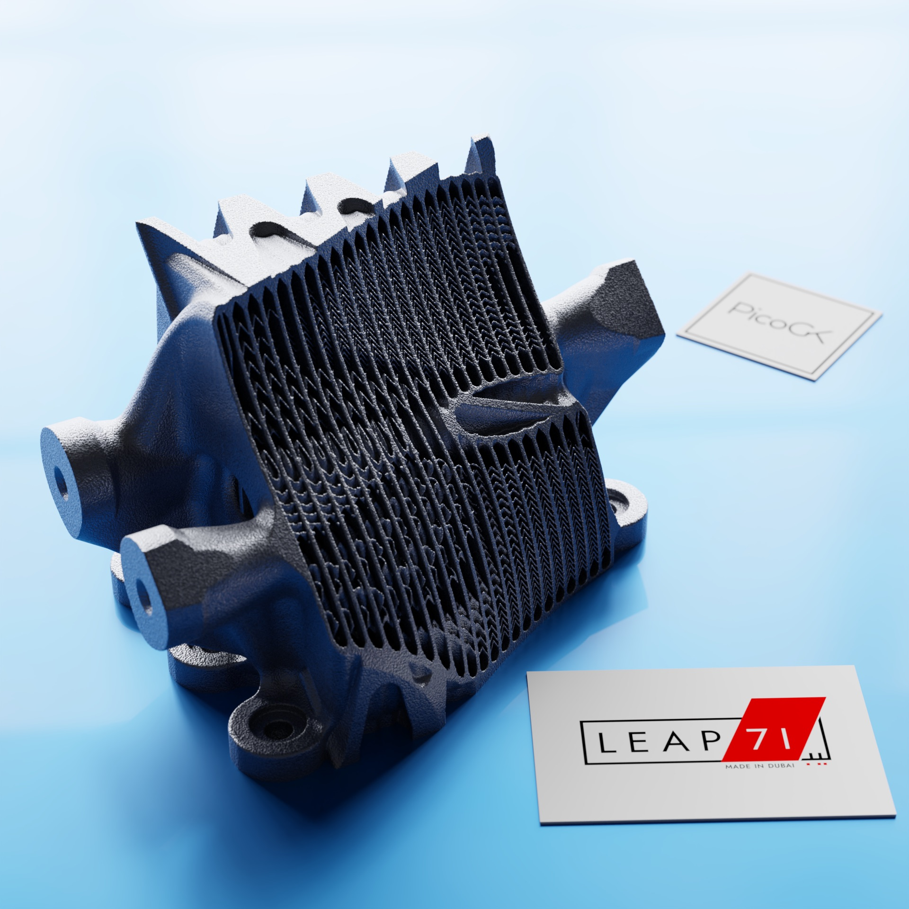
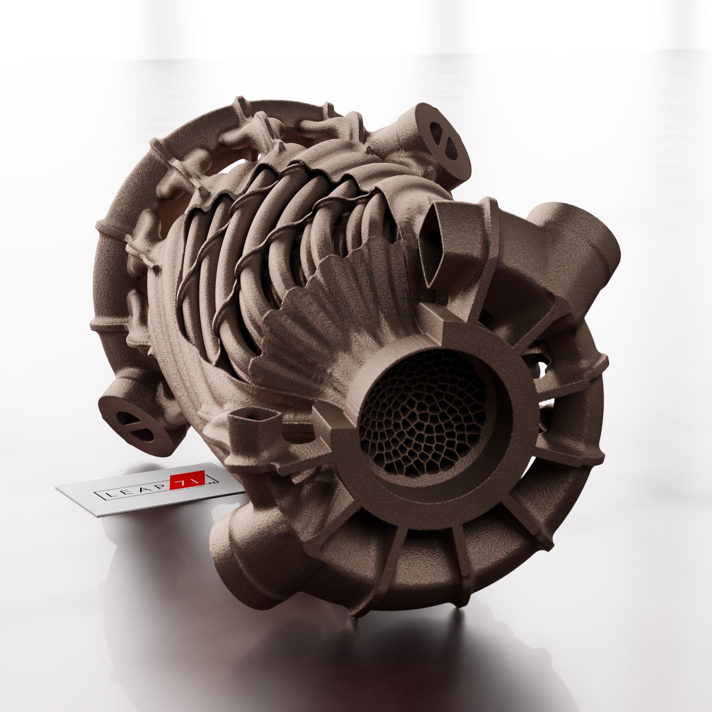
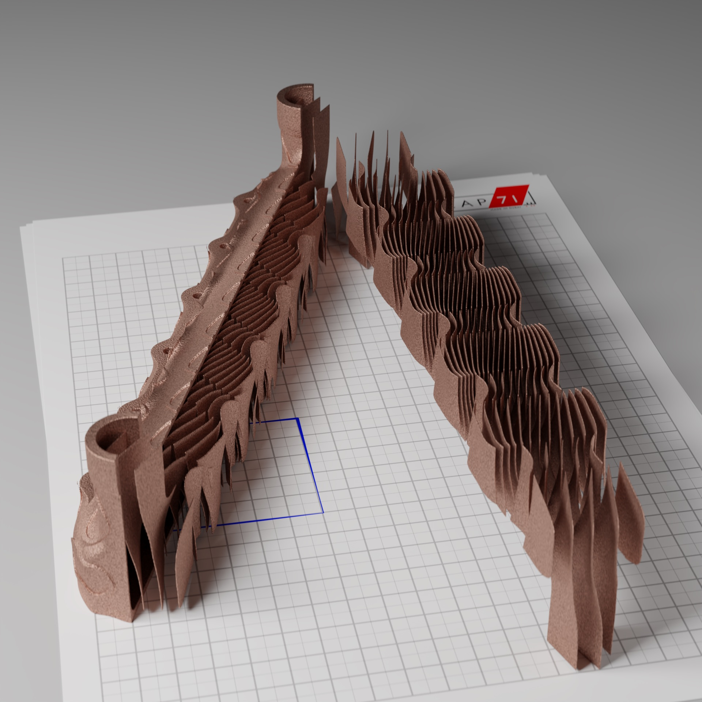
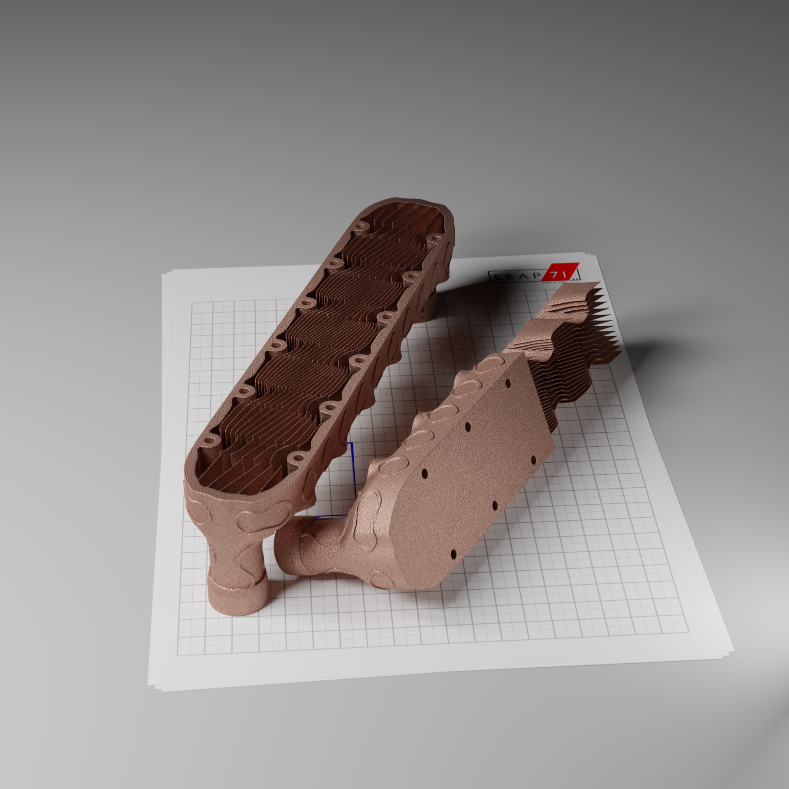
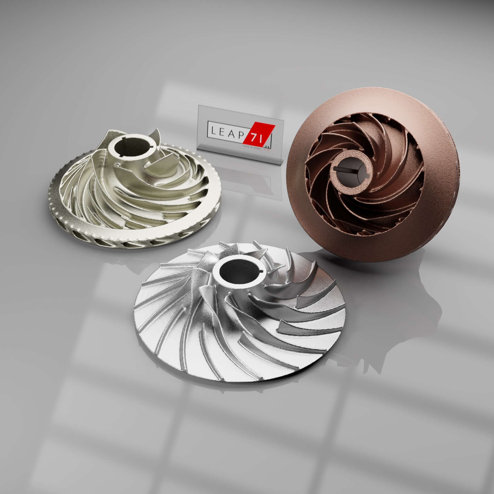
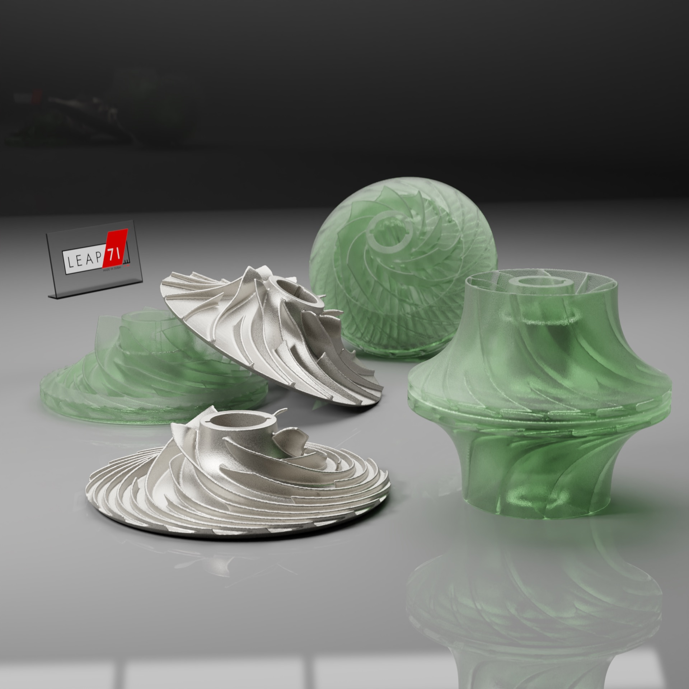
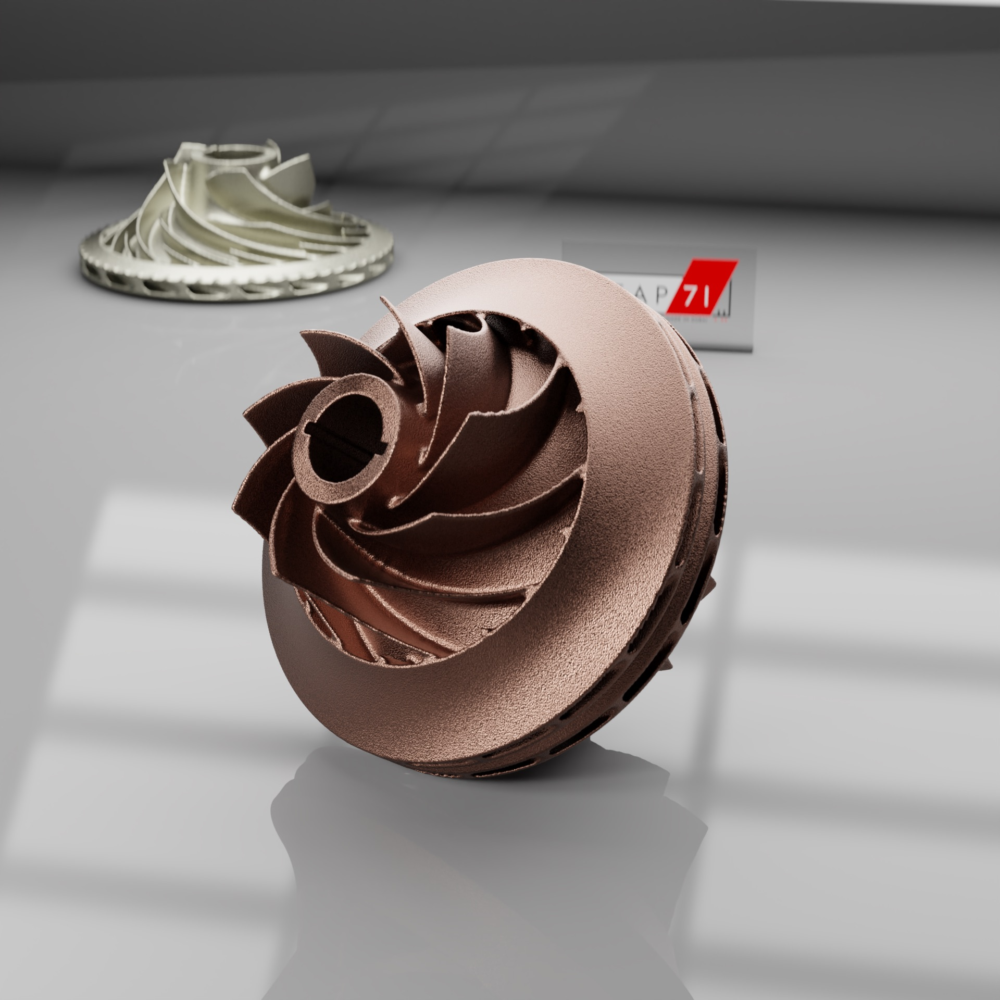
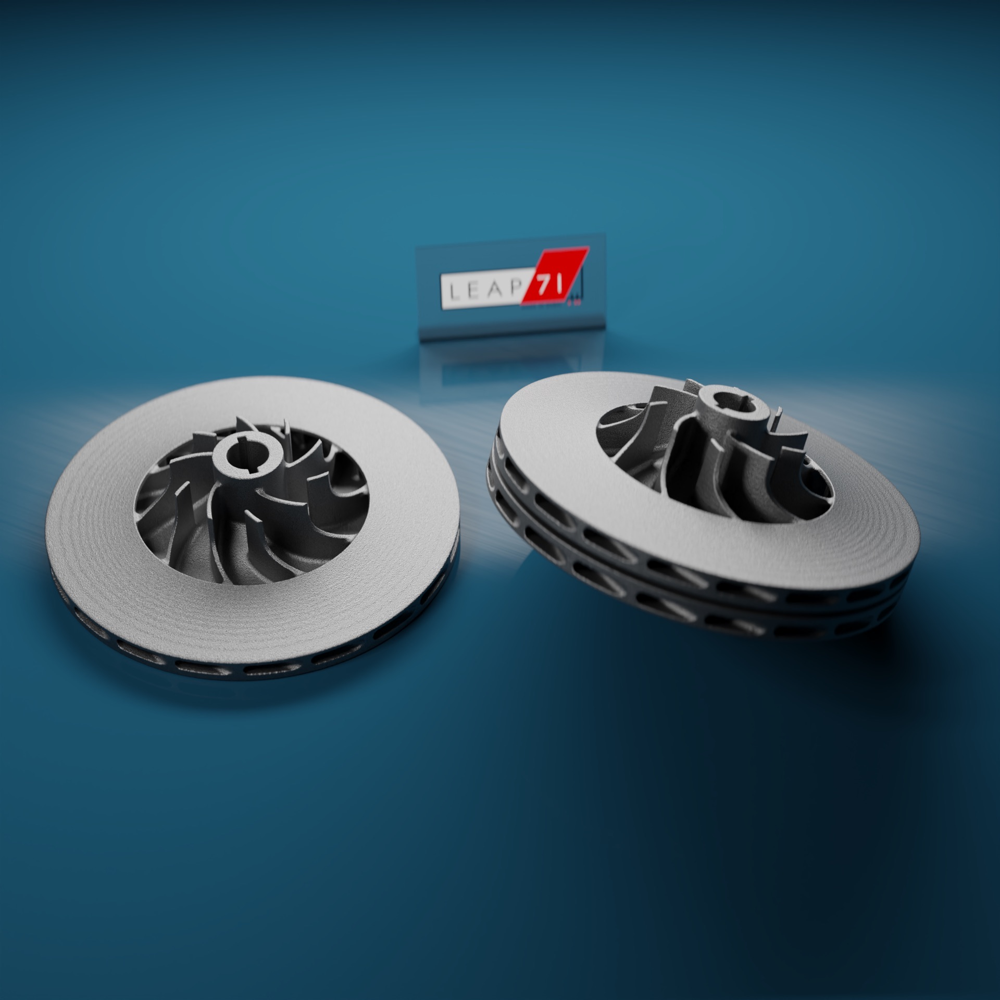

# Made with PicoGK

The following images are made available by LEAP 71 for your use under the Creative Commons [CC BY-SA](https://creativecommons.org/licenses/by-sa/4.0/) license.

## Heat Exchangers

Heat exchanger created using a Computational Engineering Model built by LEAP 71. The source code for this model is available on the LEAP 71 Github.

Heat exchanger created using a Computational Engineering Model built by LEAP 71.

Cut through a heat exchanger created using a Computational Engineering Model built by LEAP 71.

Cut through a heat exchanger created using a Computational Engineering Model built by LEAP 71.

## Impellers

Impellers created using a Computational Engineering Model designed by LEAP 71.

Impellers created using a Computational Engineering Model designed by LEAP 71.

Impellers created using a Computational Engineering Model designed by LEAP 71.

Impellers created using a Computational Engineering Model designed by LEAP 71.
