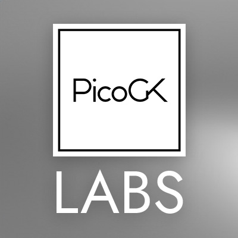
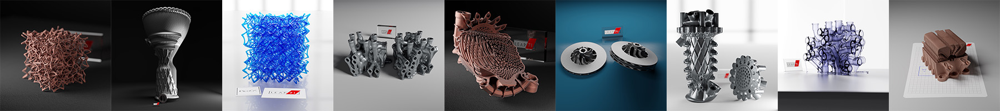

# Welcome to [PicoGK.org](https://picogk.org)

PicoGK ("peacock") is a compact open-source geometry kernel created by [LEAP 71](https://leap71.com/).

PicoGK forms the basis of a comprehensive technology stack for [Computational Engineering](https://leap71.com/computationalengineering/) built and open-sourced by LEAP 71.

PicoGK stands for **Pico** (tiny) **G**eometry **K**ernel and provides [an intentionally reduced](https://jlk.ae/2023/12/06/the-power-of-reduced-instruction-sets/) but robust instruction set that can be used to create computational geometry for engineering applications. 

The name PicoGK is also a nod to the peacocks roaming the streets in the city of Dubai, where we are based.

PicoGK may look simple on the surface, but we use it for some of the most advanced physical parts imaginable. From advanced electric motors to, heat exchangers, [to 3D-printed rocket engines](https://leap71.com/2023/09/12/the-exploration-company-and-leap-71-announce-cooperation-in-the-field-of-space-engine-engineering/), and even biologic structures.

We believe Computational Engineering will dramatically change the way we design the physical world around us. Our goal with PicoGK is to jumpstart the transition to this new paradigm so that engineers can help create a future that is both inspiring and sustainable.

|                                                  | PicoGK Resources                                             |
| ------------------------------------------------ | ------------------------------------------------------------ |
|            | PicoGK is written and maintained by LEAP 71. [Please visit the PicoGK page on the LEAP 71 website](https://leap71.com/PicoGK/) for more information about PicoGK, and why it exists. |
|                | Besides PicoGK, our foundational geometry kernel, we have open sourced many examples and supporting code modules which showcase the power of Computational Engineering. [Check out the LEAP 71 Github to explore the repositories.](https://github.com/leap71) |
|                | To get an impression of what our computational models are capable of, [visit the LEAP 71 gallery](https://leap71.com/gallery/) and [follow us on Instagram](https://www.instagram.com/leap.71/) for your daily dose of inspiration. |
|                            | The [personal website of the founders of LEAP 71](https://jlk.ae/), Josefine Lissner and Lin Kayser, has background articles, podcasts and other material which explain the roots of this new paradigm. |
|                      | **Coding for engineers** [is an book about learning how to code](coding-for-engineers/0-preamble.md) on PicoGK, which is released chapter by chapter by Lin Kayser. |
|  | On [PicoGK Labs, we showcase ongoing work in progress](labs/README.md), and our latest public experiments with PicoGK. Anything from designing quasi-crystal-like engineering structures, to using Large Language Models to create a conversational interface to engineering. |

------

*© 2024 by LEAP 71 — All Rights Reserved*

*Images used with permission of LEAP 71 — Many images released to the public under Creative Commons Licenses.*

*[See Gallery for all Creative Commons released images.](Gallery.md)*

