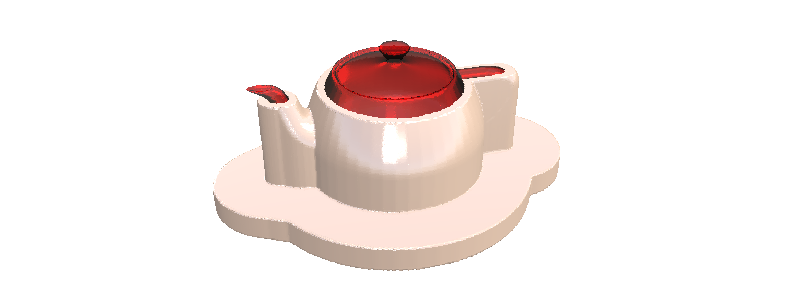
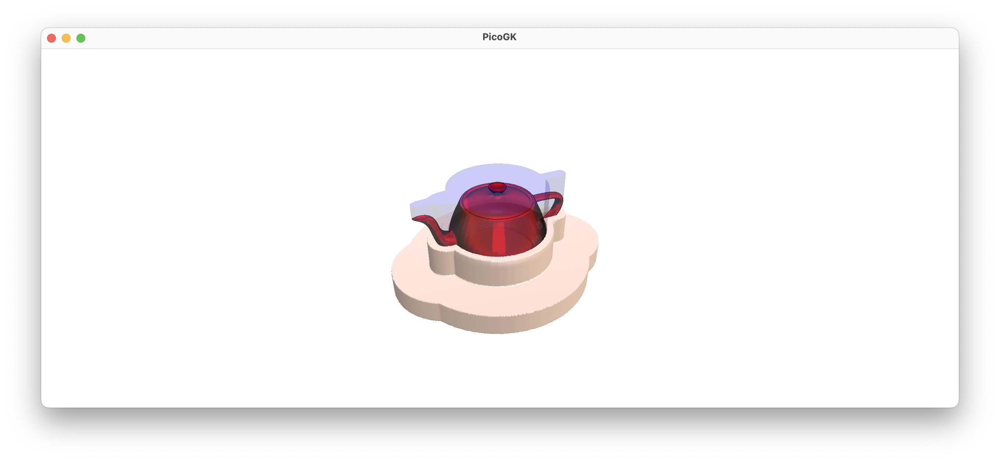

**[PicoGK.org](https://picogk.org)/coding for engineers**


[0 — Preamble: My story](README.md)

[1 — Foreword](1-foreword.md)

[2 — Fundamentals](2-fundamentals.md)

[3 — Running Code](3-running-code.md)

[4 — Classes](4-classes.md)

[5 — Inheritance](5-inheritance.md)

[6 — Interfaces](6-interfaces.md)

[7 — Design an aircraft in an afternoon](7-design-an-aircraft-in-an-afternoon.md)

[8 — First steps in PicoGK](8-first-steps-in-picogk.md)

[9 — Let's build a computational fixture maker (Part 1)](9-computational-fixture-maker.md)

**[10 — Let's build a computational fixture maker (Part 2)](9-computational-fixture-maker-2.md)**

# Let's build a computational fixture maker (Part 2)

Now, that was a lot of stuff in one chapter. And we are not done yet.

Let's review quickly what we did. We created a `FixtureMaker` which allows us to build a fixture for a random object, which we can, for example, load from an STL mesh.

We implemented the geometry creation logic, which required us to learn about positioning meshes, rendering them into `Voxels`, offsetting, and booleaning the results. 

We are onto something — but it's not perfect yet. 

We have a few things left, including correcting some issues with our objects getting stuck inside the fixture. And we haven't even touched on how we actually deal with the build plate. We decided to pass a generic `BasePlate` class to our `FixtureMaker`, trusting that we will figure this out, whenever we get to it.

But, before we continue, let's step back and look at our work for a second. 

Is this an elegant structure? Does it satisfy the principles which underly object oriented programming, including information hiding, and minimal exposure of the "internals"?

It's not too bad, actually.

We abstracted the input object and the parameters. We decided to leave the logic of cutting holes to the `BasePlate` class, so we don't have to burden the `FixtureMaker` with lots of special ways of dealing with various base plates.

But then, there is something really wrong here! 

We approached the entire project with the *process of making a fixture* in mind.

And we encapsulated that *process* in a class, the `FixtureMaker`. To build a fixture, we need to supply the parameters to the `FixtureMaker`'s constructor, then we have to invoke `Run()`, and after we have done all this, we see our fixture on screen. We have no way to access it yet, so, if we want to actually do something with our fixture, we have to find a way to store it and get it out of the Run() function.

Now, this is straighforward enough, we can just store it in a member variable and add an accessor, something like that.

```c#
Library.oViewer().Add(voxFixture, 0);
m_voxResult = voxFixture;
```

We can now add an accessor to it:

```c#
Voxels voxFixture()
{
    return m_voxResult;
}
```

Except there is a problem.

Remember what we have to do to use our `FixtureMaker`?

It's three steps. Create a new instance of the class, run it, get the result.

```c#
FixtureMaker oMaker = new(...); // details left out for brevity
oMaker.Run();
Voxels voxFixture = oMaker.voxFixture();
```

What if we forget to call `Run()`?

Ugh.

OK, you say, let's be smart. We can just return the result from the `Run()` function. So instead of storing the result, we return it. Now that's better:

```c#
Voxels voxRun(...)
{
    ....
    Library.oViewer().Add(voxFixture, 0);
    return voxFixture;    
}
```

Much better. Now, at least, we never end up with an invalid state. 

But it's still two steps.

Whenever you build something like that, requiring an instruction manual to operate it properly, you very likely fell into the old way of writing code, which relied on you knowing exactly how the code worked internally. 

If we don't use our `FixtureMaker` as expected, it could be left in a weird state, where we have a `FixtureMaker`, but it hasn't run yet, so it doesn't have a result yet — how do we know that? Should we add a lot of `if then else`...? What should happen if we call `Run()` several times? What if I need more information about the fixture we just created, rather than just the resulting `Voxels`.

No. Our architecture is not right. We are thinking about the objects in the wrong way.

What are we trying to build? What's our output?

Don't say a `Mesh` or a `Voxels` object, even though this is not entirely wrong.

Isn't what we are actually trying to build a `Fixture`?

We forgot the hero in our movie! 

Why are we building a `FixtureMaker`, when we actually looking to generate a `Fixture`?

Shouldn't our code look more like:

```c#
BasePlate      oBase   = new();
FixtureObject  oObject = new(...);

Fixture oFixture  = new(oBase, oObject);
Voxels voxFixture = oFixture.voxAsVoxels();
```

In other words, shouldn't there be a `Fixture` class, and inside the constructor, all work is done, so once we exit the constructor, we have a valid `Fixture` object, which contains correct results? 

How much this simplifies our way of thinking! 

And of course we have to know nothing about how this is all implemented, we can just create fixtures from our inputs, and don't have to call functions at the right times.

This is an important lesson for us. And there is a very generalized rule that you can derive from it:

> [!TIP]
>
> Whenever you are tempted to encapsulate a *process* in a class, you are probably doing something wrong.

In other words, if you are building a class that is named after a *process* (here *making* a fixture), it's almost certain there is a problem in your approach. We didn't create an `AirplaneMaker` in one of the past chapters, we want an `Airplane`.

Create a `Fixture`. Don't run a `FixtureMaker`.

Let's do this, it's easy enough.

## A class for fixtures

OK, let's think of it. All the things we stored as member variables, the `FixtureObject` and the `BasePlate`, we could delete, because we don't need them outside the constructor anymore. We could keep them, though, because they are the inputs to the `Fixture` and maybe, at a later point, we want to be able to reference them, when we do something with the `Fixture`. 

But, if in doubt, clean up — so gone they are.

We want to be able to store some of our results, one is definitely the `Voxels` that make up the fixture. So we add a member variable for that. And we add an accessor function, so we can actually get to the result after we have constructed the fixture.

```c#
public class Fixture
{
    public Fixture(   BasePlate     oPlate,
                      FixtureObject oObject)
    {
        // todo
    }
    
    public voxAsVoxels()
    {
        return m_voxFixture;
    }
    
    Voxels m_voxFixture;
}
```

Now, basically, we just have to copy the stuff from our `FixtureMaker`'s `Run()` function, and we are done.

```c#
public class Fixture
{
    public Fixture( BasePlate oPlate,
                    FixtureObject oObject)
    {
        m_voxFixture = new(oObject.voxObject());
        m_voxFixture.Offset(oObject.fWallMM());
        m_voxFixture.ProjectZSlice(oObject.fFlangeHeightMM() + oObject.fSleeveMM(), 0);

        BBox3 oFixtureBounds = m_voxFixture.mshAsMesh().oBoundingBox();
        oFixtureBounds.vecMin.Z = 0;
        oFixtureBounds.vecMax.Z = oObject.fFlangeHeightMM() + oObject.fSleeveMM();

        Mesh mshIntersect = Utils.mshCreateCube(oFixtureBounds);
        m_voxFixture.BoolIntersect(new Voxels(mshIntersect));

        // Flange

        Voxels voxFlange = new(m_voxFixture);
        voxFlange.Offset(oObject.fFlangeWidthMM());

        BBox3 oFlangeBounds = voxFlange.mshAsMesh().oBoundingBox();
        oFlangeBounds.vecMin.Z = 0;
        oFlangeBounds.vecMax.Z = oObject.fFlangeHeightMM();

        Mesh mshIntersectFlange = Utils.mshCreateCube(oFlangeBounds);
        voxFlange.BoolIntersect(new Voxels(mshIntersectFlange));

        m_voxFixture.BoolAdd(voxFlange);
        m_voxFixture.BoolSubtract(oObject.voxObject());

        Library.oViewer().SetGroupMaterial(0, "da9c6b", 0.3f, 0.7f);
        Library.oViewer().SetGroupMaterial(1, "FF0000BB", 0.5f, 0.5f);

        Library.oViewer().Add(oObject.voxObject(), 1);
        Library.oViewer().Add(m_voxFixture, 0);
    }

    public Voxels voxAsVoxels()
    {
        return m_voxFixture;
    }

    Voxels m_voxFixture;
}
```

I modified all the variable names to reflect our changes (parameters vs. member variables), other than that, the code is the same as before.

Now, we can modify or `App.Run` function to reflect our changes.

```c#
public static void Go()
{
    // previous stuff unchanged

    Fixture oFixture = new(oBase, oObject);
}
```

Doesn't this look much cleaner? And isn't it amazing how we encapsulated a relatively complex process in a seemingly simple piece of code?

Essentially, we don't have to think about all the complex process we have to go through to build a geometry that holds our object. All we do is create a new instance of a `Fixture` object, and that's it.

That's the power of object oriented programming.

Wouldn't it be nice to store our result as a file?

We can add one line of code, and we are done:

```c#
Fixture oFixture = new(oBase, oObject);
oFixture.voxAsVoxels().mshAsMesh().SaveToStlFile(Path.Combine(  Utils.strDocumentsFolder(), 
                                                                "Fixture.stl"));
```

We get the object as voxels, transform to a mesh, and save it to our `Documents` folder.

## Progress reporting

Now, there is a problem though. We have all these `Viewer` functions that we call to visualize our process. That is good for our debugging and to understand what is going on. But we are creating a huge mess in our viewer, by just using the constructor of a `Fixture`. 

This is probably a really bad idea.

A simple solution is, we could delete all the viewer interaction. It really doesn't belong in the constructor of an object that you will use in your application. We could do this now, and it would be a good approach. Visualizing the fixture is probably best done, after it was created.

But, since it can be a lengthy process, why don't we give our `Fixture` class a way to actually report what's going on, and show stuff on screen, if so desired?

Take a moment to think about how you would do it. 

Currently we call the PicoGK `Viewer`'s global functions inside our class member functions. 

That's really a bit messy, as you cannot see this from the outside, and it's quite unexpected, when all you wanted to do is create a new instance of the class `Fixture`.

If we want to make this optional, what we could do is, add a `boolean` flag, `bOutputToViewer` as additional parameter to the constructor:

 ```c#
 public Fixture(   BasePlate     oPlate,
                   FixtureObject oObject,
                   bool          bOutputToViewer)
 {
     ...
 ```

Now, all we have to do is query this flag, and if it is false, we don't output it. So, we do this:

```c#
public Fixture(   BasePlate     oPlate,
                  FixtureObject oObject,
                  bool          bOutputToViewer)
{
    if (bOutputToViewer)
        Library.oViewer().Add(m_oObject.voxObject());
    
    ...
```

This is a valid and OK approach. It just results in a lot of `if`s, so our code will not look as clean as before.

We could also do it differently.

We could abstract the reporting of the process through object oriented programming.

Why don't we create a `ProgressReporter` class, which can use to report our progress, while we go through the creation of our fixture.

So, which functions do we actually need from the `Viewer`, it's really just three:

```c#
public abstract class ProgressReporter
{
    public abstract void AddObject( Voxels vox,	
                                    int iGroupID = 0);

    public abstract void AddObject( Mesh msh, 	
                                    int iGroupID = 0);

    public abstract void SetGroupMaterial(  int        iID, 
                                            ColorFloat clr, 
                                            float      fMetallic, 
                                            float      fRoughness);
}
```

So, we could just pass this to our constructor, and we call the `ProgressReporter` functions instead of the global viewer functions.

```c#
public Fixture( BasePlate 			oPlate,
                FixtureObject       oObject,
                ProgressReporter    oProgress)
```

and

```c#
oProgress.SetGroupMaterial(0, "da9c6b", 0.3f, 0.7f);
oProgress.SetGroupMaterial(1, "FF0000BB", 0.5f, 0.5f);

oProgress.AddObject(oObject.voxObject(), 1);
oProgress.AddObject(m_voxFixture, 0);
```

So, now we call functions of a new `ProgressReporter` object, which determines what to do, instead of messing up our viewer by default.

But, since `ProgressReporter` is abstract, we will have to implement at least one derived class, in order to be able to use it.

Let's implement a reporter class first, which does the same as before, showing output in the viewer:

```c#
public class ProgressReporterActive : ProgressReporter
{
    public override void AddObject( Voxels vox,	
                                    int iGroupID = 0)
    {
        Library.oViewer().Add(vox, iGroupID);
    }

    public override void AddObject( Mesh msh, 	
                                    int iGroupID = 0)
    {
        Library.oViewer().Add(msh, iGroupID);
    }

    public override void SetGroupMaterial(  int        iID, 
                                            ColorFloat clr, 
                                            float      fMetallic, 
                                            float      fRoughness)
    {
        Library.oViewer().SetGroupMaterial( iID, 
                                            clr, 
                                            fMetallic, 
                                            fRoughness);
    }
}
```

Lots of code, but essentially the class just routes the 3 functions to the global viewer object.

Now we can instantiate our `Fixture` again, and it will work as before:

```c#
Fixture oFixture = new( oBase, 
                        oObject, 
                        new ProgressReporterActive());
```

We are passing a `ProgressReporterActive` object, which routes all of our information to the viewer.

What if we don't want this — if we just want a `Fixture`, and not mess up our viewer? Well, we pass a `ProgressReporterSilent`, which looks like this:

```c#
public class ProgressReporterSilent : ProgressReporter
{
    public override void AddObject( Voxels vox,	
                                    int iGroupID = 0)
    {}

    public override void AddObject( Mesh msh, 	
                                    int iGroupID = 0)
    {}

    public override void SetGroupMaterial(  int        iID, 
                                            ColorFloat clr, 
                                            float      fMetallic, 
                                            float      fRoughness)
    {}
}
```

This object doesn't do anything, when you call the progress functions. So the viewer stays untouched.

```c#
Fixture oFixture = new( oBase, 
                        oObject, 
                        new ProgressReporterSilent());
```

## Why so convoluted?

Why didn't we just delete the functions that deal with the viewer? This seems an incredibly convoluted way of not showing something on screen. 

The reality is, in Computational Engineering, you often have code that runs for extended periods of time. Frequently you need to document intermediate results, explain what you are doing and why. And you need to tell the user, where in the process you are.

The best way to do this, is through an abstract reporting mechanism. This is what we implemented here — in very rudimentary form.

Let's give us a way to tell the `ProgressReporter` what we are doing, let's add:

```c#
public abstract void ReportTask(string strTask);
```

which we can call, to say, what step we are currently executing. For our silent version, we, again, don't do anything. For our active reporting variant, we can output to the PicoGK log file:

```c#
public override void ReportTask(string strTask)
{
    Library.Log(strTask);
}
```

Let's add a few steps to our `Fixture` constructor to illustrate the point.

```c#
public Fixture( BasePlate           oPlate,
                FixtureObject       oObject,
                ProgressReporter    oProgress)
{
    oProgress.ReportTask("Creating a new fixture");
                    
    m_voxFixture = new(oObject.voxObject());

    oProgress.ReportTask("Creating the sleeve");
```

You get the idea.

Once you run it, you get a nice log output in the `PicoGK.log`, and conveniently, also in the console.

```
      0s    0.1+ Creating a new fixture
      0s    0.0+ Creating the sleeve
      1s    0.6+ Building the flange
```

And, with that, I let's move away from the abstract side, and do something with our geometry, to finish off this chapter.

## Fixing the "stuck object" problem

The last chapter pointed out one issue with our current implementation of the `Fixture` class:



I asked you to come up with a solution, and I hope you thought about it.

The way to solve it is, of course, using `ProjectZSlice` again, this time to project the object's slices upwards. This will ensure, that any protruding or enclosed features of our object are filled in by the largest silhouette of the object's 'previous layers, making sure you can lift the object out.

Take a moment and ponder how you would solve it using `ProjectZSlice`. And then implement it. The solution is, as always, [in the GitHub repository of this chapter](https://github.com/LinKayser/Coding4Engineers).

 

## Summary

This, again, was a chapter filled with theory, which is important to understand the foundations of Computational Engineering. Building sophisticated Computational Engineering Models is just as much about coming up with the right software structure, as it is about encoding engineering knowledge, physics, and building geometry.

- We looked at our existing `FixtureMaker` and realized we encapsulated a procedure in a clumsy way, instead of applying object oriented programming principles
- As a result, we came up with a `Fixture` class, which makes creating a fixture as easy as saying `Fixture oFixture = new(...)` — clean and powerful
- We looked at how we interact with global objects, like the viewer, and realized there should be a more generalized way of reporting results, progress, and describing what we are doing in the algorithm
- And, lastly, we solved the geometrical issue, that the object cannot be removed from the fixture, if the upper part is smaller than the lower part of the object

Let's look at the rest of the challenges from the previous chapter next.

------

Next Week: **Let's build a computational fixture maker (Part 3)**

[Jump into the discussion here](https://github.com/leap71/PicoGK/discussions/categories/coding-for-computational-engineers)

------

**[PicoGK.org](https://picogk.org)/coding for engineers**

© 2024 by [Lin Kayser](https://www.linkedin.com/in/linkayser/) — All rights reserved.