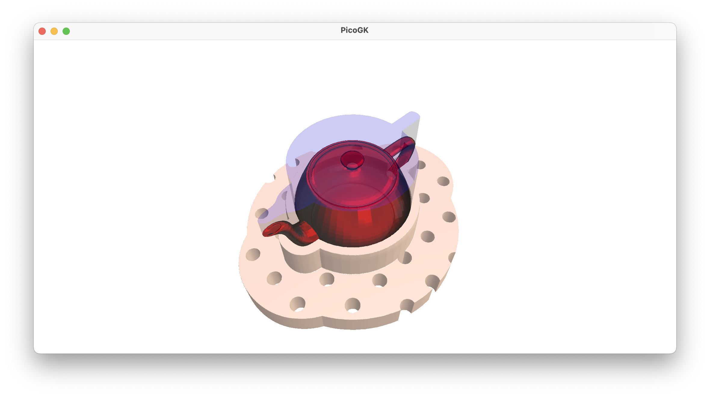
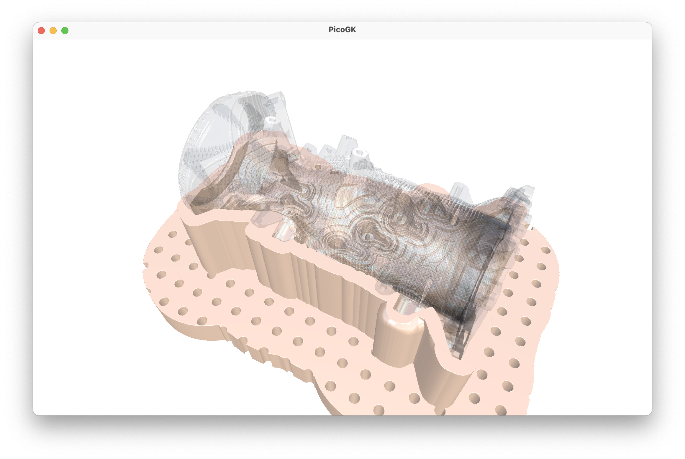

**[PicoGK.org](https://picogk.org)/coding for engineers**


**[Table of contents](TOC.md)**

# Let's build a computational fixture maker (Part 3)

So, we have a nice app already, and it implements significant functionality. In the last chapter, we restructured a lot, to make sure we are taking advantage of modern programming concepts.

We have quite a few classes in our `Fixtures` namespace. We have the `App`, which is called by PicoGK to execute the functionality.

We have an abstract way to report progress using `ProgressReporter` and its derived classes.

We have the `BasePlate`, which doesn't do anything yet.

We have the `FixtureObject`, which encapsulates the object we want to fix, and how we want to fix it (with which parameters).

And lastly, we have the `Fixture`, which is the actual hero in our story.

It's all pretty nicely structured, but, as you can guess, there is still something that's bothering me.

Let's make one last structural change, a minor one this time, to introduce to you the concept of nested classes.

## Cleaning up our namespace with nested classes

The `FixtureObject`, and maybe the `BasePlate`, seem such an integral part of the `Fixture` class, that one really can't do much without the other. Maybe we should reflect that, by moving the class definition inside the class definition of the `Fixture` class.

Whenever you create a class definition, it defines its own namespace. You can use that namespace to group other classes (and types) that belong to that class. There's nothing really complex about this, all you do is:

```c#
class Fixture
{
    /// <summary>
    /// BasePlate object that implements the base plate
    /// </summary>
    public class BasePlate
    {
        // nothing here yet
    }

    /// <summary>
    /// The FixtureObject holds the object to be fixed and various
    /// parameters that are necessary to describe the fixture
    /// </summary>
    public class FixtureObject
    {
        // existing definition ...
    }
    
    public Fixture( BasePlate           oPlate,
                    FixtureObject       oObject,
                    ProgressReporter    oProgress)
    {
        oProgress.ReportTask("Creating a new fixture");
        
    // existing code ...
            
}
```

So, all we did, is moving the class definitions inside the `Fixture` class definition — and now these classes are part of it.

To reference the `BasePlate`, the namespace is now: `Coding4Engineers.Fixtures.Fixture.BasePlate` and to use `FixtureObject`, you now have to use `Coding4Engineers.Fixtures.Fixture.FixtureObject`.

How is that an improvement!? That's a mouthful?

First, since  `Coding4Engineers.Fixtures.Fixture.FixtureObject` seems like a lot of redundancy, why don't we rename it to `Coding4Engineers.Fixtures.Fixture.Object`? Since our `FixtureObject` is now inside the `Fixture` namespace, it's entirely clear where it belongs. After this change, we have three classes relevant to the `Fixture` object: `Fixture` itself, `Fixture.BasePlate`, and `Fixture.Object`. That looks kind of clean.

Now, the `Fixtures` namespace seems kind of redundant. Why don't we rename our `App` object `FixtureMakerApp`, and kill the `Fixtures` namespace.

As a result, we have a clean hierarchy of namespaces and classes:

- `CodingForEngineers`
  - `FixtureMakerApp`
  - `ProgressReporter`
  - `Fixture`
    - `Object`
    - `BasePlate`

Why didn't we move the `ProgressReporter` inside the `Fixture` class? Because it seems like a general mechanism that we may want to reuse later. If that' the case, we should move it to its own `.cs` file at some point. But not today.

We have to make a few changes to the `FixtureMakerApp.Run()` function to make sure it reflects all the new names:

``` c#
public class FixtureMakerApp
{
    public static void Run()
    {
        Fixture.BasePlate oBase = new();

        Mesh mshSmall = Mesh.mshFromStlFile(Path.Combine(
                                Utils.strPicoGKSourceCodeFolder(),
                                "Examples/Testfiles/Teapot.stl"));

        Mesh mshObject = mshSmall.mshCreateTransformed(new(6, 6, 6), Vector3.Zero);

        Fixture.Object oObject = new(   mshObject,
                                        15,
                                        20,
                                        5,
                                        25);

        Fixture oFixture = new( oBase, 
                                oObject, 
                                new ProgressReporterActive());

        oFixture.voxAsVoxels().mshAsMesh().SaveToStlFile(Path.Combine(  Utils.strDocumentsFolder(), 
                                                                        "Fixture.stl"));
    }
}
```

And with that, we can move onto the `BasePlate`.

Except... — one comment before we move on: 

As you have discovered, if you followed the book closely, it's a winding road to refined code. 

And it's always like that. You put down the lines, only to discover a while later, that there is a more elegant way to express your logic. You make the changes. — And then you rewrite it again, when you gain more insights a week, a month, or a year later.

This is part of the journey, and this so-called *refactoring* will occupy quite a bit of your time. It's important to spend the effort. When you discover things in your code, that don't make sense anymore — go ahead and refactor. Refactoring is part of the job. Old code is never sacrosanct, in fact you should keept it alive by rewriting it. 

Many decades-old code bases have, what is called "technological debt". Someone should have rewritten and rethought it long ago — but nobody ever found the time. So it's just left there to rot, workarounds are built around this stale code, and monsters are lurking in the dark. Technological debt is why progress in established applications grinds to a halt — and why nobody will ever fix the positioning of images in Microsoft Word.

Keep you code fresh. Look at it, make sure it still makes sense. Absolutely, *do* change a running system — but make sure you have tests in place that alert you when something breaks.

One of the gripes I have with many programming books, is that they skip over this journey. A perfectly refined program, just magically appears, making the author look like a god-like genius. I worked with many geniuses in my life — they made mistakes, and constantly rewrote their code, their articles, re-executed their experiments, falsified their assumptions. That's life — brilliance comes from putting in the hours, and trashing old stuff, to make room for improvement.

## Drilling holes

In that spirit, let's drill some holes.

Now, we could spend a few hours now, thinking through all the potential base plates that one could imagine. We could create a sophisticated abstract `BasePlate` base class, that implements a refined interface, that all future base plates can work with. Because we are so smart, that structure we created will always work, and we have solved the challenge in a generalized way.

Yes, we could do that, and sometimes it's the right approach. 

But more often, it isn't. We know that there will be complex ways to attach a fixture to a base plate. But instead of trying to think through all eventualities now, let's implement a concrete example, and see how it goes.

We know we will modify the approach later. When we refactor the code.

Why not spend time to think it through? The reason is simple: It usually results in overengineering. And more often than not, you will end up with a lot of code that is never used, and potentially introduces errors. As a good rule of thumb: Always implement what you need today, not what someone might need in the future. Don't overthink.

So, let's just assume a `BasePlate` just has a size and evenly spaced holes with a certain diameter. 

So the constructor of our `BasePlate` will look something like this:

```c#
public class BasePlate
{
    public BasePlate(	Vector2 vecSizeMM,
                    	float   fHoleSpacingMM,
                    	float   fHoleDiameterMM)
    {
        ...
    }
}
```

OK, great. We can implement that, adding member variables to store all the info.

What shall we do with all the info? Let's look at the workflow for generating our `Fixture`. 

- First we build a "mold" of the object that allows us to hold the object
- Then we build a flange
- Then we combine flange and the fixture
- Then we subtract the projected object, so that it can be removed

Since the flange needs to be modified to be attached to the base plate, we should start interacting with the `BasePlate` object, once the flange is built.

I think the first thing we need to check is if the flange actually fits onto the base plate. So, let's add a function to the `BasePlate` class to find out. What should we pass as input? The dimensions of the bounding box of the flange? That could be one option. But the more general way is to pass the geometry of the flange itself. If our base plate is irregularly shaped, for example if it is round or rectangular, we can gauge more intelligently, whether this fits.

So let's just pass the `Voxels` of the flange, and deal with the logic inside. Information hiding at work.

```c#
public class BasePlate
{
    ...
    bool bDoesFit(Voxels voxFlange)
    {
        return true;
    }
}
```

We are just adding a stub for now, and add the logic later. If `bDoesFit` returns false, we can throw an exception, explaining what went wrong.

The next thing we have to do is add the mounting holes to the flange. Should we return a list of all the holes, or the distances, and hole diameters. No. The mounting system of our base plate might not be so simple. Again, the best way to do this is to simply pass the flange itself, and let the `BasePlate` drill its own holes at the positions that make sense.

The `BasePlate` might implement a complex algorithm, searching for the perfect mounting point. It may be a smart base plate, that switches to a different mounting mechanism, depending on the shape and dimensions of the object. There's a lot of room for imagination.

Again, we are not implementing all of this, or even try to think of all the eventualities. But we we can make the decision to build a simple interface for the interaction of the two objects, that makes as little assumptions as possible, about how the objects may look like or work.

```c#
public class BasePlate
{
    ... Constructor etc ... 
        
    public bool bDoesFit(Voxels voxFlange)
    {
        return true;
    }
    
    public Voxels voxCreateMountableFlange(in Voxels voxFlange)
    {
        return new(voxFlange);
    }
}
```

And that's about all we need, I guess. Again, we are implementing a stub. We just return the "modified" flange by making a copy of the existing one (using the `Voxels` class' copy constructor).

I used an important new keyword here, when passing the `Voxels`: `in`. This marks whatever is passed as read only, so it cannot be changed by the function. By default, for classes, C# passes a reference to the existing object. So, if you do something to the object inside the function, the object outside the function will be changed, because both variables point to the same object. I find this one of the most annoying and dangerous aspects of C#. But I will not get into this at this point, because it's a rabbit hole.

You want holes in your flange, and not another long detour into programming architecture. But I will come back to this.

So, let's implement the `Fixture` side of things. 

```c#

// existing code
// ....
Mesh mshIntersectFlange = Utils.mshCreateCube(oFlangeBounds);
voxFlange.BoolIntersect(new Voxels(mshIntersectFlange));

// Let's create the mounting mechanism to the base plate
 
if (!oPlate.bDoesFit(voxFlange))
    throw new Exception("Flange doesn't fit onto base plate");

voxFlange = oPlate.voxCreateMountableFlange(voxFlange);

// add the flange to the fixture
// existing code ...
m_voxFixture.BoolAdd(voxFlange);            
```

So, all we do now is, check if the flange fits onto the base plate, and then create the modfied version, which we then add to the fixture as before.

Why did we split the `bDoesFit` and `voxCreateMountableFlange` functions into two? Couldn't this all be done in one? Yes, absolutely. 

But maybe we would like to actually do something outside the `BasePlate` if the flange doesn't fit (like selecting a different base plate, or maybe creating a smaller flange). 

Again, we are trying to keep our options open, without overengineering.

So, now, how do we cut holes into the flange to mount it? 

We use a drill.

The easiest way is to generate a `Lattice` which has beams for all the holes, and then use it with a `BoolSubtract` operation on the flange.

```c#

Lattice latDrill = new();
for (int x=0; x<nCountX; x++)
{
    for (int y=0; y<nCountY; y++)
    {
        latDrill.AddBeam(...);
    }
}

Voxels voxDrill = new(latDrill);

Voxels voxMountableFlange = new(voxFlange);
voxMountableFlange.BoolSubtract(voxDrill);

return voxMountableFlange;
```

Doesn't look so hard, does it?

Imagine having to design this in the traditional way, with CAD sketches, vector math, etc. It would look like a university math exam. But because we use voxels and booleans in Computational Engineering, things get really simple. 

What if we are designing a mounting flange that has recessed holes for screw heads, etc. No problem, just the drill bit gets a bit more complex.

As usual, the full source code is in the [Coding4Engineers](https://github.com/LinKayser/Coding4Engineers) project on my GitHub. I encourage you to come up with your own implementation and then compare it with what I created. How would you make this more general? How would you split the very specific `BasePlate` into a more generalized base class? Or should it be an interface? 

Should we only drill holes into a certain part of the flange, maybe we could leave some border frame? Could we use the offset function to accomplish that? 

Should there be a small gap between the object and the fixture object, to allow for a bit of wiggle room? How would you implement that?

As a last impression, here is a fixture for the rocket engine we test fired last month, the first working rocket engine built on PicoGK.



------

Next: [**Let's build a computational fixture maker (Part 4)**](12-computational-fixture-maker-4.md)

[Jump into the discussion here](https://github.com/leap71/PicoGK/discussions/categories/coding-for-computational-engineers)

[Table of contents](TOC.md)

------

**[PicoGK.org](https://picogk.org)/coding for engineers**

© 2024 by [Lin Kayser](https://www.linkedin.com/in/linkayser/) — All rights reserved.