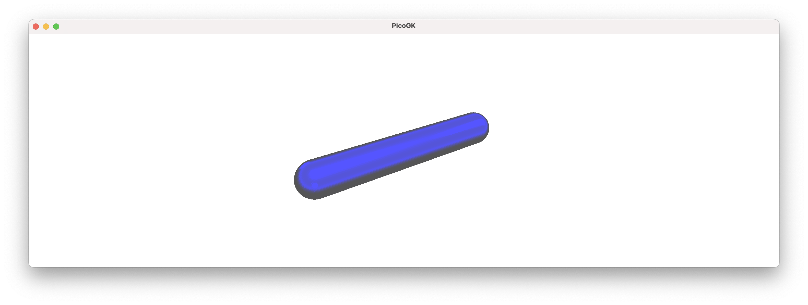
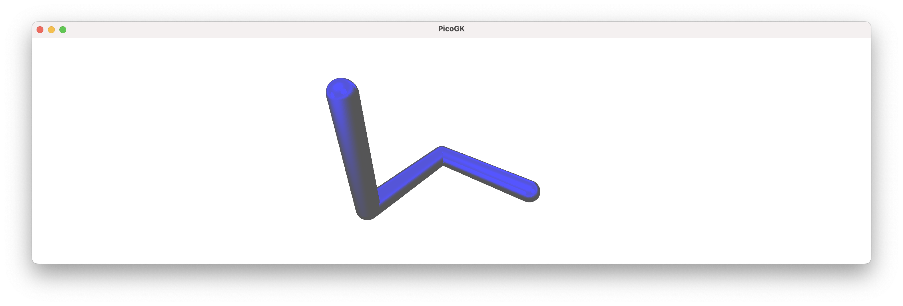
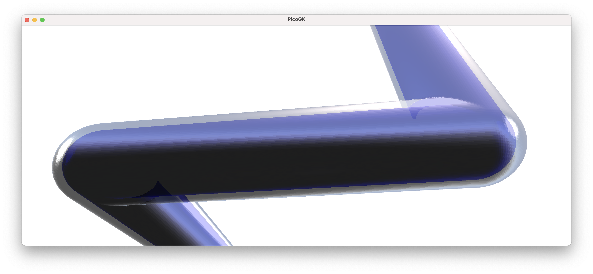
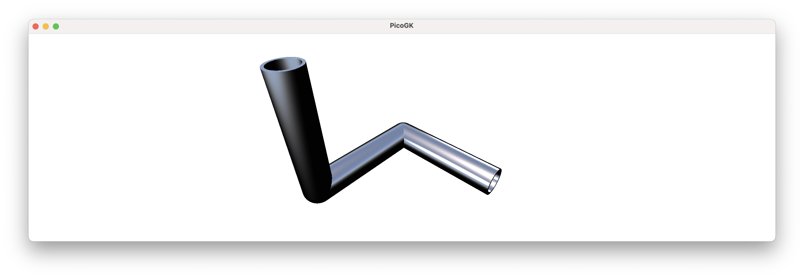

**[PicoGK.org](https://picogk.org)/coding for engineers**


**[Table of contents](TOC.md)**

# Computational geometry (Part 1)

Until now, I have not focused too much on actual geometry generation. While the fixture maker had plenty of it, most of our focus for the past chapters was on the way you structure your logic.

But designing the objects we want to build *obviously* involves the creation of geometry through algorithms, so the time has come to dive deeper.

PicoGK gives you three fundamental geometry types to work with: `Voxels`, `Mesh`, and `Lattice`.

We have alread worked with all of these over the past chapters. But we only skimmed the surface. 

In the next chapters, I show the power of lattices for creating engineering geometry.

If we recall quickly, a `Lattice` contains one or more beams. In the simplest form, a lattice beam can just be sphere. Or it can be a beam that has rounded, or non-rounded caps, the same diameter at both ends, or different ones.

Lattices are useful to build primitive objects such as cones, spheres, or cylinders. But combined with the powerful capabilities of voxel offsetting, lattices can be used to do a lot more.

Let's build some pipes using lattices.

## Building pipes

I will leave it to you to create a new `class` with `static` `Task` function, as, by now, this should be second nature.

The most basic building block, when creating pipes is a lattice beam with a round cap.



While it may not seem like much, you can use it very easily to build a sequence of interconnected pipes:



Because of the hemispherical caps, regardless of which direction the next pipe segment goes to, you will always get a nice connected knee without gaps.

Now, obviously a number of connected beams are not a pipe. How can we create a pipe from this?

One way would be to offset the current beams inwards by the pipe wall thickness and then subtract it from the outside. In this way of thinking, we are modeling the pipe, and the inside, where the fluid flows, is then the result of the offsetting process. This is usually how engineers think about geometry, as CAD forces us to constantly consider the resulting shape of the object we are designing. 

In Computational Engineering, however, we usually work differently.

If you think about it, what do we actually want to achieve? 

We want to move a liquid from one place to another. We know the dimensions of the fluid path based on physical characteristics, like mass flow and liquid velocity. From this perspective, maybe we should *not* model a pipe, we should model the actual fluid volume. And the pipe, then, is the result of an offsetting process to add material to the *outside* of the fluid volume. 

This may sound like a small detail, but it isn't. It's a fundamentally correct way of looking at the physics of an object, and driving the geometry from first principles. All too often in engineering, we design geometry first, and then try to shoehorn the physics in after the fact, because it's hard to change geometry after it has already been generated. The same is true for Computational Geometry. 

if you think of it "the wrong way around", and you iteratively are trying to come up with the best solution, you will often find it quite difficult to solve. Looking from the physics side, it's often quite simple.

We will also see later, that also just from the viewpoint of creating geometry, it's easier that way.

So — we offset the fluid volume, which is driven by physics, outwards to generate a pipe.



To get a really nice pipe, we obviously also need to cut off the ends. We can do this with a boolean intersect operation, and there we go.



Now, let's look at the code I used to accomplish this.

```c#
Lattice lat = new();

lat.AddBeam(Vector3.Zero, new(100,0,0), 10, 10);
lat.AddBeam(new(100,0,0), new(100,100,0), 10, 10);
lat.AddBeam(new(100,100,0), new(100,100,100), 10, 10);

BBox3 oBox = new(new(0,-12,-12), new(112,112,100));

Voxels voxInside    = new(lat);
Voxels voxOutside   = voxInside.voxOffset(2);
Voxels voxPipe      =   (voxOutside - voxInside)
                        & new Voxels(Utils.mshCreateCube(oBox));

Library.oViewer().Add(voxPipe, 1);
```


So, first, we create our `Lattice` object. Then we add the beams. 

Then we create a bounding box object, that we will later use to cut away the superfluous caps.

Then we create the fluid volume (`voxInside`) from the lattices. We create a new `Voxels` object that represents the outside (the `voxOffset` function creates a copy of `voxInside` and returns the offsetted result).

I then create `voxPipe` by subtracting `voxInside` from `voxOutside` and intersecting it with the bounding box.

If the last couple of lines are not clear, here are they in written in more verbatim form:

```
Voxels voxInside    = new Voxels(lat);
Voxels voxOutside   = voxInside;

voxOutside.Offset(2);

Voxels voxPipe = (voxOutside - voxInside);

Mesh    mshBounds = Utils.mshCreateCube(oBox);
Voxels  voxBounds = new Voxels(mshBounds);
                        
voxPipe.Intersect(voxBounds);
```

This is a pretty slick way of creating a pipe.

 It also has a number of glaring problems.

First of all, where did this bounding box come from, that we are intersecting with? Well, I hard coded the numbers by hand, knowing where the caps would protrude. That's not very elegant.

But more importantly, this way of cutting off the caps only works in very rare cases, where the object is aligned with the X/Y/Z axes, and none of the pipes take paths, which lie outside the box that I am using to cut off the ends.

And, looking at this from an object-oriented perspective, we should probably try to encapsulate pipes in a generalized way.

OK, while you get the idea, it will require extra work to be useful.

But this requires us to dive a bit into math.

## Transformations using matrix math

One of the things you constantly have to do when building computational geometry is coordinate transformations. It's easy to create an object in our regular world X/Y/Z coordinates, but often the object we generate needs to be moved to a different position, and/or placed at an angle. If we hard-code world coordinates, it's hard to generalize geometry creation. That's why we always want to create geometry relative to a reference frame. This frame may coincide with the world X/YZ coordinates, but usually it's someplace else, rotated, mirrored — and what not.

The easiest way to encode coordinate transformations is to use matrix math. Now, you can read up on matrix math on your own, if you are not familiar with it. But you can also skip it, simply because it's so well-encapsulated in the C# library code, that you are actually not too exposed to the math itself.

In a nutshell, a 4x4 matrix allows us very elegantly to encode anything we ever want to do with your coordinates (and more). You can rotate things, you can move stuff around, you can scale things, etc.

The standard C# library contains a multitude of matrix functions that are compatible with the `Vector3` type we use everywhere.

Let's look at how we can create a reference frame that is offset from our standard origin by 50mm in X. In math-speak, moving the origin is called a *translation*.

```C#
Matrix4x4 matMoved = Matrix4x4.CreateTranslation(new Vector3(50,0,0));
```

As a result, the reference frame encoded in `matrMoved` is offset by 50mm in X, compared to our world coordinates.

We can test out what happens with our vectors, my applying the matrix transformation to them.

```C#
Matrix4x4 matMoved = Matrix4x4.CreateTranslation(new Vector3(50,0,0));

Vector3 vecOrigin = Vector3.Zero;
Vector3 vec100mmX = new(100,0,0);

Vector3 vecOriginT = Vector3.Transform(vecOrigin, matMoved);
Vector3 vec100mmXT = Vector3.Transform(vec100mmX, matMoved);

Console.WriteLine($"Origin is at {vecOriginT}");
Console.WriteLine($"100mm is at {vec100mmXT}");
```

So, we create two vectors that we want to transform. And then we transform them by calling `Vector3.Transform()` on them. 

If you run the above code, you will see that the result is:

```
Origin is at <50, 0, 0>
100mm is at <150, 0, 0>
```

So both vectors have been moved by 50mm in X, because the reference coordinate system is 50mm offset compared to world coordinates. Now, maybe you say, that all it did was add a few numbers, so why didn't we do this directly?

Because it allows us to do things like this:

```C#
Plane plane = new Plane(Vector3.UnitX, 0);
Matrix4x4 matPlane = Matrix4x4.CreateReflection(plane);

Vector3 vecOriginP = Vector3.Transform(vecOrigin, matPlane);
Vector3 vec100mmXP = Vector3.Transform(vec100mmX, matPlane);
```

Now, we created a `Plane` object, from a normal vector, which points in the direction of the X axis `Vector3.UnitX` and a distance of `0` from the origin. We use this plane to create a reflection matrix, that mirrors the coordinate at the plane. As a result, all of our coordinates are mirrored at a Y/Z plane going through the X axis!

```
Origin is at <0, 0, 0>
100mm is at <-100, 0, 0>
```

You can create `Plane` objects in many ways, including from 3 vertices, etc. Now, this is no longer trivial. 

We can create a matrix that rotates a reference frame. One way to do this if from *yaw*, *pitch*, *roll* values. 

But an even more interesting option is to build it from a `Quaternion` object. Quaternions are another really useful mathematical construct. They allow you to encapsulate the rotation around an arbitrary axis in space.

Say, you want to rotate something around the Z axis, you simple create a `Quaternion` object like this:

```C#
Quaternion quatZ = Quaternion.CreateFromAxisAngle(Vector3.UnitZ, float.Pi / 2);
```

As we know,`Vector3.UnitZ` is equivalent to `new Vector(0,0,1)`.  

The second parameter gives us the angle in *radians*. So, 180º equals to `Pi`, 90º equals to `Pi/2`, and 360º equals to `2*Pi`. Consequently, the resulting `Quaternion` object encapsulates a rotation of 90º around the Z axis.

We can now create a matrix from it, and apply our transformations.

```C#
Quaternion quatZ    = Quaternion.CreateFromAxisAngle(Vector3.UnitZ, float.Pi / 2);
Matrix4x4 matQuatZ  = Matrix4x4.CreateFromQuaternion(quatZ);

Vector3 vecOriginQZ = Vector3.Transform(vecOrigin, matQuatZ);
Vector3 vec100mmXQZ = Vector3.Transform(vec100mmX, matQuatZ);
```

You will see, that the coordinate system is now rotated at 90º around the Z axis, and our 100mm point now is on the Y axis instead of the X axis — exactly as we would expect in a rotated system.

When you actually output, you will see that there is some imprecision in these calculations:

```
Origin is at <0, 0, 0>
100mm is at <5.9604645E-06, 99.99999, 0>
```

When we would expect

```
Origin is at <0, 0, 0>
100mm is at <0, 100, 0>
```

It's important to remember that our math in Computational Engineering is not 100% precise. 

In this case we are talking about extremely small inaccuracies, so it's close enough for engineering. But one general rule you should adopt is to avoid stacking multiple calculations on existing results. Computational Geometry is best created from scratch where it is needed. Then 6 nanometers of error will not kill our design.

In the next chapter we will delve into how we use reference frames to build geometry that is independent of world coordinates.

We will also encapsulate the pipes into a nice class you can use.

## Summary

In this chapter we looked at the `Lattice` object and how it can be used to build pipe-like objects.

We took advantage of the fact that a lattice can have round caps at the end, which makes them the ideal building blocks for connected pipe segments.

One important aspect we looked at is the idea of modeling the inside of the pipe vs. the outside. 

By driving the shape from the physical requirements of the fluid that needs to run through it, we (maybe) changed our world view a little. Instead of modeling the machine, we are modeling what the machine needs to do (in this case funnel fluid from one place to another).

The shape of the object then follows by cleverly offsetting the geometry and subtracting the volume of the fluid.

We ran into an interesting question, which lead us into an exercise of (well-hidden) matrix math. 

By abstracting coordinate transformations through a frame of reference, which is encoded in the matrix, we can transform vectors in powerful ways. 

Things that would be complex to do in a generalized way, like mirroring an object on an arbitrary plane, or rotating the frame of reference around a freely-defined axis in space, are almost trivial if we use the built in matrix functions of the C# library.

As usual, the [code for this chapter is on GitHub](https://github.com/LinKayser/Coding4Engineers).

------

Next: **Computational geometry (Part 2)**

[Jump into the discussion here](https://github.com/leap71/PicoGK/discussions/categories/coding-for-computational-engineers)

[Table of contents](TOC.md)

------

**[PicoGK.org](https://picogk.org)/coding for engineers**

© 2024 by [Lin Kayser](https://www.linkedin.com/in/linkayser/) — All rights reserved.