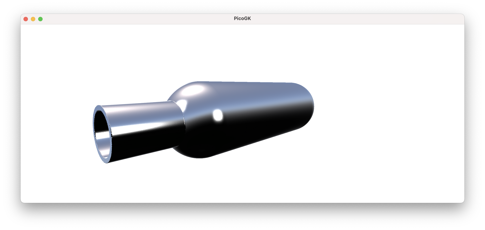
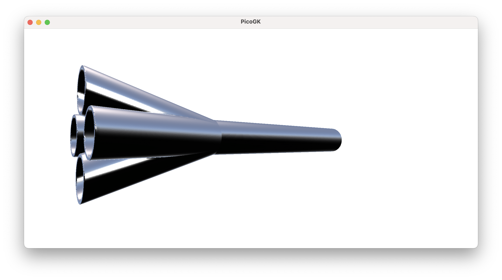
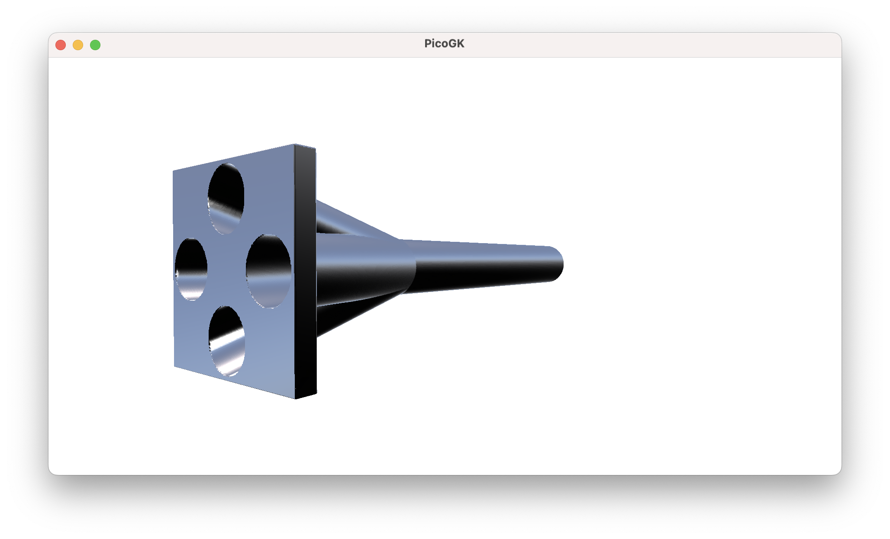
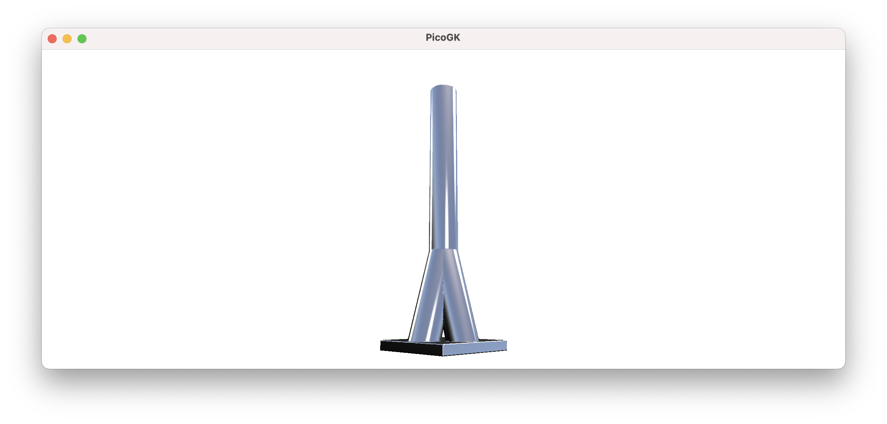
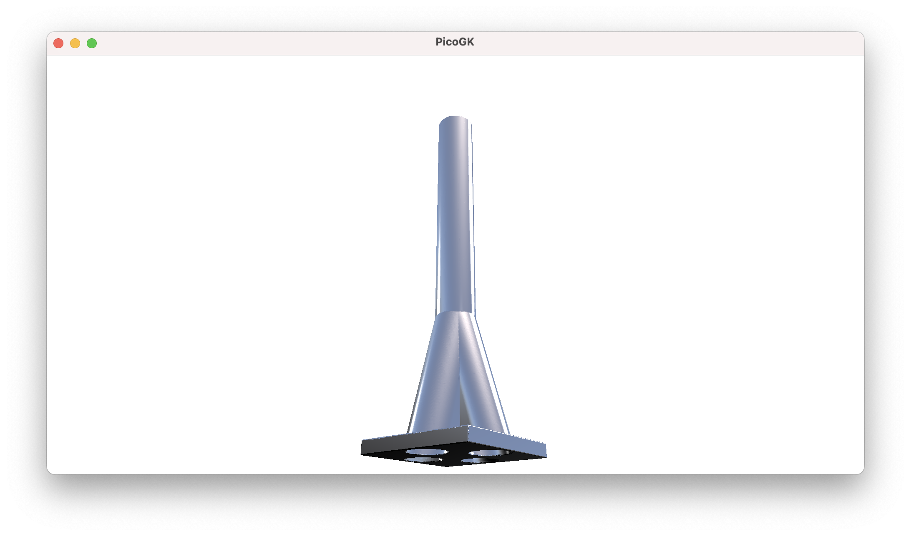
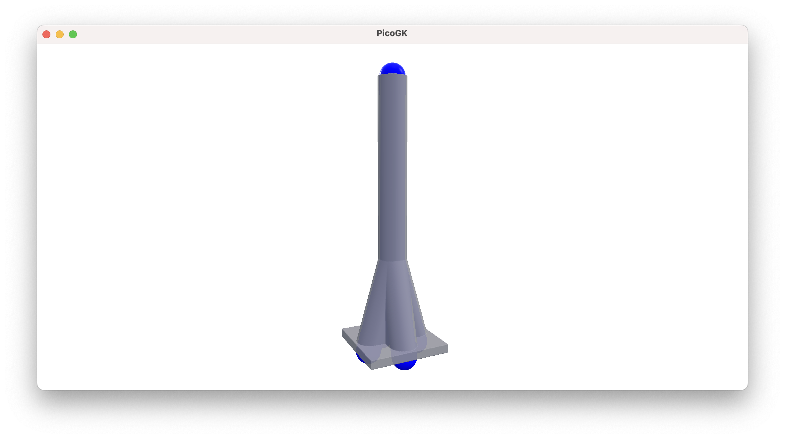
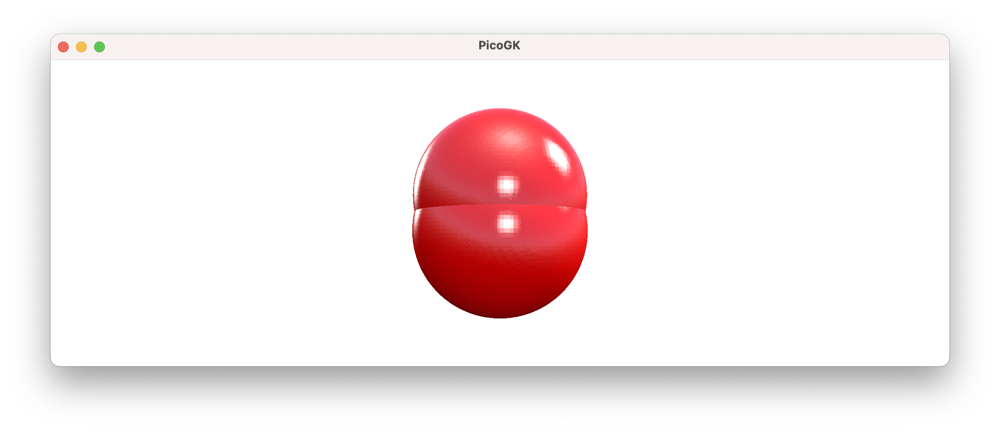
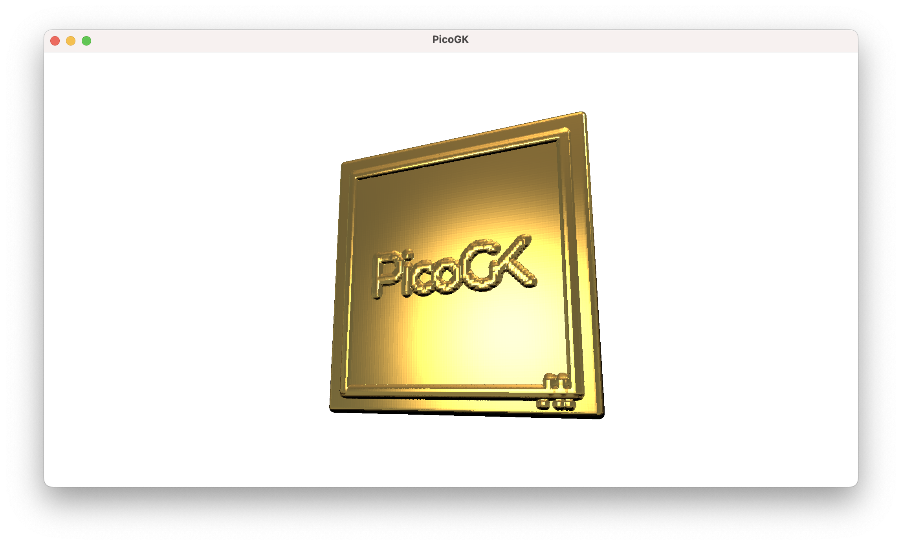

**[PicoGK.org](https://picogk.org)/coding for engineers**


**[Table of contents](TOC.md)**

# Computational geometry (Part 2)

In the last chapter, we looked at modeling simple pipe-like geometry using `Lattice` primitives as foundational blocks.

I emphasized that modeling the actual inside of a pipe, or more generally, modeling the functional volume of a device, has many advantages. To look at this hypothesis in more detail, let's model a pressure vessel connected to a pipe. 

If we model the fluid volume, it's a fairly straightforward process.

- Add a lattice beam for the vessel volume

- Add a lattice beam for the pipe

  ```c#
  Lattice latVesselVolume = new();
  latVesselVolume.AddBeam(Vector3.Zero, new(100,0,0), 20, 20);
                  
  Lattice latPipeVolume = new();
  latPipeVolume.AddBeam(Vector3.Zero, new(-51,0,0), 10, 10, false);
  ```


Now you have the functional volume of the device. How do you create the actual pressure vessel and pipe? Simply by offsetting outwards, and subtracting the inner volume. The resulting shape is thereby guaranteed to contain the fluid volume you want.

This is crucial for the physics-driven design used in Computational Engineering. In manual modeling, the function of an object is often not ideally expressed through its form. When geometry is created with a focus on the exterior shape, small imperfections and compromises frequently arise, impacting the object’s functional aspects.

```c#
Voxels voxFluidVolume = new Voxels(latVesselVolume) 
                        + new Voxels(latPipeVolume);

Voxels voxVessel = voxFluidVolume;
voxVessel.Offset(2);
voxVessel -= voxFluidVolume;
```



Now, this is still a simple object, and designing it "outside-in", like you would likely do in CAD, is maybe not a real issue. But you are beginning to glimpse the power of the approach. Let's take this a bit further. 

What about creating a manifold that combines 4 pipes into one?

```c#
Lattice latOutflowVolume = new();
latOutflowVolume.AddBeam(Vector3.Zero, new(0,0,100), 7, 7);
                
Lattice latInflowVolume = new();
latInflowVolume.AddBeam(Vector3.Zero, new( 15,0, -51), 7, 7);
latInflowVolume.AddBeam(Vector3.Zero, new(-15,0, -51), 7, 7);
latInflowVolume.AddBeam(Vector3.Zero, new(0,-15, -51), 7, 7);
latInflowVolume.AddBeam(Vector3.Zero, new(0, 15, -51), 7, 7);

Voxels voxFluidVolume   = new Voxels(latOutflowVolume) 
                          + new Voxels(latInflowVolume);
```



If you start with the fluid volume, it's really simple, as all you do is make all the fluids converge in one place. The shape of the pipes follows the shape of the volume, offsetted outwards. Since you are subtracting the inside volume from the pipes, your fluid is guaranteed to be occupying the space you defined for it.

This is an important insight, if you want to make modifications to the structure, but want to make sure the fluid path remains. Let's say, we want to add a mounting flange to the manifold. We simply add it to the structure before subtracting the fluid volume, and all our fluid paths continue to be functional.



While we are at it, we might want to fill in the gaps between the pipes. Any ideas how to do this?



We can just use our `ProjectZSlice` function to project the geometry of the upper part of the shape downwards, before we subtract the pipes again. We start at 0, where all pipes converge and project down to the lowest Z value of the bounding box.

```c#
BBox3 oBounds = voxVessel.oCalculateBoundingBox();
voxVessel.ProjectZSlice(0, oBounds.vecMin.Z);
```



I think you can imagine, how this can quickly evolve into fairly complex geometry.

Here is the result combined with the original fluid volume.



Of coutse, In a physically correct manifold, you likely will want to preserve the sum of cross-sectional area, using a larger diameter for the single pipe after the convergence. We will do this at a later point in the book.

## Painting in space

Now, there are a few more things you can do with lattices. You can literally use them to paint in space.

If you add two spherical lattices very close to each other, there is only a tiny change in the resulting curvature at the gap. Since our voxel field has an inherent resolution, as long as you space lattices in the dimension of the voxel size, you can build sophisticated shapes without introducing artifacts.



Let's try something like this:

```c#
Lattice latPaint = new();

Vector3 vecPos = Vector3.Zero;
for (float fAngle=0; fAngle<float.Pi*4; fAngle+=0.01f)
{
    vecPos.X += Library.fVoxelSizeMM;
    vecPos.Y = float.Sin(fAngle) * 20f;
    vecPos.Z = float.Cos(fAngle) * 50f;
    latPaint.AddSphere(vecPos, 5);
}
```

We run an angle from 0 to 360º (which in radians notation is expressed as `2*float.Pi`), we move our X a little bit, and calculate Y and Z as a sinus and cosinus of the angle.

The result is a swirling pipe.


This technique, while intriguing, may feel a bit crude, as it depends on you placing little spheres very close to each other. You have to be careful not to introduce artifacts that stem from the resolution of the spheres. But it is an entirely valid way of creating geometry, which can help in many cases, where it is not trivial to generate shapes in a more analytical way.

Combined with offsetting and other techniques we have already covered, it is an important part of our toolset.

## Painting pictures

To finish off this chapter, let's use this technique to convert an image into a 3D representation.

Here's how to load an image from file (PicoGK currently supports images in TGA format):

```c#
string strImagePath = Path.Combine(Utils.strProjectRootFolder(), "chapter_14/PicoGK.tga");
TgaIo.LoadTga(strImagePath, out Image img);
```

First, we construct the file name from the project location (you can hard code your own image path here). Then we load the image from the file, storing it in the variable `img`.

Now, we can iterate over the pixels in the image and move our lattice spheres to the right spot. 

The simplified code looks like this:

```c#
for (int x=0; x < img.nWidth; x++)
{
    for (y=0; y < img.Height; y++)
    {
        Vector3 vec = new(  x, 
                            y,
                            img.fValue(x,y)));

        latPaint.AddSphere(vec, 4f);
    }
}
```



Since an image has a different layout than our usual 3D coordinate system, and we need to do a bit over oversampling, flipping around, and inverting, the real code looks slightly more complex. But you get the idea.

What is important here is, we have used lattice painting to create volumetric geometry, without worrying about the topology of complex mathematical 3D shapes.

## Summary

In this chapter we looked at various ways we can use the `Lattice` class to build geometry. We reiterated how "inside out" is the right way to build shapes: If we model the inside volume for pipes and similar objects, we can guarantee functional integrity. The outer shell derives itself effortlessly through offsetting and subtraction. Even if we make substantial changes to the outside, when we subtract the inside last, the result is a working system.

Lastly, we took a quick excursion into painting lattice spheres in space to build geometry. While we usually will not create shapes that way, it is still a very powerful technique worth knowing about.

As usual, the [code for this chapter is on GitHub](https://github.com/LinKayser/Coding4Engineers).

------

Next: [**Computational geometry (Part 3)**](15-computational-geometry-part3.md)

[Jump into the discussion here](https://github.com/leap71/PicoGK/discussions/categories/coding-for-computational-engineers)

[Table of contents](TOC.md)

------

**[PicoGK.org](https://picogk.org)/coding for engineers**

© 2024 by [Lin Kayser](https://www.linkedin.com/in/linkayser/) — All rights reserved.