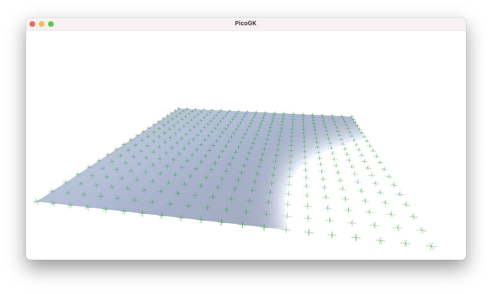
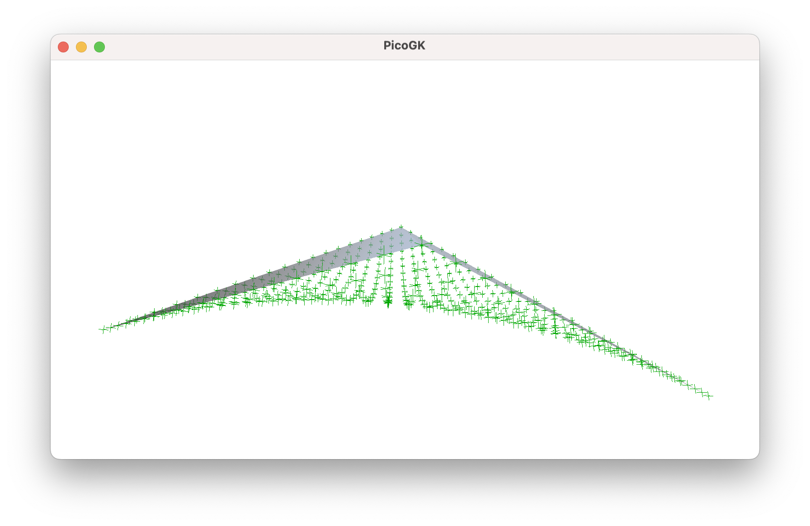
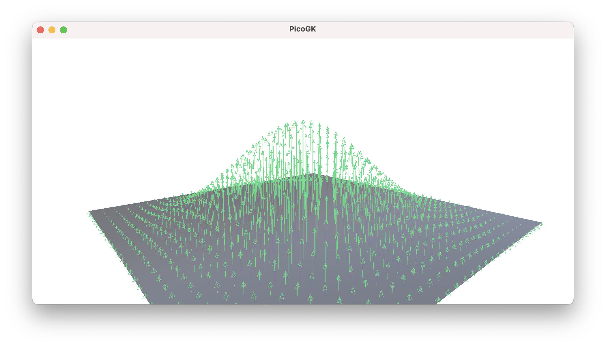
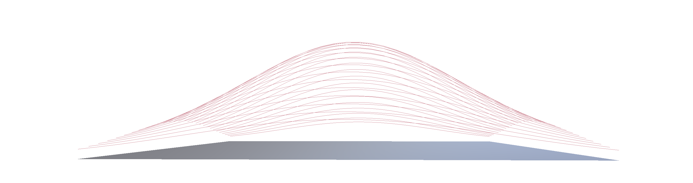
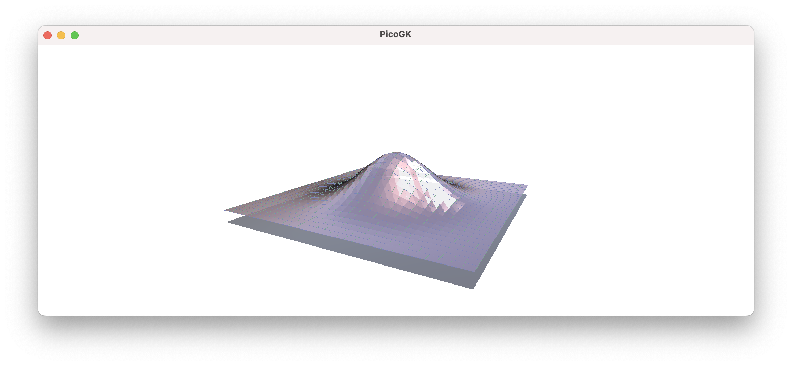
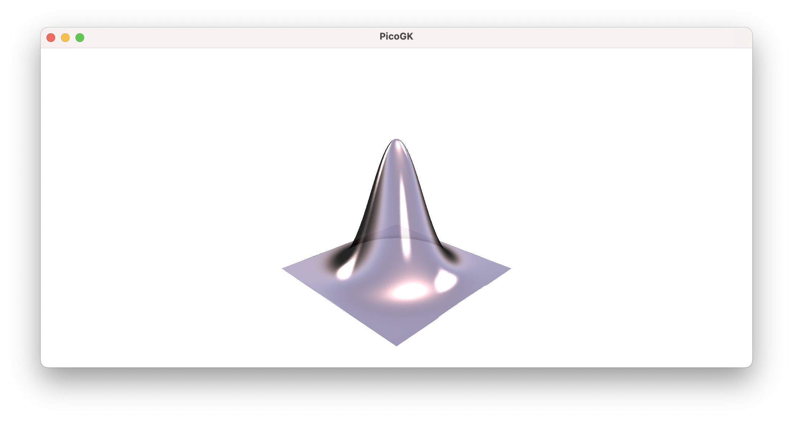
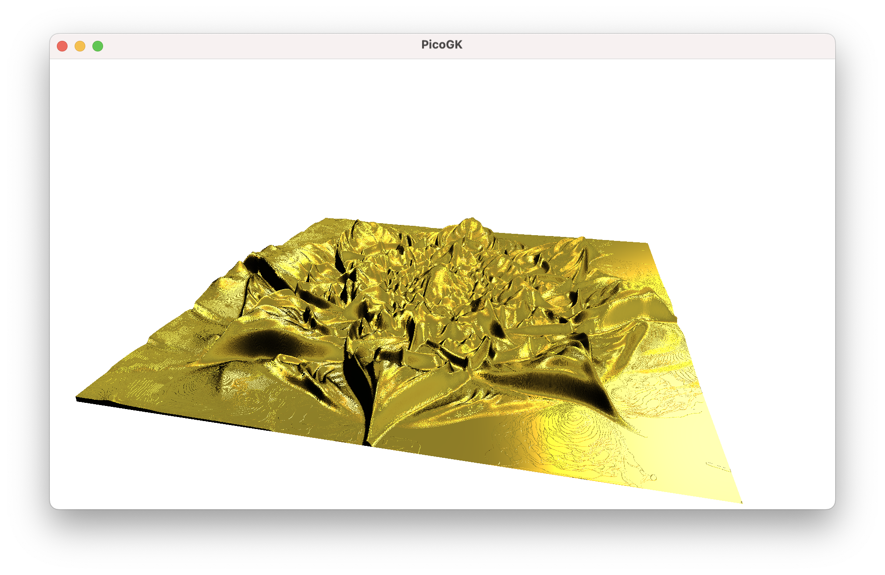

**[PicoGK.org](https://picogk.org)/coding for engineers**


**[Table of contents](TOC.md)**

# Computational geometry (Part 4)

We now know how to build simple mesh-based geometry.

But most of the objects we will want to create, are more complex than simple cubes and pyramids.

We will dive into mesh subdivision in this chapter, to help you build more elaborate meshes.

However, here's also a word of warning: If you try to build every feature of your object into one mesh, just like you would do it in parametric CAD, you will introduce the same issues that plague these decades-old systems: It is very hard to cover all edge cases, when dealing with parametric surfaces. In CAD, you frequently run into issues where the geometry kernel cannot unambiguously resolve the shape you are trying to design, leading to error messages and manual fumbling ("Cannot perform boolean operation").

When building computational geometry, it is best to keep things as simple as possible. The complexity arises from combining basic techniques and shapes with powerful operations, such as voxel booleans and offsetting.

But there is really not much that you can do wrong by modulating a surface of an object. So let's do this.

## Subdividing a mesh

Let's imagine, we wanted to emboss a logo onto the surface of a cube. How would we go about this?

The simplest way would to to subdivide the surface of the cube, so that we have enough vertices to represent the logo in its current resolution. And then we offset each vertex, perpendicular to the surface, based on the height of the logo at each logo pixels.

Subdividing a surface is therefore as simple as subdividing a quad.

What should be the result of our subdivision process? We could return a `Mesh,` with the subdivided quads. But maybe an easier way is, if we first store the intermediate result in a grid of coordinates. For this, we use a two-dimensional array.  

If you remember, to create a 1D array, we use the following syntax: `Vector3 [] avec = new Vector3[100]` which results in an array with 100 elements. To create a two-dimensional one, we can use the following syntax: `Vector3 [,] avec = new Vector3[100,500]`, which creates an array with 100 in the first dimension and the 500, the second dimension.

So let's go with the following function signature:

```c#
public static Vector3[,] avecSubdivideQuad(     int nSubDivX,
                            	                  int nSubDivY,
                                                Vector3 vecA, 
                                                Vector3 vecB, 
                                                Vector3 vecC, 
                                                Vector3 vecD)
{
  Vector3 [,] avecResult = new Vector3 [nSubDivX,nSubDivY];
  // ... TODO
  return avecResult;
}
```

So, we define our quad with the four corners, and we specify how many times it should be subdivided.

Now it is simply a question of interpolating along the two edges which are spanned up by the four corners.

```c#
public static Vector3[,] avecSubdivideQuad(     int nSubDivX,
                                                int nSubDivY,
                                                Vector3 vecA, 
                                                Vector3 vecB, 
                                                Vector3 vecC, 
                                                Vector3 vecD)
{
    Vector3 [,] avecResult = new Vector3 [nSubDivX,nSubDivY];

    for (int i = 0; i < nSubDivX; i++)
    {
        for (int j = 0; j < nSubDivY; j++)
        {
            // Calculate normalized interpolation factors
            float rTX = (float)i / (nSubDivX - 1); // Horizontal interpolation (0 to 1)
            float fTY = (float)j / (nSubDivY - 1); // Vertical interpolation (0 to 1)

            // Perform bilinear interpolation
            // Interpolate along the top and bottom edges
            Vector3 vecTopEdge      = Vector3.Lerp(vecA, vecB, fTX);
            Vector3 vecBottomEdge   = Vector3.Lerp(vecD, vecC, fTX);

            // Interpolate between the top and bottom edges
            avecResult[i, j] = Vector3.Lerp(vecTopEdge, vecBottomEdge, fTY);
        }
    }

    return avecResult;
}
```

First we calculate a normalized interpolation factor, which goes 0 to 1, with 1 being the last subdivision.

Then we determine our position along the top edge and the bottom edge, using the `tX` interpolation factor (keep in mind, that a quad doesn't have to be a square, or even a rectangle, so we cannot assume the X position of the two to be correlated, that's why we calculate them independently). `Lerp`, by the way, is just a linear interpolation function.

After we know the position along the top and bottom edges, we now need to find our weighted position perpendicular to the two edges. We do that using the last `Lerp` using the `tY` as weight.



# Modulating a grid

So now, we have our vertex positions of the subdivided quad, we can do something with it. Before we move onto actively modulating the vertices, I'd like to point out another interesting aspect of subdividing a quad. Usually quads are planar, but there is nothing that prevents you from inserting corners into the subdivision algorithm, that do not span up a planar surface. And the interpolation result gives you a nice curved grid. This is quite useful for many applications, because it allows you to smoothen a mesh.



But we leave this for another day.

Let's go back to our planar surface as that's the norm for our shapes. To demonstrate the modulation we add a simple Gauss distribution.

```c#
public static float fGaussDistribution2D(   float x, 
                                            float y, 
                                            float fSigmaX = 0.2f, 
                                            float fSigmaY = 0.2f)
{
    float fExpX = float.Pow(x - 0.5f, 2) / (2 * float.Pow(fSigmaX, 2));
    float fExpY = float.Pow(y - 0.5f, 2) / (2 * float.Pow(fSigmaY, 2));
    return float.Exp(-(fExpX + fExpY));
}
```

Now we just go over our vertex array, and apply the Gauss function to the vertices.	



If we do this blindly, we will end up with the above result. But there is a problem, I want to point out immediately. If you look closely, the vertices right at the edge of our quad will also be modulated. This could create gaps at the seams of our meshes,  and is definitely not what we want. We want our meshes to be *watertight*.



Here's the problem in more exaggerated form. You see that the transformed vertices leave a gap between the position of the original edge, and the new transformed, curved edge.

The easiest way to deal with this issue is to simply not touch the vertical coordinates of the edge vertices, and therefore keep the edge aligned with the edge of the adjacent face.

We will do this for now — but the better way is to look at subdivisions in a holistic way. In other words, subdivide a `Box` object, ensuring shared vertices at the edge, and not deal with faces individually — this is how the LEAP 71 Shape Kernel works. For now, however, we will look at the face only.

So, let's have the actual implementaton.

```c#
public static void ModulateGridGaussian(    ref Vector3 [,] avecGrid,
                                            Vector3 vecNormal)
{
    int nSizeX = avecGrid.GetLength(0);
    int nSizeY = avecGrid.GetLength(1);

    // Intentionally not modulating the edges, to keep them as-is
    // so we are starting a 1 (not 0) and ending one before the actual end
    for (int x = 1; x < nSizeX-1; x++)
    {
        for (int y = 1; y < nSizeY-1; y++)
        {
            // Calculate normalized interpolation factors
            float fTX = (float)x / (nSizeX - 1); // Horizontal interpolation (0 to 1)
            float fTY = (float)y / (nSizeY - 1); // Vertical interpolation (0 to 1)

            avecGrid[x,y] += vecNormal * fGaussDistribution2D(fTX,fTY) * 20;
        }
    }
}
```

We are passing our grid as a reference (which means, the original variable, which is passed, will also contain the result — more on that in a later chapter).


That doesn't look too bad.

Now, all we have to do is convert this array of vertices back into actual quads, and we have a `Mesh`.

Let's start by storing all vertices in a `Mesh` object, saving their index for later use.

```c#
public static int[,] anStoreGridVertices(ref Mesh msh, Vector3[,] avecGrid)
{
    int[,] anVertexIndices = new int[avecGrid.GetLength(0), avecGrid.GetLength(1)];
    for (int x = 0; x < avecGrid.GetLength(0); x++)
    {
        for (int y = 0; y < avecGrid.GetLength(1); y++)
        {
            anVertexIndices[x,y] = msh.nAddVertex(avecGrid[x,y]);
        }
    }
    return anVertexIndices;
}
```

After calling this function, we can deal with the vertex indices instead of the actual coordinates. 

Now all we need, is a way to convert these vertices into actual quads, and store them in the `Mesh`.

```c#
public static void AddGridQuadsToMesh(ref Mesh msh, int[,] anVertex)
{
    for (int x = 0; x < anVertex.GetLength(0)-1; x++)
    {
        for (int y = 0; y < anVertex.GetLength(1)-1; y++)
        {
            int n0 = anVertex[x, y];
            int n1 = anVertex[x, y + 1]; 
            int n2 = anVertex[x + 1, y + 1];
            int n3 = anVertex[x + 1, y];
            msh.AddQuad(n0, n3, n2, n1);
        }
    }
}
```



An there is of course nothing that prevents you from subdividing very finely, and building shapes that modulate the surface in more extreme ways. 



And lastly, in case you are bored by our Gauss curve, there is nothing that prevents you from applying more interesting deformations. Here is one coming from an image:



## Summary

We extended our mesh toolkit significantly in this chapter, looking into subdivision and modulating of vertices. We did this by

- Interpolating vertex positions inside a quad
- Moving these vertices perpendicular to the surface to create a modulated surface
- Reassembling these vertices back into quads, to insert them into a `Mesh`.
- We also touched on the subject of multidimensional array variables, and passing objects by reference, to influence the content of a variable outside our function.

In the next chapter we will look into a more holistic way to deal with surface modulations, and revisit some of the code we have written with our object oriented programming hat on.

As usual, the [code for this chapter is on GitHub](https://github.com/LinKayser/Coding4Engineers).

------

Next: **Computational geometry (Part 5)**

[Jump into the discussion here](https://github.com/leap71/PicoGK/discussions/categories/coding-for-computational-engineers)

[Table of contents](TOC.md)

------

**[PicoGK.org](https://picogk.org)/coding for engineers**

© 2024 by [Lin Kayser](https://www.linkedin.com/in/linkayser/) — All rights reserved.