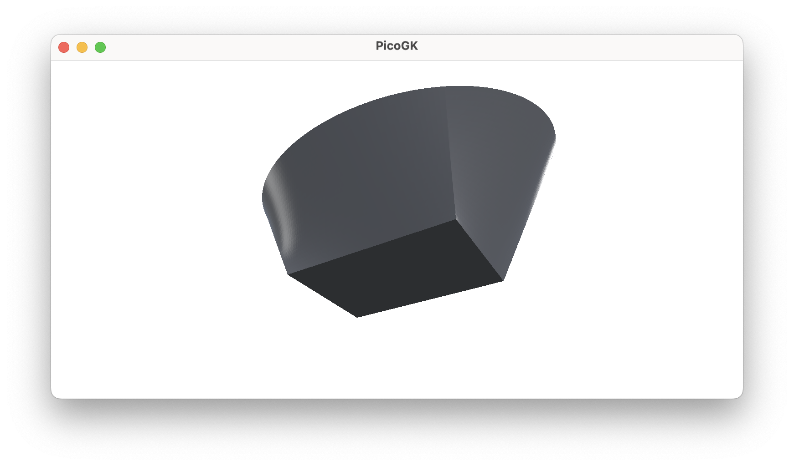
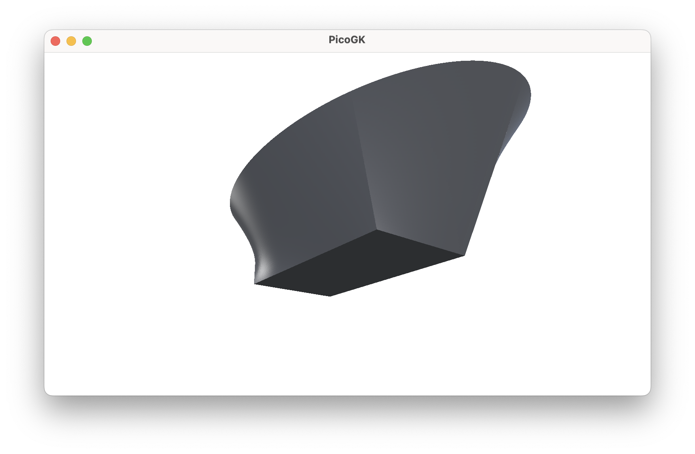
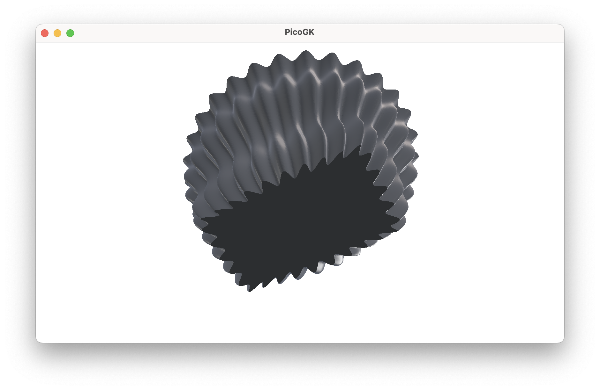
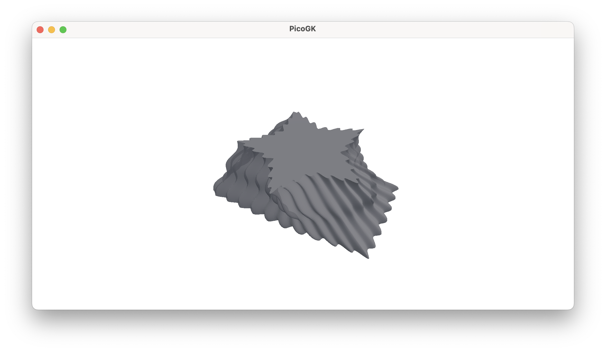

**[PicoGK.org](https://picogk.org)/coding for engineers**


**[Table of contents](TOC.md)**

# Computational geometry (Part 6)

Over the last chapters, we learned a lot about building meshes. In this chapter, we will wrap it up by abstracting many of the concepts we learned in the past chapters. I'll explain all this on a new base object, a cylinder. But not just any old cylinder. You will see that, by implementing some aspects in a generic way, a cylinder can be almost anything that has a top, a bottom, and a mantle surface.

## A generalized cylinder class

Let's think about a cylinder. A cylinder consists of two circles, which form the bottom and the top, and a connected surface that forms the mantle.

The two circles form the two edges, along which we will generate vertices that we can use to build the mantle surface from quads. Now an interesting question we can ask ourselves is: Could we abstract the shape that forms the contour of the edge, so it doesn't have to be a circle? What if we could simply say, the two edges could be made up of any closed contour?

An ellipse, a polygon even?


How would we implement that?

### Generalized 2D contours

First of all, it is clear that the contour should be on a 2D plane. So we are dealing with `x/y` coordinates. And the contour needs a function to acquire points that lie on the contour, based on a value `t` where `0` is the beginning of the contour and `1` is the end of the contour (which, as it is a closed contour, is the same coordinate as at value `0`).

So we can now create an interface that abstracts this:

```c#
public interface INormalizedContour2d
{
    public void PtAtT(  in  float t,
                        out Vector2 vecPt);
}
```

A circle now is implemented very simply like this:

```c#
public class Circle : INormalizedContour2d
{
    public Circle(float fR)
    {
        m_fR = fR;
    }

    public void PtAtT(in float t, out Vector2 vecPt)
    {
        // convert from 0..1 to 0..360º
        float fAngle = t * float.Pi * 2; 

        // calculate point on circle 0..360º
        vecPt =  new (  float.Cos(fAngle) * m_fR,
                        float.Sin(fAngle) * m_fR);
    }
}
```

Position `0` is at the beginning of the circle path, position `1` is at 360º, which is identical to `0`, closing the circle.

So now we have a simple way to sample points on a contour, and have implemented an example in the form of a circle.

We can now describe any closed 2D shape that way, complex geometries, rectangles, etc. And they are all used the same way.

Let's implement an ellipse to show how powerful this is:

```c#
public class Ellipse : INormalizedContour2d
{
    public Ellipse(float a, float b)
    {
        m_fA = a;
        m_fB = b;
    }

    public void PtAtT(in float t, out Vector2 vecPt, out Vector2 vecNormal)
    {
        float fAngle = t * 2f * float.Pi;
        vecPt = new Vector2( m_fA * float.Cos(fAngle), 
                             m_fB * float.Sin(fAngle));
    }
}
```

So this gives you an ellipse, with length `a` and `b`.

You can now use an `Ellipse` in the same way as you can a `Circle`. For our future `BaseCylinder` class, it is irrelevant what the shape actually is, as long as it implements the `INormalizedContour2D` interface, which allows us to sample points over the length of the circumference.

And if you wanted to use a star shape, or any other polygonal closed contour, you could implement a class like this:

```c#
public class PolyContour2d : INormalizedContour2d
{
    public PolyContour2d(in Vector2 [] avecVertices)
    ...
```

And if you have the above, you can easily create a class that holds a rectangle:

```c#
public class Rectangle : PolyContour2d
{
    public Rectangle(   float fLengthA, 
                        float fLengthB)
        : base([    
                    new Vector2(-fLengthA/2, -fLengthB/2),
                    new Vector2( fLengthA/2, -fLengthB/2),
                    new Vector2( fLengthA/2,  fLengthB/2),
                    new Vector2(-fLengthA/2,  fLengthB/2)) 
                ])
        {
```

You get the idea. 

We have now abstracted the top and bottom shape of our cylinder. If we use `Circle` objects with the same radius, we actually get a cylinder. But if we use other shapes, we get entirely different objects, even though the geometric logic is the same.



### From 2D to 3D

To position a 2D shape in space, we need to move it to the right place. Again, we can abstract this.

To define a position and orientation in space, we have to implement a class that encapsulates a local coordinate system, often called a *frame*, a `LocalFrame`.

```c#
public class LocalFrame
{
    /// <summary>
    /// Transforms a point defined in the local frame
    /// coordinate system into the world coordinate system
    /// </summary>
    public Vector3 vecToWorld(Vector3 vecPoint)
    {
        ...
    }
}
```

The `LocalFrame` object provides a coordinate transformation from localized coordinates, for example our 2D coordinates of our `Circle` , to the actual place where you want to position the object in world coordinates. The `LocalFrame` also allows you to orient it, if you don't want it to align with the world `XYZ` coordinates.

I will spare you the exact implementation (you find it in the source code for this chapter). But it is at the core of much of what you will do in placing computational geometry. By abstracting the actual positioning and orientation, you can, as we do it with the contours, define your shapes in a local coordinate system, without having to think about the real world coordinates.

Now, to place our 2D object properly in 3D space, we can implement a helper class that allows us to do just that:

```c#
public class OrientedContour
{
    public OrientedContour( LocalFrame frm,
                            INormalizedContour2d xContour)
    {
        m_xContour  = xContour;
        m_frm       = frm;
    }

    public void PtAtT(  in  float t,
                        out Vector3 vecPt)
    {
        m_xContour.PtAtT(t, out Vector2 vecPt2d, out Vector2 vecN2d);
        vecPt = m_frm.vecToWorld(vecPt2d);
    }

    readonly LocalFrame             m_frm;
    readonly INormalizedContour2d   m_xContour;
}
```

We pass a 2D contour and a `LocalFrame` and get an oriented contour in 3D space, which we can sample as before, but now returning 3D world coordinates.

Now we are ready to implement our `BaseCylinder`.

### Drawing a cylinder in space

To build our `BaseCylinder`, we need to pass the two 2D contours, and a `LocalFrame` that describes the place and orientation of the cylinder object. We also need to pass the height, in other words, the distance between the two contours/edges.

```c#
public BaseCylinder(    LocalFrame frm, 
                        INormalizedContour2d oEdgeBottom, 
                        INormalizedContour2d oEdgeTop,
                        float fHeight)
{
    m_frm				= frm;  
    m_oEdgeBtm  = oEdgeBottom;
    m_oEdgeTop  = oEdgeTop;
    m_fHeight   = fHeight;
}
```

Now, how would we actually implement a cylinder, if we don't want fancy shapes? 

Quite easy, let's add another constructor:

```c#
public BaseCylinder(    LocalFrame frm,
                        float fRadius,
                        float fHeight) : this(  frm, 
                                                new Circle(fRadius), 
                                                new Circle(fRadius), 
                                                fHeight)
{

}
```

OK, what is happening here? 

We defined a second constructor which takes a `LocalFrame` as before, a `fRadius`, which is the radius of the circle at the top and bottom, and `fHeight` as before. We use the `this` syntax to call the existing constructor, which takes two 2D contours. We pass two `Circle` objects which we construct from the supplied radius.

Simple, isn't it?

Now, let's create the actual `Mesh` of the cylinder object. We implement a function named `mshConstruct`.

Let's first create two new `LocalFrame` objects by offsetting the position of the existing coordinate system. These two new coordinate systems represent the position of the center of the cylinder upwards and downwards:

```c#
public Mesh mshConstruct()
{
    // Move the edges to top and bottom of the cylinder, respectively 
    LocalFrame frmTop = frm.frmTranslatedZ( fHeight/2);
    LocalFrame frmBtm = frm.frmTranslatedZ(-fHeight/2);
```

Now we have coordinate systems for the top and bottom edges.

We can now initialize two `OrientedContour` objects with the respective frames and 2D contours, so we have the shapes oriented in space, ready to be sampled.

```c#
    // Position the 2D contours in space
    OrientedContour oTop = new(frmTop, m_oEdgeTop);
    OrientedContour oBtm = new(frmBtm, m_oEdgeBtm);
```

It's time to construct the mesh. In the actual implementation, we do some calibration and adaptive mesh subdivision. For the example below, I am just assuming a fixed subdivision in height and around the cylinder. 

Let's call the coordinates around the cylinder circumference `U` and the coordinates for the height `V`. Together `U` and `V` describe a two-dimensional plane that is wrapped around to form the mantle of the cylinder. It is interesting to think about it that way, because now the cylinder is just a geometric shape made up of three 2D surfaces, the top, the bottom, and the mantle. With the interesting caveat, that the mantle surface maps back from the position `U=1` to the position `U=0`, where it all started, forming a tube.

To create the top and bottom cap of the cylinder, we need to draw triangles which are formed by two adjacent edge coordinates and the center of the contour. Conveniently, the center of our normalized 2D contours, in our case the circle's midpoint, lies always at `0/0`. So we simply transform the 2D coordinate `0/0` to world coordinates using the `LocalFrame` object for bottom and top center respectively. We then add each center vertex to our mesh, and store the index for use when building our triangles.

```c#
    int nSubU = 100; // assumed subdivision around the mantle
    int nSubV = 100; // assumed subdivisions for the height

    Mesh msh = new();

    Vector3 vecBtmCenter = frmBtm.vecToWorld(Vector2.Zero);
    Vector3 vecTopCenter = frmTop.vecToWorld(Vector2.Zero);

    int nTopCenter = msh.nAddVertex(vecTopCenter);
    int nBtmCenter = msh.nAddVertex(vecBtmCenter);
```

Now it's time to generate the vertices along the edges. Since we need this a few times, let's encapsulate it into a function:

```c#
private int [] anGenerateEdgeVertices(  ref Mesh msh,
                                        OrientedContour oBtm,
                                        OrientedContour oTop,
                                        float fV,
                                        int nSubDiv)
{
    int [] anIndices = new int[nSubDiv];

    // Generate the vertex indices for the specified V location
    ...

    return anIndices;
}
```

Let's look at this step by step. First, we create an array to hold the vertex indices for the generated edge. Then we loop through all the subdivision steps and calculate the normalized coordinate `fU`, which runs from `0..1` along the contour.

```c#
int [] anIndices = new int[nSubDiv];

// Generate the vertex indices for the specified V location

for (int u=0; u<nSubDiv; u++)
{
    float fU = u / (float) nSubDiv;
```

We use now use that coordinate to get the vertex coordinate from the top contour and bottom contour. We then linearly interpolate between these to get the position in `V` along the height of the cylinder. We add that interpolated point to the mesh, and store the vertex coordinate in the edge array, so we can refer to it when building our quads.

```c#
    oBtm.PtAtT( in  fU,
                out Vector3 vecPtBtm);

    oTop.PtAtT( in  fU,
                out Vector3 vecPtTop);

    Vector3 vecCurPt = new Vector3(     float.Lerp(vecPtBtm.X, vecPtTop.X, fV),
                                        float.Lerp(vecPtBtm.Y, vecPtTop.Y, fV),
                                        float.Lerp(vecPtBtm.Z, vecPtTop.Z, fV));

    anIndices[u] = msh.nAddVertex(vecCurPt);
```

Once we are done with, we return the edge coordinate index array for use in our mesh construction.

```c#
    }

    return anIndices;
}
```

Let's go back to our `mshConstruct` function and see how we use it. 

First, we store the bottom and top edges in a dedicated array, because we will require them for the bottom and top patches. You can see we use `V` coordinate `0` for the bottom and `V` coordinate `1` for the top of the cylinder.

We add triangles for the caps at top and bottom by going around the edge and connecting each two adjacent vertices with the center. Note how we flip the bottom triangles to have the right surface orientation by reversing the vertex order.

If you are wondering why we use this expression: `anVBtm[(u+1) % nSubU]` instead of simply `anVBtm[u+1]`. If we used the latter, we would run out of the array bounds at the last element. The modulo operator `%` ensures we wrap around to `0`, connecting the last vertex to the first.

```c#

    // Vertex index storage for the top and bottom edges
    int [] anVBtm  = anGenerateEdgeVertices(ref msh, oBtm, oTop, 0f, nSubU);
    int [] anVTop  = anGenerateEdgeVertices(ref msh, oBtm, oTop, 1f, nSubU);

    // Generate top and bottom mesh
    for (int u=0; u<nSubU; u++)
    {
        // Add bottom triangle
        msh.nAddTriangle(   anVBtm[(u+1) % nSubU],
                            anVBtm[u], 
                            nBtmCenter);

        // Add top triangle
        msh.nAddTriangle(   anVTop[u], 
                            anVTop[(u+1) % nSubU], 
                            nTopCenter);
    }
```

Now we have the bottom and top patches, it's time to add the quads for the mantle. 

We do this by starting at the bottom edge, and then successively moving upwards. The previous edge is stored in the `anPrvEdge`. We start at index `1`, not `0`, since we skip the bottom edge, since it is represented by `anPrvEdge`:

```c#
    int [] anPrvEdge = anVBtm;

    for (int v=1; v<=nSubV; v++)
    {
        int [] anCurEdge = (v==nSubV) ?
                                    anVTop : 
                                    anGenerateEdgeVertices( ref msh, 
                                                            oBtm, oTop, 
                                                            v/(float)nSubV, 
                                                            nSubU, 
                                                            fBtmCorr);
        for (int u=0; u<nSubU; u++)
        {
            msh.AddQuad(    anPrvEdge[u],
                            anPrvEdge[(u+1) % nSubU],
                            anCurEdge[(u+1) % nSubU],
                            anCurEdge[u]);
        } 
    }

    return msh;
}
```

And that's it. You have created a generalized cylinder, whose underlying 2D cross sections can be customized. We used everything we learned about meshes in the previous chapters, but abstracted the process in an elegant way.

One thing that I hope became clear is how powerful interfaces and base classes are in this context. While there is a lot going on behind the scenes, the final code that you use to create complex shapes is very lightweight and readable.

```c#
BaseCylinder oCyl = new(    LocalFrame.frmWorld, 
                            new Rectangle(1f, 2f),
                            new Ellipse(1f, 2f),
                            1);

Mesh msh = oCyl.mshConstruct();
```

These few lines of code create a sophisticated geometry at the world's origin, oriented along the world's `XYZ` axis, with a rectangular shape at the bottom and an elliptical shape at the top.



Now, with a bit more work, we can also add a surface modulation to the mantle.

### Modulating the surface of the cylinder 

Again, let's abstract the surface modulation to an interface:

```c#
public interface ISurfaceModulation
{
    /// <summary>
    /// Returns the normalized offset (0..1) at surface coordinate u/v
    /// </summary>
    /// <param name="u">Surface coordinate U 0..1, usually in the width direction of a surface</param>
    /// <param name="v">Surface coordinate V 0..1, usually in the height direction of a surface</param>
    /// <returns>Normalized offset 0..1</returns>
    float fOffset(float u, float v);
}
```

Again, we use normalized coordinates, `0..1` for the `u/v` coordinates, and `0..1` also for the height, with `1` being the max. If we do it that way, we never have to worry about the actual sizes of the objects we are dealing with.

The actual implementation is in this chapter's source code. But with very little effort, you can now create objects like this:



Or this:



Which are definitely not your grandparents' cylinders.

I think you can glimpse the power of an object-oriented approach to base geometry. Meshes are very powerful, and if navigated carefully, you can use them to build very complex parts. But again, it is important to keep things as basic as possible. It is easier to use boolean operations to cut holes, for example, than trying to build a complex mesh topology that directly incorporates them.

Over time, you will gain the experience to make the right calls.

 ## Summary

With this chapter, we are wrapping up, for now, our excursions into the world of mesh generation. 

Fortunately, you will likely never have to dive into this level of detail again. While it is important to understand the foundations of mesh geometry, you will usually work more on a higher plane, configuring base shapes using the techniques of this chapter. You will choose simple shapes, modulate surfaces, and maybe bend their spines. Very rarely will you ever have to drill in and think about adding quad patches in the right order.

As usual, the [code for this chapter is on GitHub](https://github.com/LinKayser/Coding4Engineers). Again, for better readability, the code is split into multiple `.cs` files. 

------

Next: **Computational geometry (Part 7)**

[Jump into the discussion here](https://github.com/leap71/PicoGK/discussions/categories/coding-for-computational-engineers)

[Table of contents](TOC.md)

------

**[PicoGK.org](https://picogk.org)/coding for engineers**

© 2024-2025 by [Lin Kayser](https://www.linkedin.com/in/linkayser/) — All rights reserved.