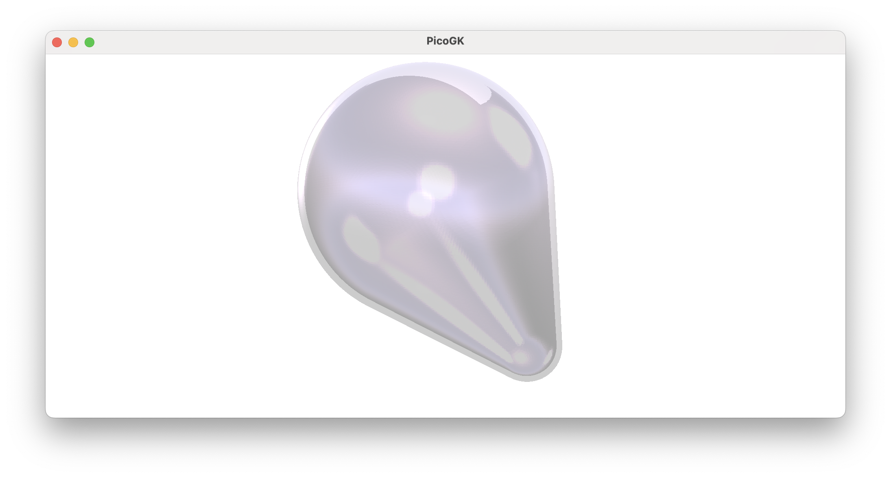

**[PicoGK.org](https://picogk.org)/coding for engineers**


**[Table of contents](TOC.md)**

# Computational geometry (Part 8)

Since we started our journey diving deep into computational geometry, we have always *explicitly* described the shape of an object. We placed lattice nodes, we set vertices, we created triangles in the right orientation, building geometry in a very direct way. We call this *explicit geometry*, because it, well, it's kind of in your face.

During our journey, we found that, while simple for trivial shapes, explicit geometry is not for the faint of heart. It's easy to create impossible or faulty geometry. There’s another approach, and by the end of this chapter, you’ll see we’ve already used it extensively.

Let's dive into *implicit* geometry.

## Implicit geometry

Implicit geometry, short for *implicits*, is called that because it indirectly describes a shape using a mathematical formula. This formula, for every point in space, defines the *distance to the surface* of an object. So, if you are directly on the surface of an object, it returns a distance of zero. As you move away, it returns larger and larger values. If you happen to be *inside* the object, the distance to the surface turns negative. 

To render such an object, you basically choose a certain sampling distance, and evaluate the function. If it returns negative or zero values, you render the object solid; if you get values larger than zero, you don’t do anything.

This of course is a perfect fit for our voxel-based methodology, where we already have a grid, based on the voxel resolution. In fact, our `Voxels` class internally stores the signed distance to the surface for all objects, when you voxelize them. `Voxels`, as implemented in PicoGK, are *discretized narrow-band signed distance fields*. *Discretized*, because they have a defined resolution, *narrow-band*, because they only store the distance values for a relatively narrow region around each object, to save memory. 

Let’s move past the theory and explore our first simple object.

## An implicit sphere

How would you define a sphere as a formula? Let's first make our sphere infinitesimally small, so it becomes a point.

To calculate distance to a point in space we can simply use the Pythagorean theorem in 3D. We want the distance to a point in space, defined by `x`,`y`,`z`. For simplicity's sake, we assume the point is at the origin. 

```d²=x²+y²+z²```

The square root of the resulting `d²` gives us the distance to the point. Remember that we want negative distances inside the object, and positive values outside. We subtract the radius `r` from the square root to get the distance to a sphere of radius `r`. If the distance is smaller than `r`, we get negative values, if the distance is exactly `r` we get zero, if the distance is larger than `r`, we get positive values.

So our signed distance function for a sphere looks like this:

```c#
float fSignedDistance(in Vector3 vec)
{
    float fRadius = 3;
    return  float.Sqrt(	vec.X * vec.X +
            						vec.Y * vec.Y +
            						vec.Z * vec.Z) -
            fRadius;
}
```

And you get a sphere with a radius of 3.

Let's try this out. Let's implement this in a class, and use the handy interface `IImplicit` that PicoGK gives us. The only thing `IImplicit` asks from us is that we implement the above function.

```c#
public class ImplicitSphere : IImplicit
{
    public ImplicitSphere(float fRadius)
    {
        m_fRadius = fRadius;
    }
    public float fSignedDistance(in Vector3 vec)
    {
        return  float.Sqrt( vec.X * vec.X +
                            vec.Y * vec.Y +
                            vec.Z * vec.Z)
                 - m_fRadius;
    }

    float m_fRadius;
}
```

How do we use it? The `Voxels` object provides a function to render an `IImplicit`-derived object. You simply provide the object, and a sampling region in the form of a bounding box. Our bounding box, of course, has the size of the sphere.

```c#
ImplicitSphere oSphere = new(3);

Voxels vox = new();
vox.RenderImplicit(oSphere, new BBox3(  new Vector3(-3,-3,-3),
                                        new Vector3(3,3,3)));
```

And we get the following result:


Now, you will say that it doesn't make sense to have to provide the sampling region for objects that clearly have a bounding box, and you are right. Why can't the render function ask the object for its bounding box? Of course it can. Let's derive from `IBoundedImplicit` instead:

```c#
public class ImplicitSphere : IBoundedImplicit
{
    public ImplicitSphere(float fRadius)
    {
        m_fRadius = fRadius;
    }
    public float fSignedDistance(in Vector3 vec)
    {
        return float.Sqrt(  vec.X * vec.X +
                            vec.Y * vec.Y +
                            vec.Z * vec.Z) - m_fRadius;
    }

    BBox3 IBoundedImplicit.oBounds => new (     new(-m_fRadius,-m_fRadius,-m_fRadius),
                                                new( m_fRadius, m_fRadius, m_fRadius));

    float m_fRadius;
}
```

All `IBoundedImplicit` asks of you is that you return the bounding box as a property, which we are doing here.

And our code shortens to 

```c#
Voxels vox = new();
vox.RenderImplicit(new ImplicitSphere(3));

```

Or, because `Voxels` has a handy constructor that takes an implicit object, you can simply write:

```c#
Voxels vox = new(new ImplicitSphere(3));
```

## When to use Implicits

Implicits are extremely elegant. They have none of the issues that plague complex meshes based on floating point vector math. There is really no arguing whether you are inside or outside an object, it's all based on the result of your formula.

But there's a downside, of course. When you think of an object, it's usually not difficult to come up a relatively clear *explicit* description of its shape. Coming up with a formula that evaluates the distance to the surface is a complex undertaking. One way to get around this is by assembling an object from subcomponents, and merging the formulas into one giant expression. But things get difficult quickly. Nevertheless, there are people who are masters of this technique, one stand-out individual is [Inigo Quilez, who has shared many examples on his website](https://www.shadertoy.com/view/ld3Gz2).

In our work at LEAP 71, we have found it best to use Implicts for procedural geometry, like infill patterns, and explicit geometry for the engineering side of things. However, with a twist: Since it is trivial to compute the distance to an explicit geometry, such as a triangle mesh, we always render to a `Voxels` object, which then stores a 'pixelated' signed distance field. In a way, Implicits lie at the foundation of PicoGK, but not by forcing everyone to use them for each aspect of their geometry.

Instead of stacking formulas, we render into `Voxels` objects, and then use the underlying signed distance field for boolean operations, offsetting, etc.

So, unless you are a math genius, it's best to stick to truly procedural patterns for the use of signed distance functions. Even seemingly trivial shapes, like an ellipsoid, are surprisingly complex to define using implicits.

But you have seen one signed distance function that has become synonymous with 3D printing (and certain software packages). People use it all of the time, because it's so simple to render, and it has some nice features. However, if you ask me, it is over-used. But here we go:

## The Gyroid

The *gyroid* was discovered in the 1970s by NASA scientist Alan Schoen. It is a structure that repeats in all three dimensions and is perfectly balanced between being concave and convex. There are other triply periodic minimal surfaces (such as the ones found by Hermann Schwartz in the 1800s), but the gyroid is certainly the most widely used for infill structures. You can even find them in nature.

The gyroid is defined by an elegant function:

```sin(x)*cos(y) + sin(y)*cos(z) + sin(z)*cos(x) = 0
sin⁡(x)*cos⁡(y)+sin⁡(y)*cos⁡(z)+sin⁡(z)*cos⁡(x)=0
```

Let's create a `ImplicitGyroid` class in C#. Since a gyroid is unbounded, it repeats forever, we derive our class from `IImplicit` and not `IBoundedImplicit`, because, well, there is no bounding box.

```c#
public class ImplicitGyroid : IImplicit
{
    public ImplicitGyroid(  float fUnitSize,
                            float fThickness)
    {
        m_fUnitSize     = fUnitSize;
        m_fThickness    = fThickness;
    }
    public float fSignedDistance(in Vector3 vec)
    {
        ...
    }

    float m_fUnitSize;
    float m_fThickness;
}
```

I'll spare you the implementation, it's in this chapter's code repository. But as a result, we get this:


You have seen this many times, and it is a cool structure. You can also see that it's a bit dangerous to use an unbounded implicit with an explicitly-defined bounded box. There are things cut off, and some of the surfaces are not closed, because the signed distance field was cut off without it having a positive distance (=outside). So we have cut it off while we were still inside.

The right way to use an implicit infill structure is to intersect it with something that already exists inside the `Voxels` object. And this is how you can create infills in existing structures.

So, let's create an infill in this lattice:


Do you remember how to create a `Lattice`?

```c#
Lattice lat = new();

lat.AddBeam(    Vector3.Zero,
                new(6,0,8),
                2,
                3);

Voxels vox = new(lat);
```

Now, we have a `Voxels` object that we can use to intersect with our `ImplicitGyroid`.

```c#
ImplicitGyroid oGyroid = new(2, .5f);
vox.IntersectImplicit(oGyroid);
```

And we have filled our beam with a gyroid pattern.


Simple, right?

Now, finally, let's do something that you may want to do, when you lightweight something: Create a thin shell, and inside fill the rest with a gyroid.

How would you do this?

Booleans to the rescue. Let's first create a copy of our voxelized lattice. Then we use the `Offset` function to offset it inwards. Then we subtract this smaller object from our main beam. We have a hollow object now. Now we intersect the smaller object with the gyroid, to generate the infill pattern. Then we boolean it all together again.

What’s happening in the background, by the way, relies heavily on signed distance functions. When you voxelize the lattice, the lattice is rendered using an implicit function that can render cylinders and spheres.

When you offset the result, the signed offset value is added to the values in the `Voxels` grid, changing the distance (and therefore the position of the surface). When you boolean the two `Voxels` objects together, all that's happening in the background is, again, a mathematical operation on the two grids with signed distance values. `BooleanAdd` is simply `float.Min(val1, val2)`. You compare the values in the two fields, and choose the smaller one, to merge the two objects.

Here is the final code which creates the shelled object.

```c#
Lattice lat = new();

lat.AddBeam(    Vector3.Zero,
                new(6,0,8),
                2,
                6);

Voxels vox = new(lat);

Voxels voxSmaller = vox.voxOffset(-0.3f);
vox -= voxSmaller; // Create shell

ImplicitGyroid oGyroid = new(2, .5f);
voxSmaller.IntersectImplicit(oGyroid);

vox += voxSmaller;
```

Let's go through this. First we create a lattice object as before and voxelize it.

We then create a smaller copy of the voxelized lattice by using the shorthand syntax 

`````c#
Voxels voxSmaller = vox.voxOffset(-0.3f);
`````

which is the same as:

``` c#
Voxels voxSmaller = new(vox); // make copy
voxSmaller.Offset(-0.3f);
```

Then we subtract the smaller voxel field from the larger one, creating a shelled object.



Then we render the gyroid into the smaller object in order to create the infill.

As the last step, we add the infill to our object, creating an object with a hard shell, and a sparse infill.


And there we are. This is the best use of implicits — repetitive infills. Even those are a bit over-used, and you should carefully evaluate whether they make sense for your application. But gyroids, and some of their neighbors, such as Schwarz minimal surfaces, can be useful for these applications.

Unfortunately, because they are so tempting to use in some software packages, people are using them for things that make no sense, such as heat exchangers, or even rocket engines. While gyroids have a large surface area, they usually create dead ends, and their very curvy nature creates high pressure drops, which you don't want in heat exchangers. 

Using fancy-shaped pipes is usually a better idea, and we have put some examples on our Github.

## Summary

With this chapter we are closing our excursion into computational geometry. The next chapters will, again, deal with coding, structuring of projects, and we will progress on building Computational Engineering Models, that, as one of their outputs, create computational geometry based on the principles we have outlined here.

As usual, the [code for this chapter is on GitHub](https://github.com/LinKayser/Coding4Engineers). Again, for better readability, the code is split into multiple `.cs` files. 

------

Next: **A few useful shortcuts in coding that you should know**

[Jump into the discussion here](https://github.com/leap71/PicoGK/discussions/categories/coding-for-computational-engineers)

[Table of contents](TOC.md)

------

**[PicoGK.org](https://picogk.org)/coding for engineers**

© 2024-2025 by [Lin Kayser](https://www.linkedin.com/in/linkayser/) — All rights reserved.