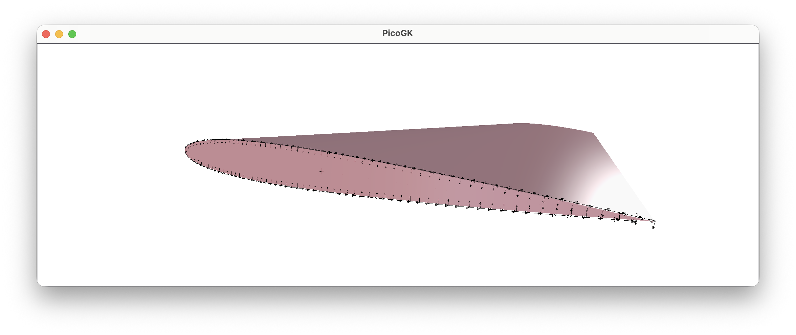
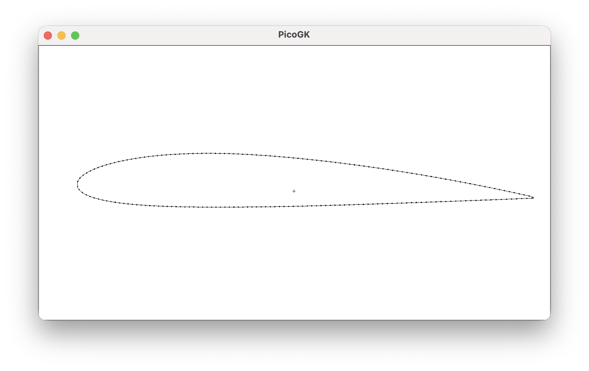
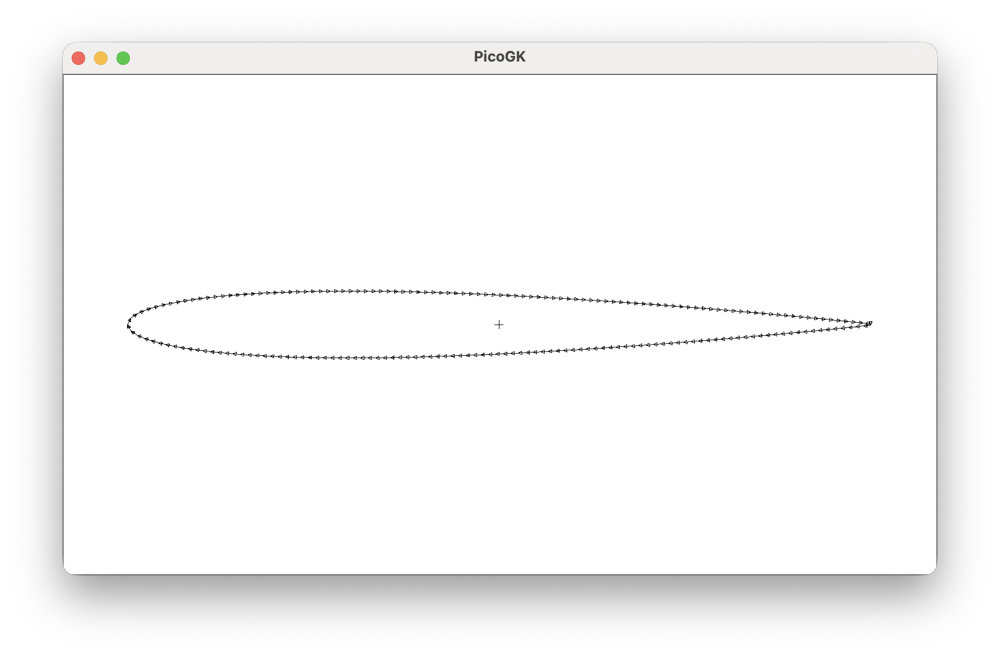
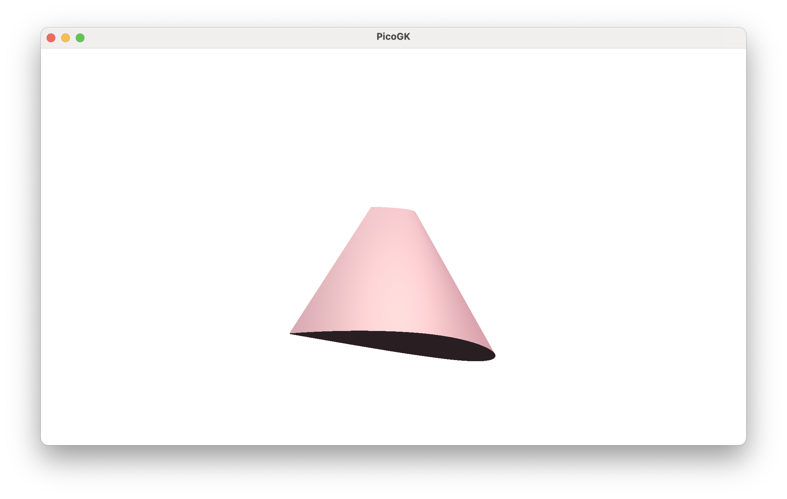
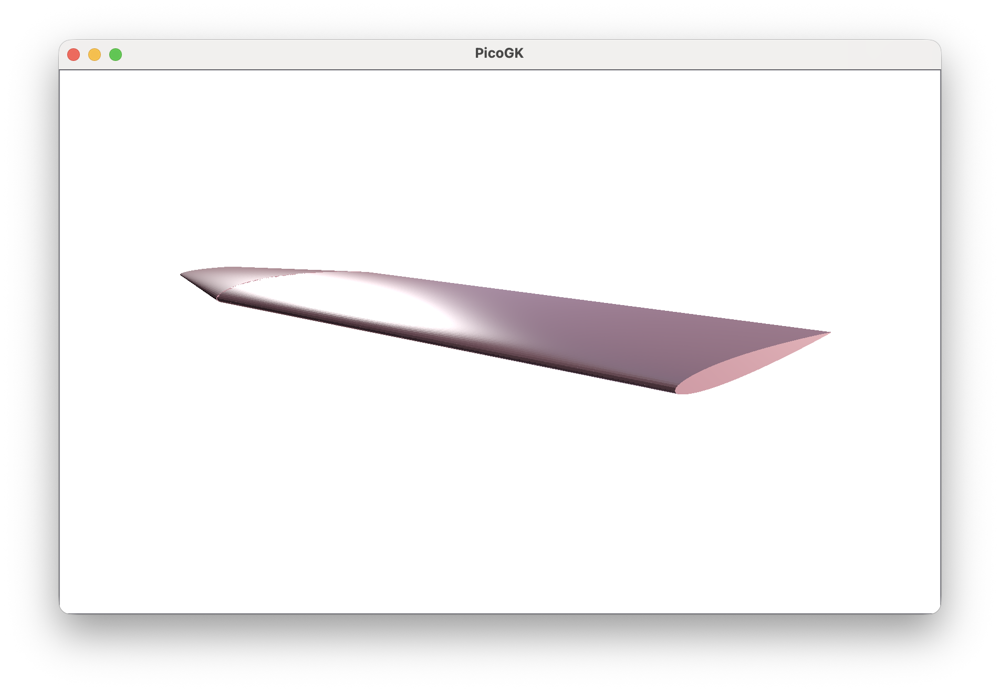

**[PicoGK.org](https://picogk.org)/coding for engineers**


**[Table of contents](TOC.md)**

# Let's build a wing (Part 1)

Let’s build a wing in this chapter, because after all, I promised you we would design an aircraft in an afternoon a while back — and airplanes without wings are not very useful.

For this, let's revisit some code we wrote a few chapters back.

Let’s look at the `BaseCylinder` object we created and how to use it.

Note: I updated the syntax to the new objects and interfaces which were released in PicoGK 2. Notably PicoGK now has `Frame3d` object (in the `PicoGK.Shapes` namespace), and the relevant interface `IContour2d`.

```c#
public BaseCylinder(    Frame3d frm, 
                        IContour2d oEdgeBottom, 
                        IContour2d oEdgeTop,
                        float fHeight)
```

Let’s recall that our `BaseCylinder` is defined by a localized coordinate system, two 2D shapes that can be sampled over `0..1`, and the distance between these two contours.

That seems like a good way to define a wing. A basic wing has a 2D outline contour that is extruded along an axis. Since even the most basic wing tapers from its root to its tip, we definitely need two outlines — which the `BaseCylinder` gives us.

So let’s get started.

## NACA profiles

What about the wing profile? Fortunately, there are some standard algorithms to define those, specifically the [NACA airfoil contours](https://www.nasa.gov/image-article/naca-airfoils/). NACA contours are defined by a sequence of digits encoded in a character string. Let's implement a NACA 4 contour, which is defined by a four-character string:

```c#
public class Naca4Contour : IContour2d
{
    public Naca4Contour(    string strCode,
                            float fChordLength)
    {
      ...
    }
}
```

In addition to the NACA identifier, we pass `fChordLength`, which defines the distance between the leading and trailing edges of the wing.

The four characters define three variables, usually called `M`, `P`, and `T`, with `T` occupying the last two digits.

- `m` is the maximum camber of the wing. Camber defines the upwards curved deviation of a wing from its mean line. If `m` is zero, the wing is symmetrical. If it is a larger number, the wing’s upper surface curves more strongly; it is “fatter” than the lower surface relative to the mean line.
- `p` is where the camber is located, relative to the chord of the wing in tens of percent. A value of 4 means the maximum camber occurs at the 40% position as you travel along the length of the chord.
- `t` is the thickness of the wing in percent of the chord length. A number of 10 means the wing has a total thickness of 10% of the chord length.

To translate the characters into our variables, we can use the `Parse` function of the `float` type, which takes a `string` as argument and translates it to a number. If the `string` doesn't represent a number, an exception is thrown.

```c#
 public Naca4Contour(    string strCode,
                         float fChordLength)
{
    if (strCode.Length != 4)
        throw new ArgumentOutOfRangeException($"NACA 4 Code must be 4 characters ({strCode})");

    m_fMaxCamber    = float.Parse(strCode[0].ToString()) / 100f;
    m_fCamberPos    = float.Parse(strCode[1].ToString()) / 10f;
    m_fThickness    = float.Parse(strCode.Substring(2, 2)) / 100f;

    m_fChordLength  = fChordLength;
 }
```

Note how we use `Substring` to split the `strCode` variable into pieces. The first number is at position `0` (since indexing is zero-based) and is one character long. The second number is at position `1`, again one character long. The last number occupies the last two digits of the string, so we use the third (`2`) position and pass a length of `2` characters to `Substring`.

OK, so much for string manipulation and setup. Now, how do we calculate the NACA contour? Fortunately these are standardized formulas which you can just look up.

The `IContour2d` interface requires us to implement the function `PtAtT` which returns both the point and its normal at the location `t`. But `IContour2d` derives from the `IPath2d`, which only requires us to implement the following:

```c#
public Vector3 vecPtAtT(float t)
```

And the property 

```c#
public float fLength
```

If we do not explicitly implement the `PtAtT` function in our `IContour2d`-derived class, the `IContour2d` interface has a default implementation which samples the normal at the position, which is ideal for our case.

So, all we implement is `vecPtAtT` and let the normal be calculated numerically.

Before we move on to the calculation of the contour itself, let’s implement the `fLength` property of the interface. Contrary to circles and other geometric shapes, it's not so trivial to calculate the circumference of a wing profile. The most straightforward approach is to sample points along the contour and sum the distances between them. That is a straightforward numerical solution to a problem without a closed-form expression.

## A bit of sampling to the rescue

There's a handy class for this, `ContourSampler2d` in `PicoGK.Shapes`, which takes care of this. It also gives us a conversion function for the `t` parameter in `PtAtT`, which ensures that as we linearly increase it, we move at constant speed by converting linear `t` to arc-length `t`.

All we have to do is derive our class from the `ContourSampler2d.ISampleable` interface, which requires us to implement the function `Vector2 vecPtAtTLinear(float t)`,  which does the actual work.

Let's quickly look at the code we need to create to use the sampler properly:

```c#
public class Naca4Contour : IContour2d, ContourSampler2d.ISampleable
```

This makes sure the contour can be sampled.

We add the sampler to our class:

```c#
ContourSampler2d m_oSampler;
```

And in the constructor, we initialize it with `this` which points to our `Naca4Contour` object.

```c#
public Naca4Contour(    string strCode,
                        float fChordLength)
{
    ...
    m_oSampler = new(this);
}
```

Now, all we need to do is route the `fLength` property to our `m_oSampler` which has sampled the contour length.

```c#
public float fLength => m_oSampler.fTotalLength;
```

And we convert the linear length parameter `t` in our `vecPtAtT` function:

```c#
public Vector2 vecPtAtT(float fT)
{
    return vecPtAtTLinear(m_oSampler.fArcTFromLinearT(fT));
}
```

Which ensures that we run at constant speed along the contour and don't create smaller and wider gaps for monotonic increases in `t`.

## Implementing NACA 4

With all that out of the way, let’s move on to the crucial `vecPtAtTLinear` function.

I have implemented the formulas in the accompanying source code and will skip them here, as it will just fill up pages.

There are two areas where the formulas deviate from the standard literature. NACA defines an upper contour and a lower contour, each running individually from `0..1`.

Since our `t` parameter runs around the entire circumference of a shape, we split the parameter into two ranges and calculate a new parameter x that runs forward from `0..1` for the upper part and backwards from `1..0` for the lower part. 

```c#
bool bUpper = fT <= 0.5f;
float x = bUpper ? (1f - 2f * fT) : (2f * fT - 1f);
```

This gives us a single closed contour over `0..1`, rather than two independent halves.

`PtAt` also requires us to return the normal at that position. This is used for things like surface modulation. We could calculate the normal like we calculated the circumference length, but a good approximation of the normal is simply the vector from the midpoint of the wing to the current point. Normalizing it yields a normal that is sufficient for our current purposes.

```c#
vecNormal = Vector2.Normalize(vecPt);
```

We can do this, because the wing profile is centered around `0/0` like all of our contours. So the vector from `0/0` to the point is simply the position of the point. Normalizing it creates a normal that is fine for our purposes for now.

And that's it. We can now use the NACA 4 contour to define a wing.

Instead of the `LocalFrame` class we defined back in Chapter 18, let's use the new `Frame3d` object introduced in PicoGK 2.0. It works the same way: it represents a local 3D coordinate system.

```c#
BaseCylinder oCyl = new(    Frame3d.frmWorld, 
                            new Naca4Contour("2412", 1570), 
                            new Naca4Contour("0009", 830),
                            5500);

Mesh msh = oCyl.mshConstruct();
```

I used parameters that create a plausible single-prop aircraft wing.

- We use the world frame, which aligns with our global `X/Y/Z` coordinate system.

- We use a NACA `2412` contour near the fuselage, which has `2%` camber for a bit of lift, the max camber at `40%` and `12%` of the wing chord as the thickness of the wing. We use approximately `1.5m` as the chord length.

  

- We use a NACA `0009` contour at the wing tip, which is symmetrical (no camber), and on the thinner side with `9%` of the wing chord. We taper the wing substantially to `830mm`.

  

- We assume a wing span of `11m`, so we pass half of that, `5500mm`, for half a wing.

Let's run this and have a look at the result:



Not a bad transformation from a plain cylinder to a wing — achieved simply by implementing another 2D contour object.

You can imagine building all kinds of objects that share similar basic construction properties. In fact, the `BaseCylinder`, with many additional properties, is one of the most powerful base objects we use at LEAP 71.

As a fun experiment you could build a wing that starts as a circle. Or maybe more interestingly, you can implement NACA 5 and other more complex wing geometries used in modern aircraft.

But wait — this is only *half* a wing. How do we create the other half?

You might be tempted to create a mirrored `Frame3d`, but this would violate the right-hand rule for coordinate systems. So, while mathematically feasible, we don't like to do this. We simply move the wing in the opposite direction and reverse the wing profile.

```c#
float fWingSpan = 11000; //mm

Frame3d frmRight = Frame3d.frmFromZX(   new Vector3(0,  fWingSpan / 4, 0),  
                                        Vector3.UnitY, 
                                        Vector3.UnitZ);

IContour2d xRoot  = new Naca4Contour("2412", 1570);
IContour2d xTip   = new Naca4Contour("0009", 830);

BaseCylinder oWingR = new(  frmRight, 
                            xRoot, 
                            xTip,
                            fWingSpan / 2);

Frame3d frmLeft  = Frame3d.frmFromZX(   new Vector3(0, -fWingSpan / 4, 0),  
                                        Vector3.UnitY, 
                                        Vector3.UnitZ);

BaseCylinder oWingL = new(  frmLeft, 
                            xTip,
                            xRoot,
                            fWingSpan / 2);

Mesh mshR = oWingR.mshConstruct();
Mesh mshL = oWingL.mshConstruct();

Library.oViewer().Add(mshR, 1);
Library.oViewer().Add(mshL, 1);
```

Which yields this result: 

 

## Summary

Obviously, this wing is as basic as it gets. There are a few features we will need to add to our `BaseCylinder` before we can build wings suitable for modern aircraft.

The key principle at work here is that we systematically apply our methodology to new problems and reduce them to very simple steps. While NACA contours are no longer state of the art, you can easily use them as placeholders while working on more complex shapes. Those complex shapes can be dropped in at any time, and the end result will be recomputed automatically. No engineering time is wasted. 

As always, the [code for this chapter is on GitHub](https://github.com/LinKayser/Coding4Engineers) (again quite basic this time).

------

Next: **Let's build a wing (Part 2)**

[Jump into the discussion here](https://github.com/leap71/PicoGK/discussions/categories/coding-for-computational-engineers)

[Table of contents](TOC.md)

------

**[PicoGK.org](https://picogk.org)/coding for engineers**

© 2024-2026 by [Lin Kayser](https://www.linkedin.com/in/linkayser/) — All rights reserved.