**[PicoGK.org](https://picogk.org)/coding for engineers**


**[Table of contents](TOC.md)**

# Thinking beyond Cartesian coordinates

We have been making good use of Cartesian coordinates in the past chapters, coordinates which are based on a system of three orthogonal axes, `X`, `Y`, and `Z`. We introduced the concept of a local coordinate system, represented by the `Frame3d` class, which allows us to orient the coordinate system independently of world coordinates. Using different `Frame3d` objects, we were able to place and orient parts to our hearts' desires.

But while you always need three coordinates to represent a point in 3D space (and two for 2D space), there are other systems that are often better suited to a task. In this chapter, we will introduce `Polar`, `Cylindrical`, and `Spherical` coordinates, and how to use them in PicoGK.

One of the major advantages of choosing the right coordinate system is that the geometry often becomes dramatically simpler to describe algorithmically.

## An apology

An apology first: many of you are familiar with these coordinate systems. So the following chapter may sound a bit repetitive, even trivial at times. You will, however, be using these systems *a lot* in Computational Engineering, so let's over-explain, until you are so bored that you will not have to think about how they work *ever again*.

## Polar coordinates

Let's begin on a 2D plane and introduce the concept of `Polar` coordinates. On a flat 2D plane, we require two numbers to uniquely represent a point. In our standard Cartesian coordinate system, we use the `Vector2` class, with its `X` and `Y` members. `X` and `Y` represent the distances along the respective axes from the origin, which lies at `[0,0]`. So a coordinate of `X=1; Y=0;` represents a point that lies `1` unit shifted in `X` and zero units shifted in `Y`.

So, in the image below, the coordinate `[1,1]` (blue) is the result of moving `1` unit along the `X` axis (red), and `1` unit along the `Y` axis (green).

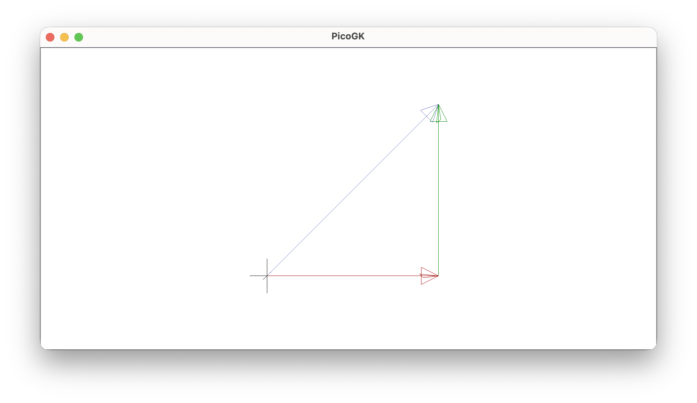

How else could you represent that point?

One way is to use `Polar` coordinates. We still have two dimensions, but one now represents the absolute distance of the point to the center of the coordinate system. What geometric shape consists of all points at the same distance from a reference point? A circle with radius `R`.

So let's define a coordinate system with `R`, the radius, as one of the coordinates. What else do we need? An angle. If we specify the radius of a circle and the position on the circle using an angle, we have uniquely identified a point on a 2D plane.

While most people are used to specifying angles in degrees 0 to 360º, in mathematics, we specify angles using *radians*.

Radians are derived from the fact that the formula for the circumference of a circle is `2πr`. For a circle with a radius of `1`, you can simplify the circumference to `2π`. 

In other words, in math, an angle is actually the distance on a unit circle from `0 .. 2π`, which in C# is `0 .. float.Pi * 2`.

Since it's cumbersome to constantly write `float.Pi * 2`, PicoGK defines a constant: `Rad.TwoPi`.

Where a full circle is `float.Pi*2` (`Rad.TwoPi`), a half circle (180º) equals `Rad.TwoPi/2`, a quarter circle (90º) equals `Rad.TwoPi/4`. Etc. At first glance, the heavy use of Greek symbols may seem a little opaque, but radians are actually a remarkably intuitive system once you think about angles as distances along a circle. For completeness, one degree (1º) equals `Rad.TwoPi/360`.

So, radians it is. PicoGK has a `Polar` coordinate type, with two members, `R` and `Phi`. `R` is the distance of the point from the origin (the radius of the circle it is on). `Phi` is the angle, defining the position on that circle, in other words `Phi` is the azimuthal angle, the rotation around the central axis.

Here's how it works:

``` c#
Polar co = new();
co.R     = 10;
co.Phi   = Rad.TwoPi/4;
```

Since most of the time we are not working in `Polar` coordinates, the `Polar` type has a handy function to convert to Cartesian coordinates, which returns a `Vector2`:

```c#
Vector2 vecCartesian = co.vecAsCartesian();
```

So, let's check this out in practice:

```c#
Polar coZero = new();
Vector2 vec2 = coZero.vecAsCartesian();
Vector3 vec3 = vec2.vecAsVector3();
Library.oViewer().AddCross(vec3);
```

We initialize a new `Polar` coordinate (`coZero`), convert it to Cartesian space, add a third dimension using `vecAsVector3`, and visualize the result with a cross in the viewer.

Just like with `Vector2` and `Vector3`, `Polar` coordinates initialize to zero, in other words to the *origin*.

As expected, `vec2` results in the coordinate `[0,0]` .

It's probably a good idea at this point to highlight a curiosity of `Polar` coordinates: For the origin, with `R` equaling zero, `Phi` is undefined. Or more accurately, it doesn't matter what number `Phi` has, if the distance `R` to the origin is zero, the point is (obviously) always at the origin. This is known as a coordinate singularity.

So let's set our radius to something reasonable:

```c#
Polar co = new();
co.R = 1;
Console.WriteLine($"Polar={co} - Cartesian={co.vecAsCartesian()}");
```

Our coordinate now lies at a distance of `1` from the origin, at the angle `Phi=0` (which is the default).

The above code shows us that a `Polar` coordinate of `Radius=1; Phi=0;` results in a Cartesian `Vector2` of `X=1; Y=0`. So, we've established the direction of the angle, at position `0` it points towards the `X` axis of our orthogonal coordinate system. Let's move `Phi` by a quarter circle (90º) in the positive direction and see where it points to:

```c#
co.Phi = Rad.TwoPi / 4;
Console.WriteLine($"Polar={co} - Cartesian={co.vecAsCartesian()}");
```

If you output this, you will get a weird number for `X`. This is expected and a common issue with floating point precision. Because `π` cannot be represented exactly in binary floating point, trigonometric functions often produce extremely small residual values instead of exact zeros. 

`Y` on the other hand is clearly `1`. So, by moving a quarter circle from `Phi=0`, (which translated to `[1,0]`), we now ended up at `[0,1]`. From this result, you can see the direction in which the coordinate system moves. PicoGK uses a right-handed coordinate system. Positive angular rotation is counter-clockwise when looking down the positive `Z` axis toward the origin. Our test just confirmed that. 

If we move a half circle distance (180º), we will end up at `[-1,0]`:

```c#
co.Phi = Rad.TwoPi / 2;
Console.WriteLine($"Polar={co} - Cartesian={co.vecAsCartesian()}");
```

Again, you have to account for the floating point rounding issues, and ignore the tiny value you get for `Y`.

Let's have some fun and plot the polar circle (sorry for the pun):

```c#
public static void PolarCircle()
{
    Polar coZero = new();

    Vector2 vec2 = coZero.vecAsCartesian();
    Vector3 vec3 = vec2.vecAsVector3();
    Library.oViewer().AddCross(vec3);

    Polar co = new();
    co.R = 10;

    int   nSteps = 20;
    float fStep  = Rad.TwoPi / nSteps;

    for (int n=0; n<nSteps;n++)
    {
        co.Phi = n * fStep;
        Library.oViewer().AddCross(co.vecAsCartesian().vecAsVector3());
    }
}
```


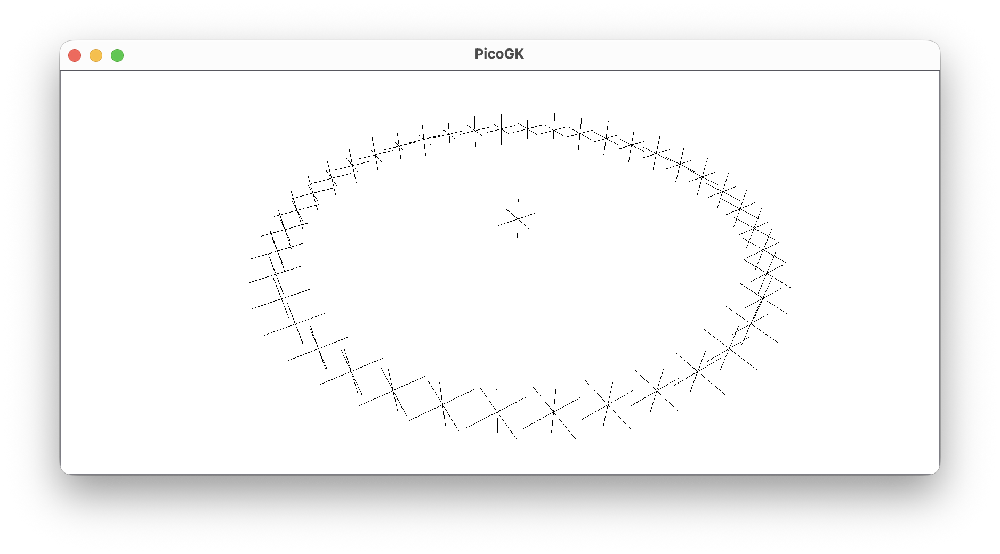

Let's sum this up quickly. In Cartesian coordinates, we represent a point by specifying the distance from the origin for each orthogonal axis. 

In `Polar` coordinates, a point is specified by the radius `R` (red) of the circle on which it lies, and the angle `Phi` (green) that determines the position on the circle.

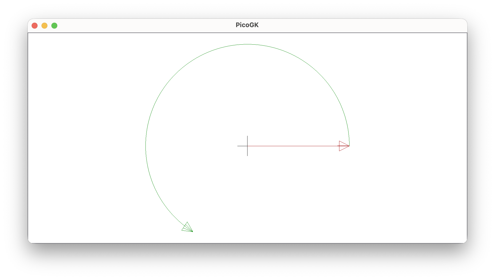

## Cylindrical coordinates

`Polar` coordinates are a good segue into a much more useful type of coordinate system. In fact, so useful, that we at LEAP 71 spend a lot of time, maybe most of our time there: If you look at many engineered objects, they are often rotationally symmetrical. Think of bolts, jet engines, pipes, what have you.

If you add a `Z` coordinate to a `Polar` coordinate, you end up with a `Cylindrical` coordinate, which specifies a point in 3D space.

Let's rewrite our `Polar` example and just change the type:

```c#
public static void CylindricalCircle()
{
    Cylindrical coZero = new();
    Library.oViewer().AddCross(coZero.vecAsCartesian());

    Cylindrical co = new();
    co.R = 10;

    int     nSteps  = 20;
    float   fStep   = Rad.TwoPi / nSteps;

    for (int n=0; n<nSteps;n++)
    {
        co.Phi = n * fStep;
        Library.oViewer().AddCross(co.vecAsCartesian());
    }
}
```

As you can see, we no longer need the conversion to a `Vector3`, as `vecAsCartesian` already returns a 3D vector.

Well, to no one's surprise, the example looks exactly like the `PolarCircle` example, as we didn't do anything in `Z`.

Let's move our point along the `Z` axis as we turn a full circle, and let's draw an arrow from the center:

```c#
public static void CylindricalSpiral()
{
    Cylindrical coZero = new();
    Library.oViewer().AddCross(coZero.vecAsCartesian());

    Cylindrical co = new();
    co.R = 10;

    int     nSteps  = 40;
    float   fStep   = Rad.TwoPi / nSteps;
    float   fZStep  = 20f / nSteps;

    for (int n=0; n<nSteps;n++)
    {
        co.Phi      = n * fStep;
        coZero.Z    = n * fZStep;
        co.Z        = coZero.Z;

        Library.oViewer().AddArrow(coZero.vecAsCartesian(), co.vecAsCartesian());
    }
}
```

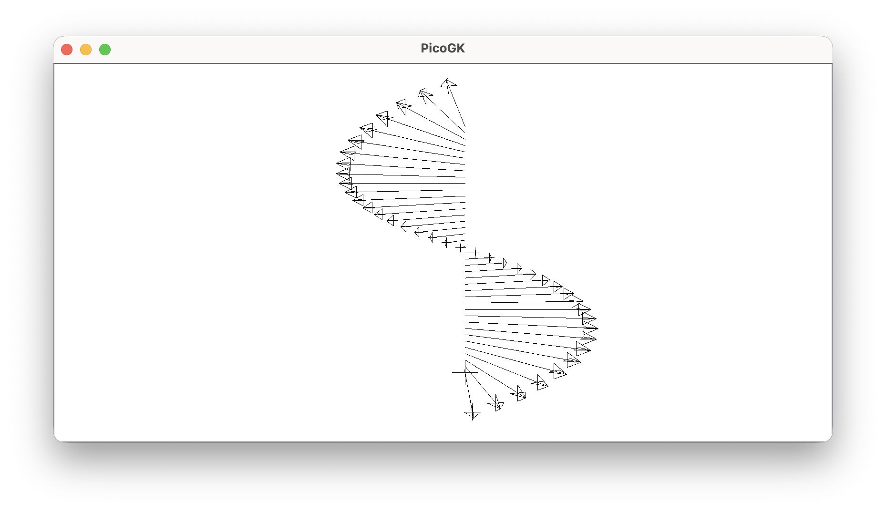

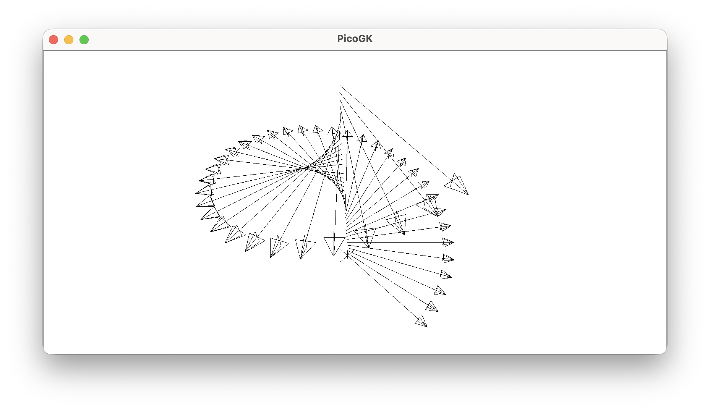

Now, that's more 3D, isn't it? You probably don't need much imagination to consider what objects benefit from this type of coordinate system. Need to define the thread of a screw: `Cylindrical` coordinates. You need to place features around a rotationally symmetrical object? `Cylindrical` coordinates to the rescue.

Again, the simplest way to think about `Cylindrical` is `Polar` coordinates moved up (or down) the `Z` axis.

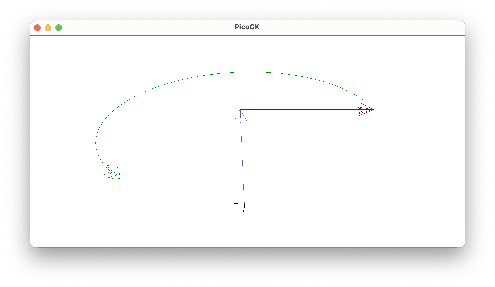

## Spherical coordinates

What if we push the concept of angular coordinates even further? You end up with `Spherical` coordinates. 

Where `Cylindrical` coordinates have `Z`, `Spherical` coordinates have another angle, `Theta`. 

**Note:** Unfortunately, spherical coordinate conventions differ across mathematics, physics, CAD, and graphics systems. In PicoGK, `Phi` always represents the azimuthal angle around the `Z` axis (as with `Polar` and `Cylindrical` coordinates), while `Theta` represents the inclination from `Z+` toward `Z-`.

The easiest way to think about `Spherical` coordinates is longitude and latitude on Earth, though mathematically `Theta` behaves more like an inclination measured from the North Pole. Latitude determines how far north or south you are, while longitude determines rotation around the Earth's axis.

A `Theta` of `0` points straight up the `Z+` axis. A `Theta` of `Pi` (half circle, 180º) points straight down to `Z-`. 

A `Theta` of `Pi/2` sits at the equator, halfway between the poles.

The radius `R` (red) again defines the distance of a point from the origin, but where `R` is the distance to the central axis of a cylinder in `Cylindrical`, in `Spherical` coordinates, `R` is the radial distance from the origin, defining a sphere. Just like with `Polar` and `Cylindrical`, a radius of `0` means that all coordinates map to the origin, regardless of the values of `Phi` (green) and `Theta` (blue).

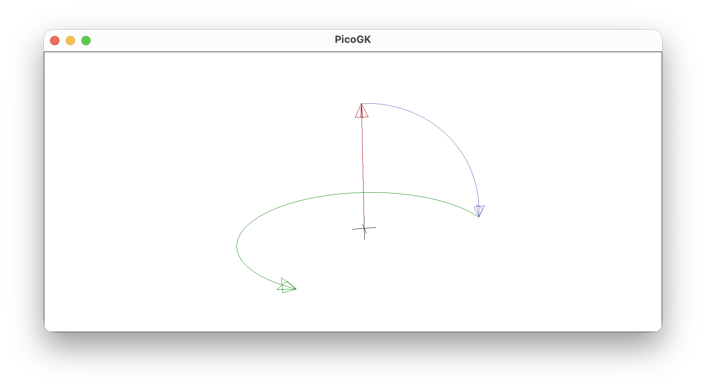


Just like at the North Pole and South Pole, longitude becomes degenerate at the poles: For a `Theta` of `0` (North Pole) and `Pi` (South Pole) all values of `Phi` map to the same point at the pole.

Below is the same value of `Phi` plotted at different values for `Theta`.

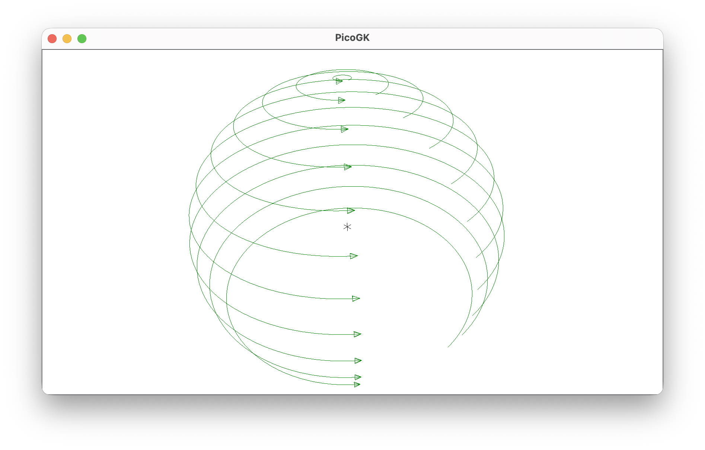

You can also see why we only need a half circle in `Theta` to reach every point on the surface of the sphere: `Phi` sweeps an entire circle for each value of `Theta`, so we can reach every point.

If you plot the same value of `Theta` for different values of `Phi`, it looks like this:

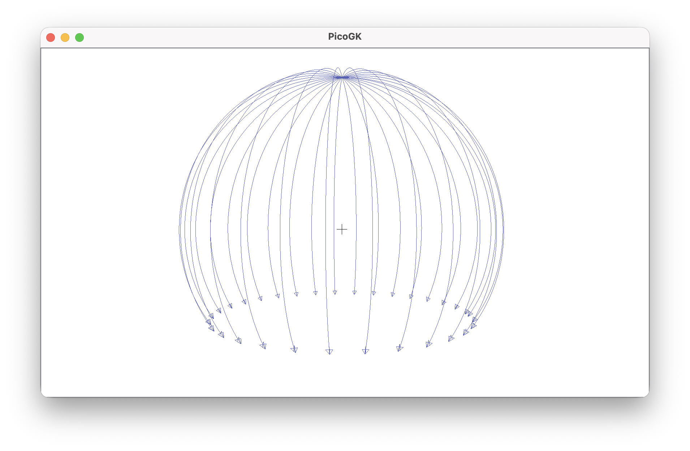

Let's go through the following and let's see if you can guess the output.

```c#
Spherical co = new();
co.R = 1;
Console.WriteLine($"Example 1: Spherical={co} - Cartesian={co.vecAsCartesian()}");

co.Theta = float.Pi / 2;
Console.WriteLine($"Example 2: Spherical={co} - Cartesian={co.vecAsCartesian()}");

co.Phi = Rad.TwoPi / 2;
Console.WriteLine($"Example 3: Spherical={co} - Cartesian={co.vecAsCartesian()}");

co.Theta = float.Pi;
Console.WriteLine($"Example 4: Spherical={co} - Cartesian={co.vecAsCartesian()}");
```

Let's review:

- Example 1: `Phi` and `Theta` are both zero. Since `Theta` is `0`, the coordinate lies at the North Pole regardless of the value of `Phi`. The Cartesian vector is `[0,0,1]`.
- Example 2: `Theta` now points halfway down the half circle, which means: to the equator. Since `Phi` is zero, the Cartesian coordinate now points along the positive X axis: `[1,0,0]` (again ignoring floating point rounding).
- Example 3: Now we set `Phi` to the value of `Rad.TwoPi/2`, which moves it half way around the globe. The Cartesian coordinate now points along the negative `X` axis: `[-1,0,0]`.
- Example 4: We now set `Theta` to `Pi`, which moves it to the South Pole: it now points straight down. `Phi` has no influence, since there's only one position possible at the pole, since the diameter of the circle along which `Phi` moves is zero: `[0,0,-1]`.

## Let's place some objects

Enough with the lines and arrows. Let's put these coordinates to use.

Let's imagine we want to place objects in a circular manner.

```c#
public static void ObjectsAlongACircle()
{
    Polar co = new();

    co.R = 30;

    int   nSteps  = 10;
    float fStep   = Rad.TwoPi / nSteps;

    for (int n=0; n<nSteps; n++)
    {
        co.Phi = n * fStep;
        Vector3 vecPos = co.vecAsCartesian().vecAsVector3();
        Library.oViewer().Add(Voxels.voxSphere(vecPos, 2));
    }
}
```

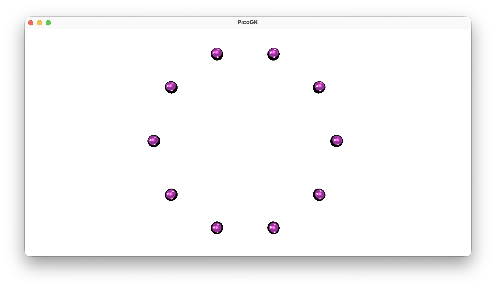

OK, nice, but not groundbreaking. What about some lattice beams that are actually aligned to face outwards?

Let's modify the inner loop to create two coordinates:

```c#
co.Phi = n * fStep;
Vector3 vecPos = co.vecAsCartesian().vecAsVector3();

Polar coOuter = co;
coOuter.R += 10;
Vector3 vecOuter = coOuter.vecAsCartesian().vecAsVector3();

Library.oViewer().Add(Voxels.voxLatticeBeam(vecPos, 2, vecOuter, 1));
```

You can see, I could have gone about this in many different ways. I could have calculated the direction to the origin in Cartesian space, added that to the position, multiplied by a distance, for example.

But what I did instead is created a copy of the coordinate, increased the radius by 5 units, and used that as the tip of the object.

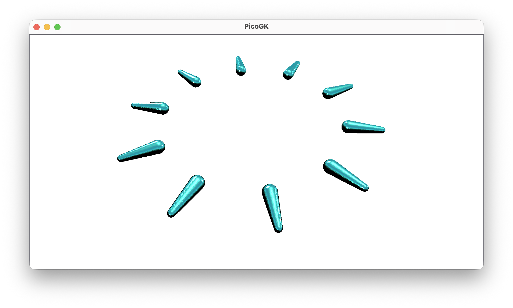

Let's try the same in spherical coordinates:

```c#
Spherical co = new();
co.R = 20;

int nThetaSteps = 5;
float fThetaStep = float.Pi / (nThetaSteps-1);

int nPhiSteps = 10;
float fPhiStep = Rad.TwoPi / nPhiSteps;

for (int nTheta=0; nTheta<nThetaSteps; nTheta++)
{
    co.Theta = nTheta * fThetaStep;

    for (int nPhi=0; nPhi <nPhiSteps; nPhi++)
    {
        co.Phi          = nPhi * fPhiStep;
        Vector3 vecPos  = co.vecAsCartesian();

        Spherical coOuter = co;
        coOuter.R += 10;
        Vector3 vecOuter = coOuter.vecAsCartesian();

        Library.oViewer().Add(Voxels.voxLatticeBeam(vecPos, 1, vecOuter, .5f));
    }
}
```

Please note the subtle difference between the calculations of the steps for the `Phi` and `Theta` loops: While `Phi` needs to stop short of the full circle, to avoid placing two objects at the beginning and end of the circle (after `2*Pi` we are back at position `0`), for `Theta` we have to go the entire half circle, otherwise the object at the South Pole is missing, hence the float `fThetaStep = float.Pi / (nThetaSteps-1);` calculation, which ensures we include that coordinate.

Which gives us this result.

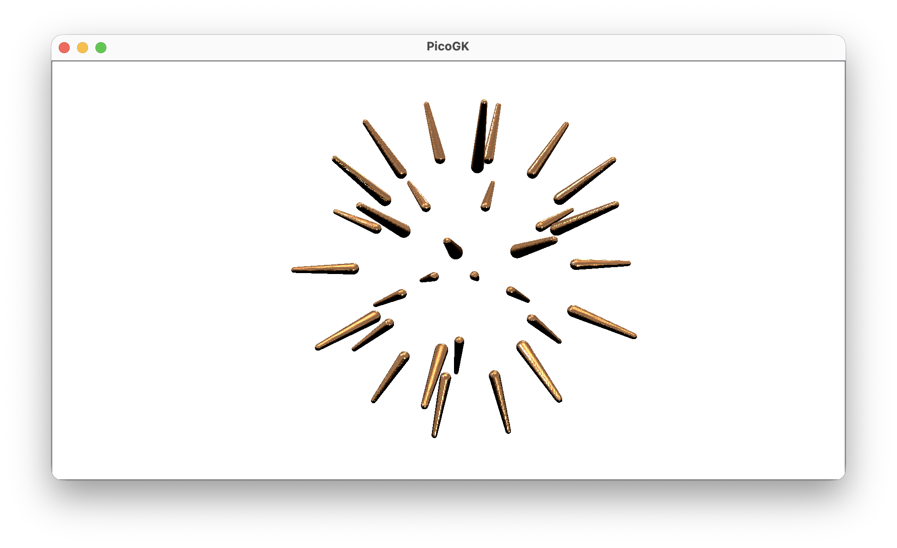

Great for a first demo. Now, there are a number of things we probably want to change: Because the longitudinal circles have smaller and smaller circumferences, the higher latitudes get pretty crowded with objects, as the distances decrease. At the poles the distance between the objects collapses to zero, resulting in many objects occupying exactly the same position. Probably not what we want.

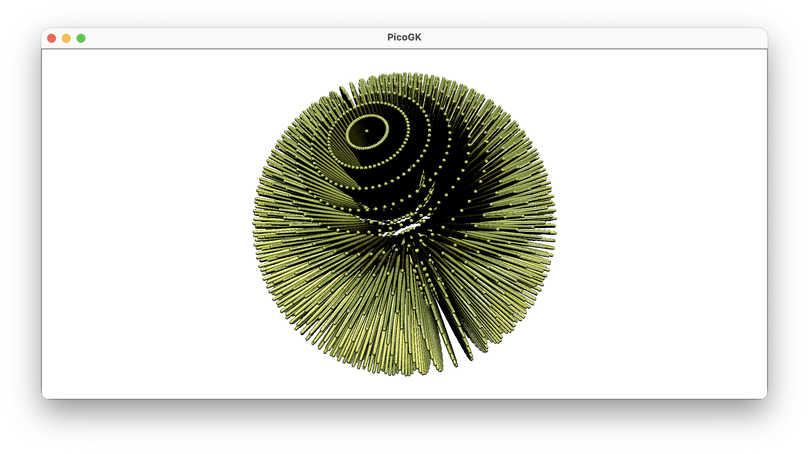

But we will leave this for the next chapter, where we will tie these coordinate systems to our `Frame3d` objects to start doing some more interesting things.

As a last step, since for cylinders, things are a little easier, let's do the same exercise for a cylinder, and space our lattice beams evenly.

 ```c#
 Cylindrical co = new();
 co.R = 15;
 
 int nSteps = 15;
 float fPhiStep = Rad.TwoPi / nSteps;
 
 // Distance (on the circle), between each object: 2πR
 float fZStep = fPhiStep * co.R;
 
 for (int nZ=0; nZ<nSteps; nZ++)
 {
     co.Z = nZ * fZStep;
 
     for (int nPhi=0; nPhi <nSteps; nPhi++)
     {
         co.Phi          = nPhi * fPhiStep;
         Vector3 vecPos  = co.vecAsCartesian();
 
         Cylindrical coOuter = co;
         coOuter.R += 10;
         Vector3 vecOuter = coOuter.vecAsCartesian();
 
         Library.oViewer().Add(Voxels.voxLatticeBeam(vecPos, 1, vecOuter, .5f));
     }
 }
 ```

We take advantage of the fact that we can just multiply the `fPhiStep` with the radius to get the distance between the objects. We can use that as `fZStep` to evenly space the beams along the `Z` axis.

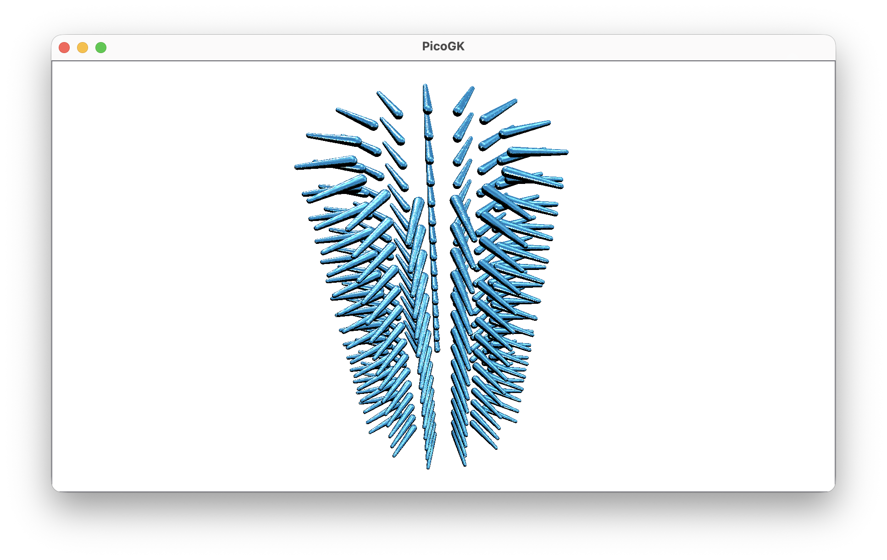

## The other way around

Now, lastly, I should mention that of course you can also convert Cartesian coordinates to `Polar`, `Cylindrical`, and `Spherical` coordinates. This is less common than you might think, but of course it's entirely supported. 

```c#
Spherical coSph = new(Vector3.UnitX);
Console.WriteLine($"Spherical: {coSph}");
```

As you can see, you can just pass a Cartesian `Vector3` (or `Vector2` in the case of `Polar`) to the constructor and create a new corresponding coordinate.

If you plot the `Phi` values for different Cartesian coordinates, you will notice that the range is somewhat different than what we used in all our examples above. In this chapter, we continuously traveled along the circle (in counter-clockwise direction), increasing the value of `Phi`. 

So for a `Polar` coordinate with an `R` of `1` the following table is true:

| Phi                 |         | Cartesian |            |
| ------------------- | ------- | --------- | ---------- |
| `Rad.TwoPi * 0.00f` | `0`     | `[1,0]`   | Positive X |
| `Rad.TwoPi * 0.25f` | `π*0.5` | `[0,1]`   | Positive Y |
| `Rad.TwoPi * 0.50f` | `π`     | `[-1,0]`  | Negative X |
| `Rad.TwoPi * 0.75f` | `π*1.5` | `[0,-1]`  | Negative Y |

We increase `Phi` by a quarter distance of the full circle (`0.25f`) at each step, and the coordinate moves counter-clockwise around the circumference.

But of course you can also travel the other way around, decreasing the value of `Phi`, which is just as valid:

| Phi                  |          | Cartesian |            |
| -------------------- | -------- | --------- | ---------- |
| `Rad.TwoPi * -0.00f` | `0`      | `[1,0]`   | Positive X |
| `Rad.TwoPi * -0.25f` | `-π*0.5` | `[0,-1]`  | Negative Y |
| `Rad.TwoPi * -0.50f` | `-π`     | `[-1,0]`  | Negative X |
| `Rad.TwoPi * -0.75f` | `-π*1.5` | `[0,1]`   | Positive Y |

A value of `-float.Pi` and a value of `float.Pi` points to the same position, halfway around the circle.

When you convert from Cartesian coordinates, `Phi` ends up in a range of `-float.Pi .. +float.Pi` and not `0 .. 2*float.Pi` as you might have expected.

Here's how this looks like in practice. In a way it's intuitive that negative Cartesian coordinates also produce negative values of `Phi`.

| Cartesian |             | Phi                 |          |
| --------- | ----------- | ------------------- | -------- |
| `[1,0]`   | Positive X  | `Rad.TwoPi * 0.00`  | `0`      |
| `[0,1]`   | Positive Y  | `Rad.TwoPi * 0.25`  | `π*0.5`  |
| `[-1,0]`  | Negative X  | `-Rad.TwoPi * 0.50` | `-π`     |
| `[0,-1]`  | Negative Y  | `-Rad.TwoPi * 0.25` | `-π*0.5` |

Just something to be aware of, when converting from Cartesian coordinates. The math stays the same, the range is still `2π` — it doesn't really matter where you start and in which direction you travel. A `Phi` of `0` continues to always point to the positive `X` direction.

## Summary

As a Computational Engineer, you will spend a lot of time working in different coordinate systems. Traditional CAD systems, derived from the concept of a drafting table, tend to keep you thinking in Cartesian sketches, extrusions, and orthogonal feature operations, even when the underlying geometry is fundamentally radial or rotational. 

But many engineered objects — turbines, pipes, pressure vessels, nozzles, bolts, threads, lattices — are far more naturally described using `Cylindrical` or `Spherical` coordinates.

In this chapter you:

- learned about `Polar`, `Cylindrical`, and `Spherical` coordinates
- understood why angles in mathematics are measured in radians
- learned to think about angles as distances along a unit circle
- started placing geometry intuitively in non-Cartesian coordinate systems

In the next chapter, we will combine these coordinate systems with `Frame3d` objects and start putting them to practical use before we continue to build our wing.

As always, the [code for this chapter is on GitHub](https://github.com/LinKayser/Coding4Engineers) 

------

Next: **Juggling coordinates in unusual ways**

[Jump into the discussion here](https://github.com/leap71/PicoGK/discussions/categories/coding-for-computational-engineers)

[Table of contents](TOC.md)

------

**[PicoGK.org](https://picogk.org)/coding for engineers**

© 2024-2026 by [Lin Kayser](https://www.linkedin.com/in/linkayser/) — All rights reserved.