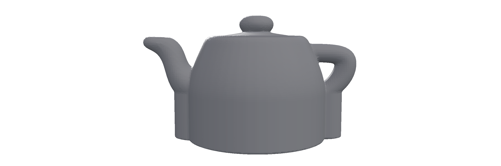
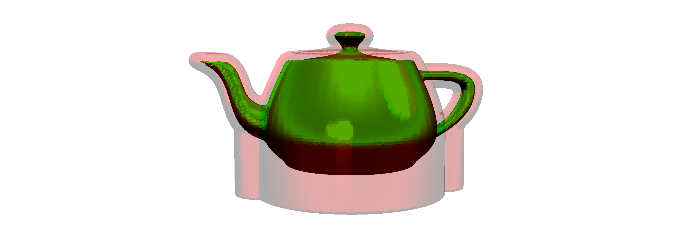
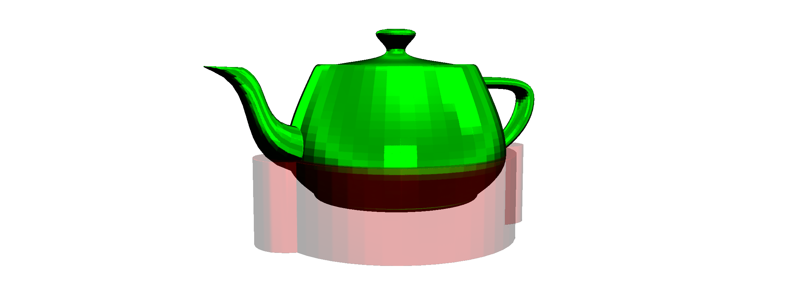

**[PicoGK.org](https://picogk.org)/coding for engineers**


**[Table of contents](TOC.md)**

# Let's build a computational fixture maker (Part 1)

In this chapter, we will learn about a few more geometry representations that you can use in PicoGK. 

But instead of playing around with random lattices, let's build something useful.

We recently had to machine a rocket engine and noticed that it would have been really helpful to have some 3D printed fixtures to hold that irregularly shaped object in place.

Building a fixture is not a trivial task. What if we could automate it for many cases?

So, let's try this.

## There's an App for that

Let's get started by either creating a new PicoGK project, like we did before. Or you just add new functionality to the PicoGK Example that is installed with PicoGK. Both ways work.

Let's create a new file and call it `FixtureMaker.cs`.

Inside, we put our usual namespaces, `CodingForEngineers`, etc. I will not describe this in detail here. From the past chapters, you should know how it works. At the end of this chapter, you can see the final implementation — but I encourage you to build from scratch and follow the instructions. You will learn more that way.

Inside our `CodingForEngineers` namespace, I am adding a new one, and call it `Fixtures`.

Now lets start by creating an App with a static `Go` function, that we can call.

```c#
namespace Fixtures
{
    public class App
    {
        public static void Run()
        {
            // Do stuff here
        }
    }
}
```

You can now modify your `Program.cs` to call the function from PicoGK.

```c#
try
{
    PicoGK.Library.Go(.5f, Coding4Engineers.Fixtures.App.Run);
}

catch (Exception e)
{
    Console.WriteLine(e.ToString());
}
```

Now, obviously, this doesn't do much yet.

Let's get started building our functionality.

## Defining the inputs

First of all, we will need a base plate, onto which we can place the fixture. Most base plates have many holes, spaced out in regular intervals. You can place the fixture onto the base plate, and use screws to fix it in place.

So, a reasonable assumption would be to define the inputs like this:

```c#
Vector3 vecBasePlateMM;
float   fBorderMM;
float   fHoleSpacingMM;
float   fHoleDiameterMM;
```

So, this is the dimensions of the base plate, a border area, that has no holes, the spacing of the holes, and the diameter of each hole. We could pass this onto our fixture generator as parameters, and use them to build the holes for the fixture.

So, our class definition could look like this:

```c#
public class FixtureMaker
{
    public FixtureMaker(    Vector3 vecBasePlateMM,
                            float   fBorderMM,
                            float   fHoleSpacingMM,
                            float   fHoleDiameterMM,
                            ... More stuff)
    {
        m_vecBasePlate      = vecBasePlateMM;
        m_fBorder           = fBorderMM;
        m_fHoleSpacing      = fHoleSpacingMM;
        m_fHoleRadius       = fHoleDiameterMM / 2;
        .... More stuff
```

And yeah, most people would implement it that way. One big function, that does it all.

But wait! 

What about information hiding. What about object oriented programming? Aren't we forgetting something.

A base plate is certainly an object. Where it places the holes, and whether it has a border, what shape the holes have... all of this belongs to the `BasePlate` object, and maybe we don't even have to tell anyone about all this? Maybe there are `BasePlate` objects that have different hole arrangements? What if there is a `BasePlate` that has only a few holes in certain places?

Without making it complicated — why don't we make it simple?

Let's just define an empty `BasePlate` class, and let's see what we actually need to know in order for it to work?

Now, that' easy:

```c#
public class BasePlate
{
    // nothing here yet
}
```

Good. So, we can pass a `BasePlate` to our `FixtureMaker` and worry about the details later.

What else do we need? We need an object that we want to be held by the fixture. 

We also need a few parameters, like, at which height above the base plate do we want the object to be held, and stuff like that. Maybe we should just store all of this in a `FixtureObject` class. 

At this time, we also don't really know what we need, so let's define another empty class for that:

```c#
public class FixtureObject
{
    // nothing here yet
}
```

Like in the airplane example, we are defining the information flow first, before we actually understand what exact data we need.

Let's set up the `FixtureMaker`, to work in PicoGK.

```c#
public class FixtureMaker
{
    public FixtureMaker(  BasePlate     oPlate,
                          FixtureObject oObject)
    {
        m_oPlate  = oPlate;
        m_oObject = oObject;
    }
    
    public void Run()
    {
        // Do something here!
    }
    
    BasePlate     m_oPlate;
    FixtureObject m_oObject;
}
```

That looks simple enough! We have a `FixtureMaker` class. It has a constructor which takes two required arguments, the `BasePlate` and the `FixtureObject`. It stores these objects for later use. And it implements a public `Run` function that is supposed to do something based on these inputs. We just don't know what yet.

But we can run our App nevertheless!

So, all we have to do in our `App.Run()` function is the following:

```c#
BasePlate      oBase   = new();
FixtureObject  oObject = new();

FixtureMaker oMaker = new(oBase, oObject);
oMaker.Run();
```

Easy, right?

Now, it doesn't do anything useful yet, but we have the skeleton of our little App.

Let's recap:

- We are instantiating a new `BasePlate`.
- We are instantiating a new object to be fixed, a`FixtureObject`
- We are instantiating a new `FixtureMaker` which receives the two inputs
- And we are calling the `FixtureMaker`'s `Run` function

Now, let's try to do something useful.

## Loading and positioning a mesh

First, we need to get an object to fix. We could do another placeholder object, like a lattice. But let's do something real — let's load a *mesh* from a file.

To load a mesh from an STL, all you have to do is call the following function:

```c#
Mesh msh = Mesh.mshFromStlFile("FileName.stl");
```

If the file is not found, an `Exception` is thrown, explaining why.

What is a `Mesh`? 

A `Mesh` in PicoGK is simply a list of triangles which describe the surface of an object. A triangle mesh is still one of the most powerful ways to express geometry, so it's quite useful. Meshes from STL files can have nasty problems, but fortunately today most coming out of CAD are fine. STL is a terrible file format, which could have been made better with just a few small modifications. But it's still the industry standard.

Other formats like 3MF exist, but they require the interaction with, and installation of additional libraries, so I did not put support for 3MF into the base PicoGK implementation. Unfortunately 3MF violates the first rule of a good file format: Being as simple and easy to implement as possible, ideally without external libraries.

If you don't have an STL lying around, you can load one that we put into the PicoGK source folder. Here's the code to load it:

```c#
Mesh mshObject = Mesh.mshFromStlFile(  Path.Combine(
                                       Utils.strPicoGKSourceCodeFolder(),
                                       "Examples/Testfiles/Teapot.stl"));
```

This uses C#'s' `Path` class to combine the relative path to `Teapot.stl` with your project's PicoGK source code folder, and loads it from there.

Now, the `Teapot.stl` is a bit small, so we can make it a bit bigger like this:

```c#
Mesh mshSmall = Mesh.mshFromStlFile(  Path.Combine(    
                                      Utils.strPicoGKSourceCodeFolder(),
                                      "Examples/Testfiles/Teapot.stl"));
    
Mesh mshObject = mshSmall.mshCreateTransformed(new(6,6,6), Vector3.Zero);
```

Now our `Teapot.stl` is six times as large (and still at the same position, because we moved it by the offset stored in `Vector3.Zero`, which, as you guessed, is `0,0,0`, in other words, nothing.


Obviously you can load your own meshes if you know the path to their STLs, so feel free to do that.

It makes sense to pass this `Mesh` to the constructor of our `FixtureObject` class, doesn't it? After all, that's the object we want to position.

So, let's extend our `FixtureObject` class accordingly.

```c#
public class FixtureObject
{
    public FixtureObject(Mesh msh)
    {
        m_mshObject = msh;
    }
    
    Mesh m_mshObject;
}
```

Did you notice that nothing else had to change? We are still passing a `BasePlate` and `FixtureObject` to our `FixtureMaker` constructor. At this point in time, the `FixtureMaker` doesn't have to know that we added something. 

Now, we don't really know where the `Mesh` we passed is oriented in space. So, it's a good idea to position it in the middle and make sure it sits at a specified height above the build plate. Let's also define that the build plate's top is at Z zero.

So, let's add a parameter to our `FixtureObject` that defines the distance above the build plate in millimeters.

```c#
public class FixtureObject
{
    public FixtureObject(  Mesh  msh
                           float fObjectBottomMM)
    {
        m_mshObject = msh;
    }
    
    Mesh m_mshObject;
}
```

Let's also do some parameter validation, since the `fObjectBottomMM` parameter definitely needs to be larger than zero.

We will use an `Exception` to indicate an error state. If you remember from the previous chapters, an `Exception` can be caught, when it's thrown, which allows you to do error handling. Once you throw an `Exception`, none of the code after it is executed, and the program execution ends up in the closest `catch` block. The most outward `catch` block is in our `Program.cs`. So if no other blocks are added, any exception you `throw`, ends up there (and prints its message). 

```c#
public class FixtureObject
{
    public FixtureObject(  Mesh  msh
                           float fObjectBottomMM)
    {
        if (fObjectBottomMM <= 0)
            throw new Exception("Object cannot be placed below build plate");
        
        m_mshObject     = msh;
        m_fObjectBottom = fObjectBottomMM;
    }
    
    Mesh  m_mshObject;
    float m_fObjectBottom;
}
```

It's always good to perform parameter validation as soon as possible, while you are still thinking about the algorithm implementation. Because it's easy to forget assumptions later on.

So, now our `FixtureObject` stores the `Mesh` and the distance of the `Mesh` to the build plate. But we haven't ensured that the `Mesh` is actually at that position. Let's do this.

```c#
public class FixtureObject
{
    public FixtureObject(  Mesh  msh
                           float fObjectBottomMM)
    {
        if (fObjectBottomMM <= 0)
            throw new Exception("Object cannot be placed below build plate");
        
        BBox3 oObjectBounds = msh.oBoundingBox();
        Vector3 vecOffset = new Vector3( -oObjectBounds.vecCenter().X,
                                         -oObjectBounds.vecCenter().Y,
                                         -oObjectBounds.vecMin.Z + fObjectBottomMM);
        
        m_mshObject     = msh.mshCreateTransformed(Vector3.One, vecOffset));
        m_fObjectBottom = fObjectBottomMM;
    }
    
    Mesh  m_mshObject;
    float m_fObjectBottom;
}
```

Let's look at the code: We get the object's bounding box. It tells us, which position in space it occupies. It has a `vecMin` and `vecMax` coordinate, with `vecMin` being the smallest coordinates in the mesh, and `vecMax` the largest. This describes a 'box', where the mesh fits in.

We want to look at the center coordinate, which is conveniently exposed by the `vecCenter()` function. 

Since we want the center to be at `0/0`, we create a vector that offsets the center by the negative of the current center coordinates. We also want the bottom of the object to be at `fObjectBottomMM`, so we first subtract the current minimum bounding box Z value (which places it at zero), and then add `fObjectBottomMM`, which moves it up that distance.

We use the offset vector to create a duplicate of the mesh, which is transformed. The `mshCreateTransformed` function takes two parameters. The first one is scale, the second one is offset. We do not want to scale, so we use `Vector3.One`, which is the same as `new Vector3(1,1,1)`, and pass our `vecOffset` to move the mesh.

Now, do we actually need a `Mesh` later on? 

I don't think so. PicoGK is a voxel engine, so now that we are done with moving our `Mesh` around, we can safely store it as `Voxels`. 

So, let's change how we store our object.

```c#
public class FixtureObject
{
    public FixtureObject(  Mesh  msh
                           float fObjectBottomMM)
    {
        if (fObjectBottomMM <= 0)
            throw new Exception("Object cannot be placed below build plate");
        
        BBox3 oObjectBounds = msh.oBoundingBox();
        Vector3 vecOffset = new Vector3( -oObjectBounds.vecCenter().X,
                                         -oObjectBounds.vecCenter().Y,
                                         -oObjectBounds.vecMin.Z + fObjectBottomMM);
        
        m_voxObject     = new Voxels(msh.mshCreateTransformed(Vector3.One, vecOffset));
        m_fObjectBottom = fObjectBottomMM;
    }
    
    Voxels  m_voxObject;
    float   m_fObjectBottom;
}
```

We are passing the transformed `Mesh` to the constructor of the `Voxels` class, creating a new voxel field from the mesh, and store the result.

Note, again, that nothing really has changed for anyone on the 'outside'. We have been doing a lot of stuff, but the interfaces stay the same.

## Offsets and other magic

It's time to finish up our input object, and do some real work.

What else do we need to describe our fixture? We need a height of the 'sleeve' of the fixture holding the object. We need a wall thickness for the fixture. And we need a width for the mounting flange holding the fixture to the base plate.

Let's add those variables. And let's add access functions for everything.

```c#
public class FixtureObject
{
    public FixtureObject(  Mesh  msh,
                           float fObjectBottomMM,
                           float fSleeveMM,
                           float fWallMM,
                           float fFlangeMM)
    {
        if (fObjectBottomMM <= 0)
            throw new Exception("Object cannot be placed below build plate");
        
        BBox3 oObjectBounds = msh.oBoundingBox();
        Vector3 vecOffset = new Vector3( -oObjectBounds.vecCenter().X,
                                         -oObjectBounds.vecCenter().Y,
                                         -oObjectBounds.vecMin.Z + fObjectBottomMM);
        
        m_voxObject     = new Voxels(msh.mshCreateTransformed(Vector3.One, vecOffset)));
        m_fObjectBottom = fObjectBottomMM;
        m_fSleeve       = fSleeveMM;
        m_fWall         = fWallMM;
        m_fFlange       = fFlangeMM;
    }
    
    public Voxels voxObject()
    {
        return m_voxObject;
    }
  
    public float fWallMM()
    {
        return m_fWall;
    }
    
    public float fSleeveMM()
    {
        return m_fSleeve;
    }
    
    public float fFlangeHeightMM()
    {
        return m_fObjectBottom;
    }
    
    public float fFlangeWidthMM()
    {
        return m_fFlange;
    }
    
    Voxels  m_voxObject;
    float   m_fWall;
    float   m_fSleeve;
    float   m_fObjectBottom;
    float   m_fFlange;
}
```

This, together with the `BasePlate` should describe our fixture configuration in sufficient detail for now.

Let's build the algorithm. Let's look at the `FixtureMaker.Run()` function. 

```c#
public void Run()
{
    // Do something here!
}
```

What we will do here, is make a copy of the object we want to hold, and offset it, so that it becomes 'fatter'. We will offset it by the wall thickness of the fixture. We can then later subtract the original object, to hollow it.

```c#
public void Run()
{
    Voxels voxFixture = new(m_oObject.voxObject());
    voxFixture.Offset(m_oObject.fWallMM());
}
```

Now, there is one problem that we will have to deal with, undercuts and the fact that our object is quite up in the air. There is a handy function for these things in PicoGK, it's called `ProjectZSlice`. What it does it, it starts at a certain level in your objects, and projects all voxels down or up to the next layer, adding them to that layer. Then it continues in that direction, until the end height you specify. Let's do this.

```c#
public void Run()
{
    Voxels voxFixture = new(m_oObject.voxObject());
    voxFixture.Offset(m_oObject.fWallMM());
    voxFixture.ProjectZSlice(m_oObject.fFlangeHeightMM() + m_oObject.fSleeveMM(), 0);
}
```

So, we went to the position where the object is in Z (`fFlangeHeightMM`) and more up, the sleeve distance (`fSleeveMM`). And we projected all voxels downwards to zero. 

We should probably look at the result, let's add it to the viewer.

```c#
public void Run()
{
    Voxels voxFixture = new(m_oObject.voxObject());
    voxFixture.Offset(m_oObject.fWallMM());
    voxFixture.ProjectZSlice(m_oObject.fFlangeHeightMM() + m_oObject.fSleeveMM(), 0);
    Library.oViewer().Add(voxFixture);
}
```

Let's execute PicoGK with the following `App.Run()` code.

```c#
public class App
{
    public static void Run()
    {
        BasePlate      oBase   = new();

        Mesh mshSmall = Mesh.mshFromStlFile(  Path.Combine(    
                                              Utils.strPicoGKSourceCodeFolder(),
                                              "Examples/Testfiles/Teapot.stl"));
    
        Mesh mshObject = mshSmall.mshCreateTransformed(new(6,6,6), Vector3.Zero);

        FixtureObject  oObject = new(   mshObject,
                                        10,
                                        15,
                                        3,
                                        20);

        FixtureMaker oMaker = new(oBase, oObject);

        oMaker.Run();
    }
}
```

- We instantiate a `BasePlate`
- We load the infamous [Utah Teapot](https://en.wikipedia.org/wiki/Utah_teapot)
- Since it is a bit small, we create a transformed mesh which is 6 times as large
- We create a new `FixtureObject` which contains the object and key input values
- We create a new `FixtureMaker` passing the two objects as before
- We `Run()` it as before.



So, what you see here is the result of the `Offset`, which resulted in a fatter teapot, and `ProjectZSlice` operation, which created in the solid base at the bottom.

## Here's looking at you

Let's use the PicoGK materials in the viewer to show this in more detail. 

```c#
public void Run()
{
    Voxels voxFixture = new(m_oObject.voxObject());
    voxFixture.Offset(m_oObject.fWallMM());
    voxFixture.ProjectZSlice(m_oObject.fFlangeHeightMM() + m_oObject.fSleeveMM(), 0);

    Library.oViewer().SetGroupMaterial(0, "00FF00", 0.5f, 0.5f);
    Library.oViewer().SetGroupMaterial(1, "FF000055", 0.5f, 0.5f);

    Library.oViewer().Add(m_oObject.voxObject(), 0);
    Library.oViewer().Add(voxFixture, 1);
}
```

So, we use the `SetGroupMaterial` function to add a transparent red color for viewer group 1, and a green, non-transparent color for group 0. When we add the object, we use the group id to indicate the color. Here is the result:



So, you can clearly see the effect of the offset, and the projection afterwards.

Now is a good idea to cut the fixture to size. We will create a new `Mesh` object, based on the bounding box of the object, but that ends at the height of the sleeve. We will intersect the fixture with this, to cut off the top.


```c#
public void Run()
{
    Voxels voxFixture = new(m_oObject.voxObject());
    voxFixture.Offset(m_oObject.fWallMM());
    voxFixture.ProjectZSlice(m_oObject.fFlangeHeightMM() + m_oObject.fSleeveMM(), 0);

    BBox3 oFixtureBounds = voxFixture.mshAsMesh().oBoundingBox();
    oFixtureBounds.vecMin.Z = 0;
    oFixtureBounds.vecMax.Z = m_oObject.fFlangeHeightMM() + m_oObject.fSleeveMM();

    Mesh mshIntersect = Utils.mshCreateCube(oFixtureBounds);
    voxFixture.BoolIntersect(new Voxels(mshIntersect));

    Library.oViewer().SetGroupMaterial(0, "00FF00", 0.5f, 0.5f);
    Library.oViewer().SetGroupMaterial(1, "FF000055", 0.5f, 0.5f);

    Library.oViewer().Add(m_oObject.voxObject(), 0);
    Library.oViewer().Add(voxFixture, 1);
}
```



This doesn't look too bad for a fixture. Now, let's add a flange to mount it.

We will offset the fixture again, by the flange width, and then cut bottom and top off to get a flat flange:

```c#
Voxels voxFlange = new(voxFixture);
voxFlange.Offset(m_oObject.fFlangeWidthMM());

BBox3 oFlangeBounds = voxFlange.mshAsMesh().oBoundingBox();
oFlangeBounds.vecMin.Z = 0;
oFlangeBounds.vecMax.Z = m_oObject.fFlangeHeightMM();

Mesh mshIntersectFlange = Utils.mshCreateCube(oFlangeBounds);
voxFlange.BoolIntersect(new Voxels(mshIntersectFlange));
```


So, we could now `BoolAdd` the flange and the fixture, then `BoolSubtract` the object, and we have a pretty good fixture already. 

Let's try that:


Not bad for a few lines of code.

I think this is enough for this chapter. 

Next week we will refine the algorithm further and address a few issues with the code structure.

## Recap

Let's look at the steps for this App we are creating.

- First we created an `App` class that holds the `Go` function of our App, which we pass to PicoGK
- We defined the inputs as bare bones classes, and later fleshed out some of the details
- We implemented our `FixtureMaker.Run()` function and implemented a couple of steps:
  - We used the `Offset` function to create an object that was 'fatter' by the fixture wall thickness
  - Then we used the `ProjectZSlice` function to build a solid base for the object
  - We cut the fixture to size and added another wider offsetted part that will be our mounting flange
  - We booleaned flange and fixture together, and subtracted the object, so it can be held

## TODO

So, there is still a bit of stuff to do. 

- First of all, there is no way to mount the object using the flange, except to clamp it. We need to add mounting holes, that correspond to the build plate.
- Secondly, depending on the geometry, the fixture may enclose the object in such a way that it is 'stuck inside'. We will have to fix that. Think about how you would do it, here's a visual that shows the problem:


- Thirdly, the fixture may have tiny details that protrude from it, if there are small holes in the object. It's important to fix an object based on holes, but some of these might be tiny, resulting in very long columns that may not be stable.	

Fortunately, all of this is easily done. 

Feel free to make an attempt at a solution. Or wait until next week's chapter.

If you followed the implementation in detail, you should have a running App. As always, [you can find working source code here](https://github.com/LinKayser/Coding4Engineers).

------

Next: [**Let's build a computational fixture maker (Part 2)**](10-computational-fixture-maker-2.md)

[Jump into the discussion here](https://github.com/leap71/PicoGK/discussions/categories/coding-for-computational-engineers)

[Table of contents](TOC.md)

------

**[PicoGK.org](https://picogk.org)/coding for engineers**

© 2024 by [Lin Kayser](https://www.linkedin.com/in/linkayser/) — All rights reserved.

