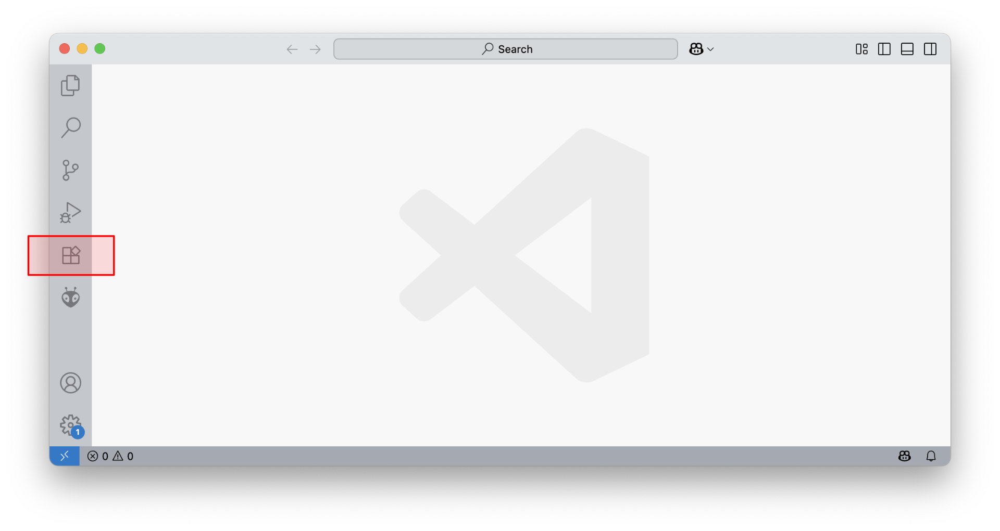
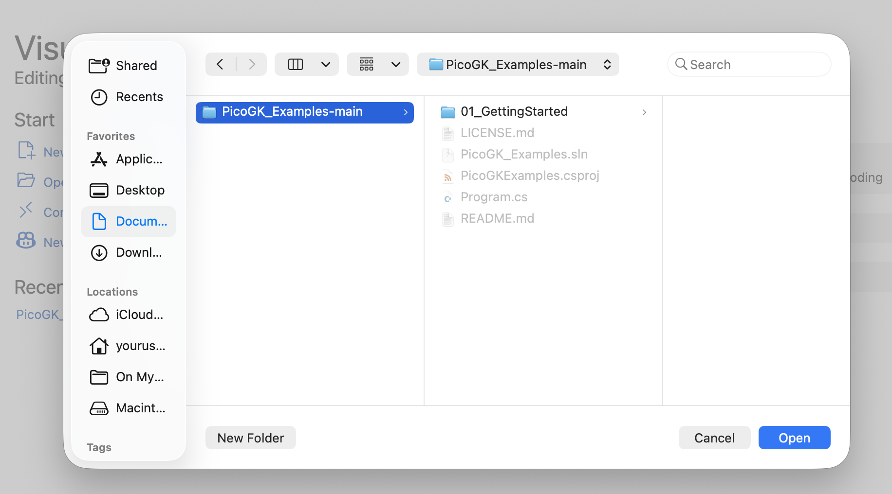
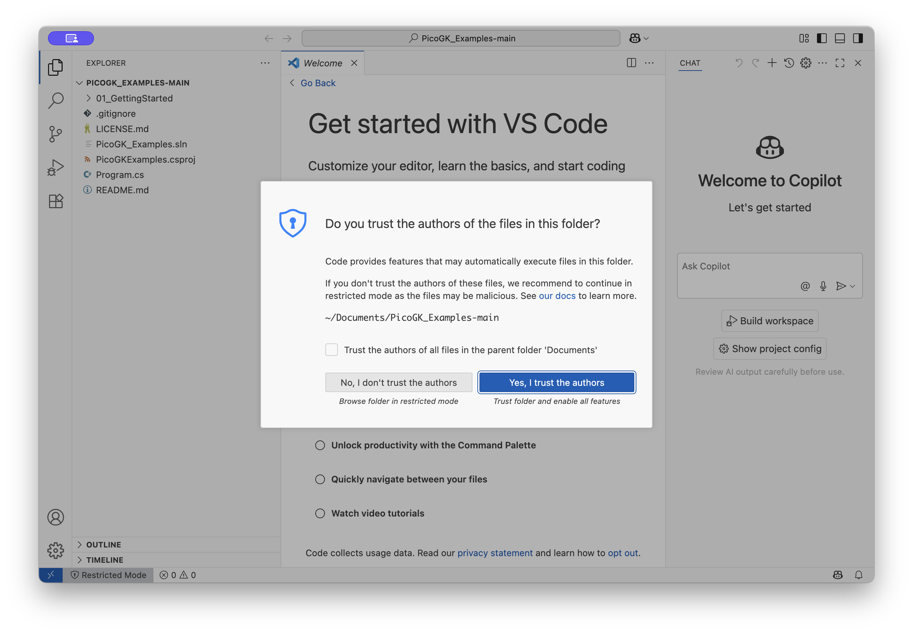
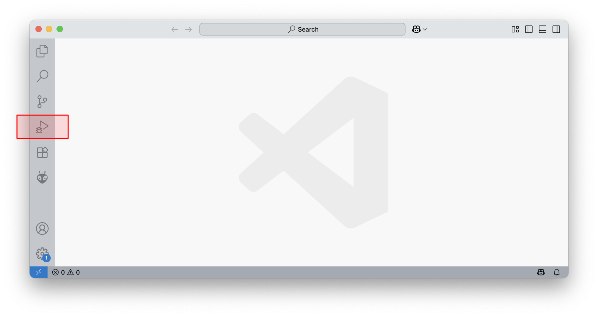
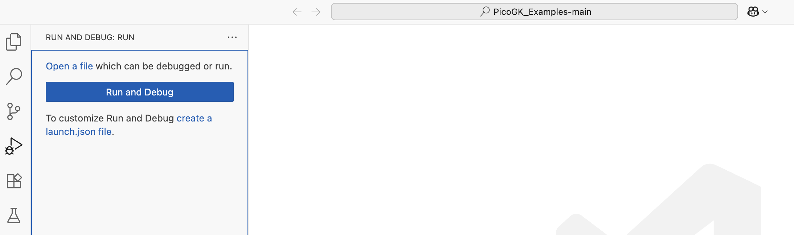
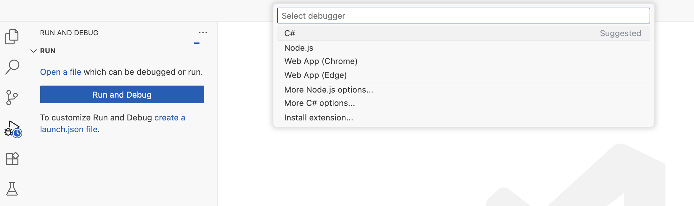
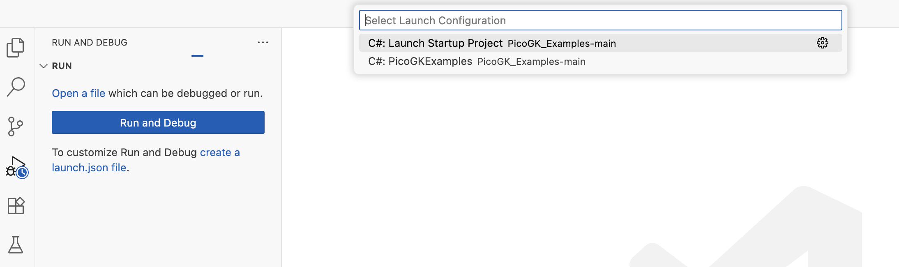
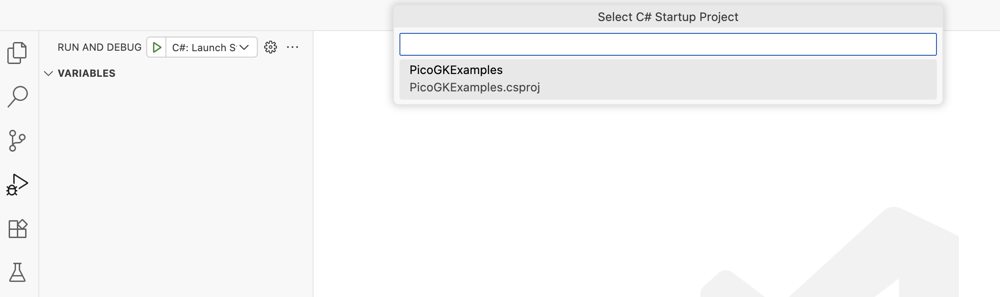
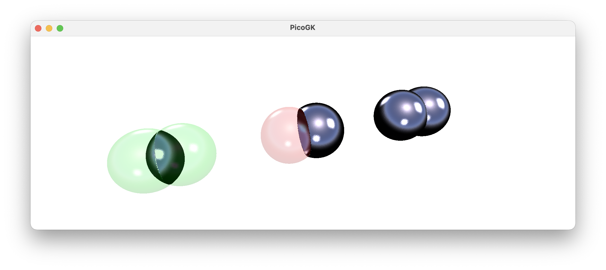

# From zero to PicoGK

Here's everything you need to get to a running PicoGK project.

## TLDR

The following sections will guide you through the following steps

- Install a C# programming environment: Visual Studio Code
- Download the PicoGK_Examples project from GitHub
- Run it and modify it to see PicoGK in action

## Prerequisites 

PicoGK is built for **Windows 64 bit** and **macOS X on Apple Silicon**. While people have compiled the PicoGK runtime for other operating systems, the above two are the only ones supported when using the official Nuget package.

## Install the .NET SDK from Microsoft

[Download and install the latest .NET SDK from Microsoft](https://dotnet.microsoft.com/en-us/download/dotnet/sdk-for-vs-code) — we use version 9.0.

## Install Visual Studio Code

[Download Visual Studio Code from Microsoft](https://code.visualstudio.com).

After downloading, 

- On Windows: run the installer 
- On Mac: drag and drop the app to your **Applications** folder. **Do not launch it from your Downloads folder directly.**

## Run and configure Visual Studio

Launch Visual Studio Code

You can customize Visual Studio (we prefer bright looks!). When you are done, click on the extensions button on the left.

Type **C#** into the search field and install the C# Dev Kit. This will also install the C# base language support.

The download and installation will take a moment, depending on your internet speed.

After you are done with all this, **it's a good idea to restart Visual Studio Code.**

## Download the PicoGK_Examples project

Head over to the LEAP 71 Github and download the [PicoGK_Examples project](https://github.com/leap71/PicoGK_Examples). 

You can do this by clicking on the green **Code** button and choosing **Download ZIP**.

Unzip to your Documents folder it will be called PicoGK_Examples-main or similar.

## Open project in VisualStudio Code

Make sure you closed and reopened Visual Studio Code as described in the last step. Choose **Open Folder** from the **File** menu and choose the folder you just unzipped.

You will likely get a security warning, which you have to accept in order to open the project:

## Run the project

Click on the **Run and Debug** button on the left side of the screen.

This will switch the screen and show a **Run and Debug** button, which you need to press.

The first time you do this, a number of confirmation queries will pop up at the top center of the screen. 

The first asks you to confirm the language — select **C#** and hit enter. If you don't see C#, you either didn't install the C# language extension (previous steps), or you forgot the restart Visual Studio Code.

After this, two more confirmations will pop up, you can always select the first option and continue:

1. Select Launch Configuration 

2. Select C# Startup Project

Thankfully, this will the last time these questions are asked.

After this, the application, which is contained in the file `Program.cs` will launch, and showcase a few PicoGK operations.

Congratulations, you have PicoGK up and running.

If you receive any error messages, check out the file **PicoGK.log**, which, by default, will be written in your **Documents** folder. It contains diagnostic messages that can help you pinpoint any problems.

## Check out the examples

There's a number of example tasks in the subfolders of the project. 

Return to [PicoGK.org](https://PicoGK.org) and [join the PicoGK discussions](https://github.com/leap71/PicoGK/discussions) for more resources.